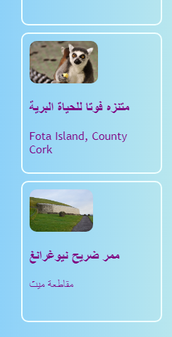
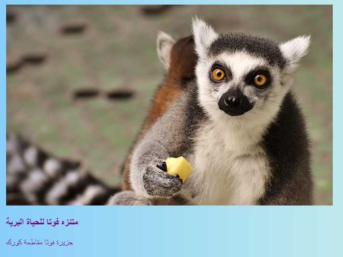
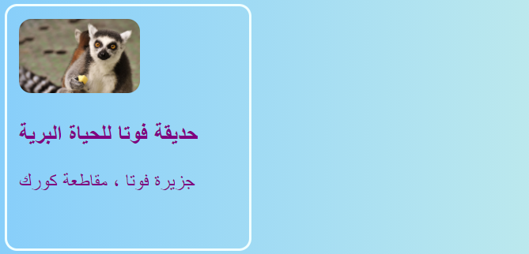

## بطاقات قابلة للنقر

إليك طريقة يمكنك استخدامها لإنشاء معرض صور ، أو صفحة معرض تعرض مشاريعك: ** بطاقات المعاينة ** مختصرة.



+ أضف كود HTML التالي إلى موقع الويب الخاص بك ، في أي مكان تريد. أنا أضفت ` index.html `. يمكنك تغيير الصورة والنص لتناسب بطاقات المعاينة الخاصة بك. سأقوم بابراز مجموعة من المعالم السياحية في أيرلندا.

```html
    <article class="card">
        
        <h3> الحياة البرية في فوتا </h3>
        <p> جزيرة فوتا ، مقاطعة كورك </p>
    </article>
```



+ أضف رمز CSS التالي لإنشاء الفئات `بطاقة` و `صورة مصغرة`:

```css
    .tinyPicture {
        height: 60px;
        border-radius: 10px;
    }
    .card {
        width: 200px;
        height: 200px;
        border: 2px solid #F0FFFF;
        border-radius: 10px;
        box-sizing: border-box;
        padding: 10px;
        margin-top: 10px;
        font-family: "Trebuchet MS", sans-serif;
    }
    .card:hover {
        border-color: #1E90FF;
    }
```



دعنا نحول بطاقة المعاينة بأكملها إلى رابط حتى يتمكن الناس من النقر لرؤية المزيد من المعلومات.

+ ضع عنصر ` المقالة ` بأكمله داخل عنصر الرابط. تأكد من وضع وسم الإغلاق ` </a>` بعد وسم الإغلاق ` </article>`! لا تتردد في تغيير الرابط ** URL ** إلى كل ما تريد الارتباط به. قد تكون صفحة أخرى على موقع الويب الخاص بك ، أو قد تكون موقعًا آخر بالكامل.

```html
    <a href="attractions.html#scFota">  
        <article class="card ">
            
            <h3>الحياة البرية في فوتا</h3>
            <p> جزيرة فوتا، مقاطعة كورك</p>
        </article>
    </a>
```


## \--- collapse \---

## title: الارتباط بجزء معين من الصفحة

لاحظ كيف أن قيمة ` href ` في الرابط الخاص بي تنتهي بـ ` #scFota ` ؟ هذه خدعة متقنة يمكنك استخدامها للانتقال إلى جزء معين من الصفحة.

+ أولاً ، اكتب عنوان URL للصفحة المراد الارتباط بها ، متبوعًا ` # `.

+ في ملف التعليمات البرمجية للصفحة التي تتصل بها ، ابحث عن الجزء الذي تريد الانتقال إليه وإعطي هذا العنصر `معرف`, مثال, `<section id="scFota"`. قيمة ` المعرف ` هو ما تكتبه بعد ` # ` في الرابط الخاص بك.

\--- /collapse \---

## \--- collapse \---

## title: إعادة تعيين الأنماط

الآن بعد أن أصبحت بطاقة المعاينة بأكملها رابطًا ، فقد يكون خط النص قد تغير.

+ إذا كان كذلك ، يمكنك إصلاحه عن طريق إضافة فئة ** CSS ** إلى الرابط: ` class = "cardLink" `. إليك رمز CSS الذي سيتم وضعه في ملف الأنماط الخاص بك:

```css
    .cardLink {
        color: inherit;
        text-decoration: none;
    }
```

تعيين قيمة أي خاصية إلى ` inherit ` يجعلها تستخدم القيمة التي يستخدمها عنصر ** parent**. لذلك في هذه الحالة ، سوف يتطابق لون النص مع بقية النص على الصفحة الرئيسية.

\--- /collapse \---

+ اصنع على الأقل أربع أو خمس من هذه البطاقات. إذا كنت تعمل من مثال موقع الويب الخاص بي ، فيمكنك القيام بواحد لكل قسم من أقسام صفحة الجذب السياحي. في بطاقة سوشي التالية ، ستتعرف على كيفية ترتيب البطاقات بخدعة رائعة!