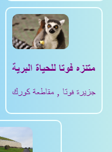
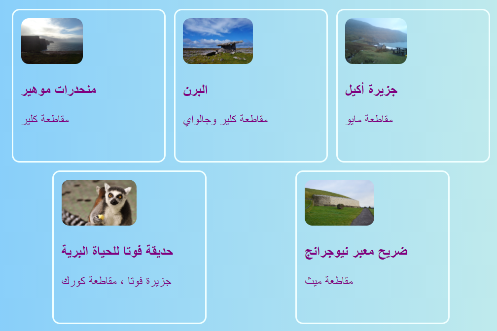
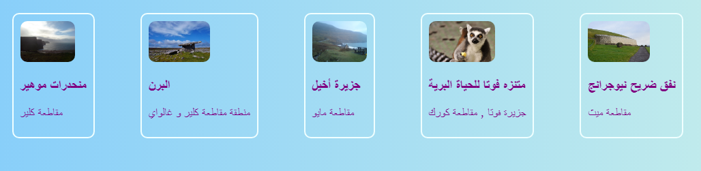
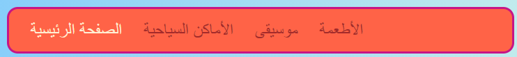
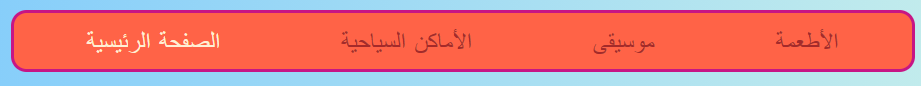
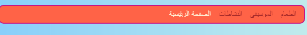

## جميع مافي الصف

على هذه البطاقة سوف تتعلم بعض الحيل لترتيب الأشياء ** أفقياً ** على الصفحة. أولاً ، سترى كيفية توسيط الأشياء. ثم سترتب العناصر جنباً إلى جنب في صف.

+ أضف خصائص CSS التالية إلى بطاقة `.card ` class:

```css
    margin-left: auto;
    margin-right: auto;
```

يجب أن تشاهد البطاقات تنتقل إلى وسط الصفحة. عن طريق تعيين الهوامش اليمنى واليسرى على ` auto ` ، يمكنك جعل أي عنصر في المنتصف بدلاً من اليسار.



+ اسحب حافة نافذة المتصفح لجعل الصفحة أضيق وأوسع نطاقًا - لاحظ أن البطاقات تظل في المركز.

+ ضع كل روابط البطاقة التي قمت بها للتو في عنصر حاوية جديد. لن تكون ` article` أو `section ` ، ولكن واحدة تسمى ` div `. هذه حاوية متعددة الأغراض يمكنك استخدامها لتجميع الأشياء وعمل تخطيطات لطيفة.

```html
    <div class="cardContainer">
```

+ أضف كود CSS التالي في ملف الأنماط الخاص بك:

```css
    .cardContainer {
        display: flex;
        flex-wrap: wrap;
        justify-content: space-around;
        padding: 10px;
    }
```

هاهي! بفضل ** Flex ** ، يتم الآن عرض البطاقات الخاصة بك جنبًا إلى جنب!

+ اسحب حافة نافذتك لتوسيع موقع الويب وتضييقه ، ومشاهدة كيف تتحرك البطاقات لتلائم حجم النافذة ، وأحيانًا تلتف إلى السطر التالي.



+ حاول حذف خصائص العرض ` width` و الارتفاع ` height` من عنصر `.card ` ونرى ما سيحدث: ` flex ` سيتلاءم مع البطاقات بذكاء مثل اللعبة ، مع الحفاظ على ارتفاع متساو عبر كل شيء في نفس الصف.



إذا كان لديك قائمة تنقل في أعلى صفحتك ، فهذا مكان آخر يمكنك استخدامه هذه الخدعة فيه. يجب أن تتكون قائمتك من عناصر القائمة ((` li `)) للجزء المقبل. إذا كنت تحب، يمكنك تجربتها مع موقعي الإلكتروني.

+ اوجد قواعد CSS للقائمة. في موقعي ، هذه هي البلوكات ` nav ul ` ، ` nav ul li ` و ` nav ul li a `.

+ احذف الخاصية `display: inline;` من قائمة العناصر. ثم ، في القائمة ` nav ul ` ، اضف:

```css
    display: flex;
    justify-content: flex-start;
```



سيكون عندك نفس القائمة ، أليس كذلك؟ The cool thing about `flex` is you can control the layout with the property `justify-content`.

+ Change the value of `justify-content` to `flex-end` and see what happens. Or change it to `space-around` to make the menu items evenly spaced, just like you did for the cards.





**`flex`** is a pretty powerful layout tool that could fill a whole Sushi Card series of its own — you can learn more about it at [dojo.soy/html3-flex](http://dojo.soy/html3-flex).