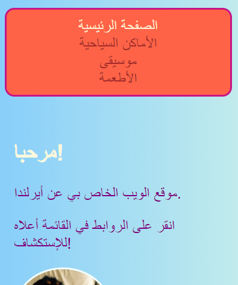
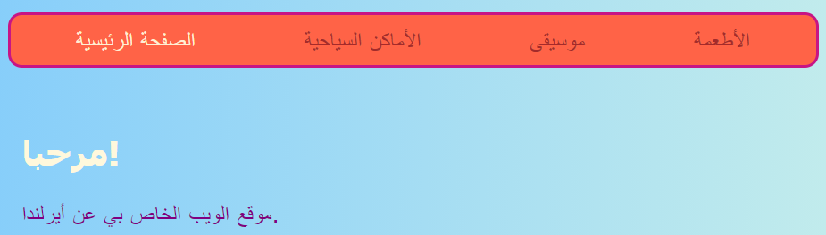
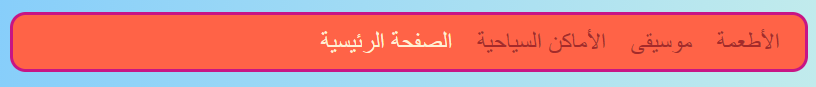

## اجعل قائمتك قابلة للاستجابة

موقع الويب **القابل للاستجابة** هو موقع يتكيف مع حجم الشاشة بحيث يبدو رائعًا دومًا ، سواء كنت تنظر إليه على جهاز كمبيوتر أو هاتف محمول أو جهاز لوحي. دعنا نجعل قائمتك قابلة للاستجابة!

ستبدأ باستخدام الأنماط العادية: سيكون هذا هو سلوكك الافتراضي.

--- collapse ---
---
title: ماذا تعني كلمة "الافتراضي"؟
---

الأنماط الافتراضية هي مجموعة القواعد المعتادة الخاصة بك. يتم تطبيقها اولا ، قبل التحقق من أي شروط خاصة.

يمكنك إضافة كود برمجي يتحقق بعد ذلك من حجم الشاشة وإجراء بعض التعديلات إذا لزم الأمر.

--- /collapse ---

+ أضف قواعد CSS التالية إلى قائمتك. ربما لديك ألوان وحدود محددة كذلك ؛ لقد تركتهم لتوفير المساحة هنا! إذا كان لديك بالفعل قواعد CSS محددة لقائمتك ، فما عليك سوى إضافة أو تغيير الخصائص والقيم أدناه.

```css
    nav ul {
        padding: 0.5em;
        display: flex;
        flex-direction: column;
    }
    nav ul li {
        text-align: center; 
        list-style-type: none;
        margin-right: 0.5em;
        margin-left: 0.5em;
    }
```

مع تعليمات CSS أعلاه ، ستكون قائمتك أكثر ملاءمة للشاشات الصغيرة. وهذا ما يسمى بطريقة المحمول أولاً في البرمجة.



--- collapse ---
---
title: ماذا تعني كلمة "الافتراضي"؟
---

في كثير من الأحيان عند برمجة موقع ويب ، سوف تستخدم شاشة كمبيوتر ، وربما ستحدد أنماطك استنادًا إلى كيفية ظهورها على تلك الشاشة.

عندما البرمجة للجوال أولاً ، فإنك تختار بدلاً من ذلك الأنماط الافتراضية المناسبة للشاشات الصغيرة مثل الهواتف الذكية. ثم تضيف اكواد برمجية إضافية لإجراء تعديلات للشاشات الأكبر حجمًا.

نظرًا لأن المزيد والمزيد من الناس يتصفحون الإنترنت على هواتفهم الذكية أو أجهزة الكمبيوتر اللوحية بدلاً من استخدامها على جهاز كمبيوتر ، فمن الممارسات الجيدة تطوير موقع الويب الخاص بك مع وضع ذلك في الاعتبار.

--- /collapse ---

+ أضف الكود التالي الى ملف الأنماط الخاص بك:

```css
    @media all and (min-width: 1000px) {
        nav ul {
            flex-direction: row;
            justify-content: space-around;
        }
    }
```

يتحقق السطر الأول من الشفرة أعلاه من حجم نافذة المتصفح. إذا كانت النافذة بعرض **1000 بكسل** أو أكثر ، سيتم تطبيق جميع قواعد النمط داخل الكتلة.



--- collapse ---
---
title: كيف يعمل؟
---

تحتوي الكتلة على قيم جديدة لبعض خصائص `nav ul` قائمة الطعام.

كلما كانت النافذة أكبر من 1000 بكسل ، سيتم تطبيق هذه القيم الجديدة بدلاً من تلك التي حددتها بالفعل لـ `nav ul`.

باقي الخصائص التي حددتها مسبقًا لـ `nav ul` سوف تبقى على حالها.

--- /collapse ---

+ إذا كنت تستخدم Trinket لكتابة التعليمات البرمجية ، فقد يكون من المفيد تنزيل المشروع حتى تتمكن من اختباره على شاشة كبيرة الحجم.

--- challenge ---

## Challenge: اجعل قائمتك تضبط نفسها للشاشات الكبيرة

+ يمكنك إضافة كتلة أخرى للشاشات أكبر من **1600 بكسل** ، مع `flex-end` بدلا من `space-around` ؟



--- hints ---


--- hint ---

تحدد التعليمة البرمجية التالية flex properties لعناصر القائمة عندما تكون الشاشة أكبر من 1600 بكسل:

```css
    @media all and (min-width: 1600px) {
        nav ul {
            flex-direction: row;
            justify-content: flex-end;
        }
    }  
```

--- /hint ---

--- /hints ---

--- /challenge ---

يمكنك وضع أي قواعد CSS تريدها في كتل مثل هذه لتعريف أنماط مختلفة للأحجام المختلفة للشاشات. سيكون مفيدًا بشكل خاص عند القيام بتخطيطات شبكة CSS لاحقًا!