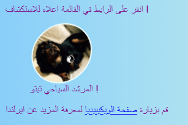
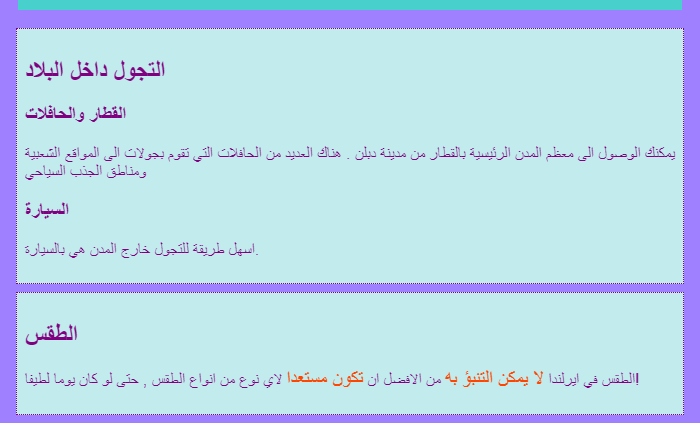

## التسميات التوضيحية والملاحظات الجانبية

في هذه البطاقة ، ستتعرف على نوعين آخرين من عناصر **الحاويات **: عنصر يمكنك استخدامه لإضافة تعليق (نص مثل العنوان أو الوصف المختصر) لصورة ، والآخر عندما يكون لديك أشياء إضافية لا تنتمي حقًا إلى المعلومات الرئيسية في الصفحة.

### صور مع التعليقات

+ اعثر علي عنصر ` img ` حيث يكون لديك نص أعلى أو أسفل الصورة. أنا أعمل علي صورة Tito في ملف ` index.html ` ، ولكن يمكنك العمل علي ما يتوفر على موقع الويب الخاص بك. 

```html
            
  <p>
    Tour guide Tito!
  </p>
```

+ على السطر أعلى الكود البرمجي ، أضف علامة الفتح `<figure>`. في سطر جديد أسفل الرمز ، ضع علامة الإغلاق ` </figure>`.

+ بعد ذلك ، قم بإزالة العلامات `p <0/> ، أو أي علامات لديك حول النص (ربما يكون عنوانًا ، مثل <code> h2 ` ؟) ، ثم ضع النص بين العلامات `&lt;figcaption&gt; <1/> بدلا من ذلك. يجب أن يبدو الكود مشابه لهذا الشكل:</p></li>
</ul>

<pre><code class="html">  <figure>
                
      <figcaption>
      Tour guide Tito!
      </figcaption>
  </figure>
`</pre> 
    
    ` figcaption ` للعنصر هو ** caption **. يمكن أن توضع إما فوق العنصر ` img ` أو تحته.
    
    
    
    ## \--- collapse \---
    
    ## title: لماذا هذا مفيد؟
    
    ` الوسم ` يعمل كنوع من ** الحاوية ** لصورتك والتعليق عليها. يتيح لك ذلك معاملتهم كوحدة واحدة عند تحديد الأنماط.
    
    تجميعها معًا بطريقة منطقية يساعد أيضًا في الحفاظ على بنية جيدة لكود برمجة موقع الويب الخاص بك.
    
    \--- /collapse \---
    
    يمكنك استخدام كود CSS لتنسيق ` figure` و ` figcaption ` كما تفعل بأي وسم آخر باستخدام فئات أو معرفات أو محددات العناصر. انا أقوم بإضافة القواعد التالية لإزالة المسافات الإضافية التي تمت إضافتها بواسطة الحاوية الجديدة:
    
    ```css
      figure { 
          margin-top: 0px;
          margin-bottom: 0px;
          margin-left: 0px;
          margin-right: 0px;
      }
    ```
    
    ### ملاحظات جانبية
    
    صفحة الجذب السياحي على موقع الويب الخاص بي هي قائمة بالأماكن التي يجب زيارتها. أرغب في إضافة بعض الملاحظات حول الطقس وكيفية التجول. تلك المعلومات لا تنتمي حقًا إلى وسم ` article ` مع جميع مناطق الجذب. هذا مثال على متى يمكنك استخدام وسم ` aside `.
    
    + انتقل إلى صفحة من موقع الويب الخاص بك تحتوي على وسم ` article` - أنا أستخدم ` Attractions.html `.
    
    + ** خارج ** وسم ` article` ، أضف زوجًا واحدًا أو أكثر من علامات `<aside> </aside>` التي تحتوي على الأشياء الإضافية الخاصة بك.
    
    ```html
      <aside class="sideNoteStyle">
          <h2> التجول </h2>
          <h3> القطار والحافلة </h3>
          <p> يمكنك الوصول إلى معظم المدن الرئيسية بالقطار من دبلن. هناك العديد من الحافلات التي تقوم بجولات إلى المواقع الشعبية ومناطق الجذب السياحي. </p>
          <h3> سيارة </h3>
          <p> أسهل طريقة للتجول خارج المدن هي بالسيارة. </p>
        </aside>
        <aside class="sideNoteStyle">
          <h2> الطقس </h2>
          <p> الطقس في أيرلندا <span class="specialText"> لا يمكن التنبؤ به للغاية! </span> من الأفضل أن تكون مستعد <span class="specialText"> </span> لأي نوع من الطقس ، حتى لو كان يوما جميلا! </p>
      </aside>
    ```
    
    ## \--- collapse \---
    
    ## title: لماذا هذا مفيد؟
    
    وسم `aside<0/> و <code>article<0/> ، وغيرها من الحاويات كلها متشابهة. الفرق الحقيقي الوحيد هو في المعنى <strong> </strong> الذي إستخدمتها له.</p>

<p>من المهم استخدام عناصر HTML ذات معنى كلما استطعت. إنه يوفر لموقعك بنية أفضل ويكون مفيدًا بشكل خاص للأشخاص الذين يستخدمون<strong> قارئات الشاشة </strong>.</p>

<p>--- /collapse ---</p>

<p>هل لاحظت ذلك العنصر الآخر هناك ، <code> span ` ؟ This is a special tag you can use just for adding extra CSS code! You can put anything in between a pair of `span` tags. It's useful for things like styling a **part** of the text in a paragraph.
    
    + Add the following CSS code to your style sheet to complete the styling for the HTML code above.
    
    ```css
      .sideNoteStyle {
        border: dotted 1px purple;
        background-color: #c1ebec;
        padding: 0.5em;
        margin: 0.5em;
      }
      .specialText {
          color: #FF4500;
          font-size: larger;
      }
    ```
    
    
    
    On the next card, you're going to learn how to make your website's layout more interesting!
    
    + To get ready, make a page that has one `article` and two `aside` elements inside the `<main> </main>` tags. Or if you prefer, you can work with the Attractions page on my website.