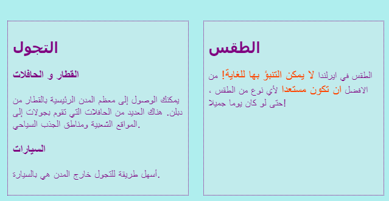
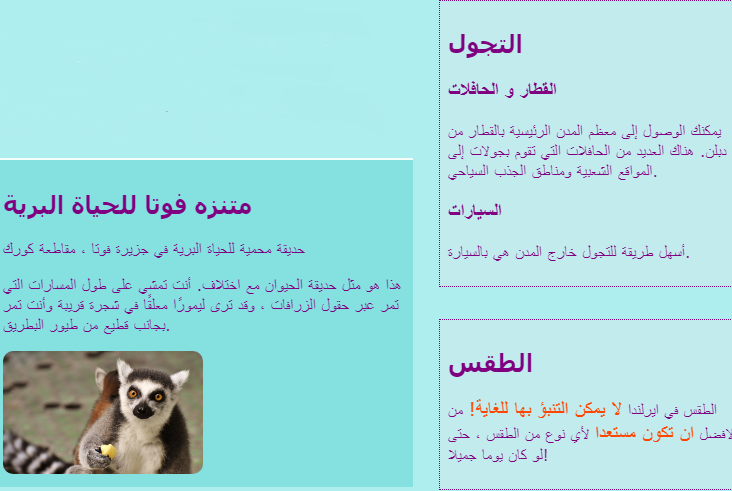

## تصميم تخطيط صفحات رائع

+ بالنسبة لهذه البطاقة ، يجب عليك العمل مع صفحة تحتوي على عنصر ` main` مع ثلاثة عناصر في الداخل: واحد `article` واثنين `aside`. قم بعمل هذا أولا إذا كنت بحاجة إليه. إذا كنت ترغب في العمل في موقع الويب الخاص بي ، فقم بإضافة كود ` aside ` من بطاقة سوشي السابقة إلى صفحة الجذب السياحي. 

فيما يلي ثلاثة تخطيطات مختلفة للصفحة التي ستطبقها:


+ إضف فئات CSS جديدة إلى ` main ` وكل من العناصر الثلاثة التي ذكرناها بداخله.

```html
    <main class="attPageLayoutGrid">
        <article class="attGridArticle">
            <!--other stuff here-->
        </article>
        <aside class="attGridAside1">
            <!--other stuff here-->
        </aside>
        <aside class="attGridAside2">
            <!--other stuff here-->
        </aside>
    </main>
```

الحاوية التي ستقوم بتغيير تخطيطها هي ` main ` ، ولكن يمكنك القيام بذلك مع أي نوع من الحاويات ، مثل ` div ` أو ` article ` ، أو حتى الصفحة بأكملها ` body `. تسمى التقنية التي ستستخدمها ** CSS grid**.

في هذا المثال ، العنوان ` header` وتذييل الصفحة ` footer` سيتم تركه خارج التصميم ، ولكن من الشائع جدًا تضمينه في الشبكة أيضًا.

+ اضبط خاصية الشاشة ` display` اضبطها الي ` grid ` على الحاوية الشاملة:

```css
    .attPageLayoutGrid {
        display: grid;
        grid-column-gap: 0.5em;
        grid-row-gap: 1em;
    }
```

ما الذي تعتقد أن الخصائص `grid-column-gap` و `grid-row-gap` تفعل؟

+ بعد ذلك ، يمكنك تسمية ` grid-area` لكل عنصر: 

```css
    .attGridArticle {
        grid-area: agArticle;
    }
    .attGridAside1 {
        grid-area: agAside1;
    }
    .attGridAside2 {
        grid-area: agAside2;
    }
```

مرحا لقد قمت بتصميم التصميم الخاص بك! دعنا نضع العناصر الاثنين `aside` جنبًا إلى جنب في أسفل الصفحة. لهذا تحتاج إلى عمودين ** columns** متساويين في العرض. يمكنك الاحتفاظ بارتفاع الصف ** row** التلقائي.

+ ضع التعليمات البرمجية التالية داخل قواعد CSS `.attPageLayoutGrid `:

```css
    grid-template-rows: auto;
    grid-template-columns: 1fr 1fr;
    grid-template-areas: 
        "agArticle agArticle"
        "agAside1 agAside2";
```

` fr ` تمثل ** fraction ** وهي وحدة قياس. لاحظ كيف جعلت المقال `article ` يشغل كل المساحة على العمودين.

## \--- collapse \---

## title: المساعدة! لقد حصلت على أخطاء وتحذيرات!

إذا كنت تستخدم Trinket ، فقد تلاحظ ظهور بعض الأخطاء والتحذيرات ، حتى إذا قمت بكتابة الكود كما هو مذكور أعلاه. وذلك لأن Trinket لم يتعرف بعد على خصائص شبكة CSS. ومع ذلك ، فإن الكود لا يزال يعمل.

إذا كان كود شبكة CSS يمنحك تحذيرات "خاصية غير معروفة" 'unknown property' أو خطأ مثل "الرمز المميز غير متوقع 1fr' " unexpected token 1fr'، يمكنك ببساطة تجاهل هذه التحذيرات.

\--- /collapse \---



دعنا نضع عناصر ` aside ` على اليمين ونجعلها نصف عرض العنصر `article `.

+ قم بتغيير قيم `grid-template-columns` و `grid-template-areas` إلى:

```css
    grid-template-columns: 2fr 1fr;
    grid-template-areas: 
        "agArticle agAside1"
        "agArticle agAside2";
```



+ If you don't want the `aside` elements to stretch all the way to the bottom, you can add a blank space using a dot: 

```css
    grid-template-areas: 
        "agArticle agAside1"
        "agArticle agAside2"
        "agArticle . ";
```


\--- challenge \---

## Challenge: make different layouts for different screen sizes

+ Can you use the screen size checks you added earlier to make the layout change depending on how wide the screen is? Note: if you already created CSS blocks for each screen size, you can add the new CSS code to those blocks instead of creating new ones.

\--- hints \---

\--- hint \---

The following code defines a layout for the CSS class above when the screen is bigger than 1000 pixels:

```css
    @media all and (min-width: 1000px) {
        .attPageLayoutGrid {
            grid-template-columns: 1fr 1fr;
            grid-template-areas: 
                "agArticle agArticle"
                "agAside1 agAside2";
        }
    }  
```

\--- /hint \---

\--- hint \---

The following code defines a layout for the CSS class above when the screen is bigger than 1600 pixels:

```css
    @media all and (min-width: 1600px) {
        .attPageLayoutGrid {
            grid-template-columns: 1fr 1fr;
            grid-template-areas: 
                "agArticle agAside1"
                "agArticle agAside2"
                "agArticle .";
        }
    }  
```

\--- /hint \---

\--- /hints \---

\--- /challenge \---

With **CSS grid**, you can make almost any layout you like. If you want to learn more, go to [dojo.soy/html3-css-grid](http://dojo.soy/html3-css-grid){:target="_blank"}