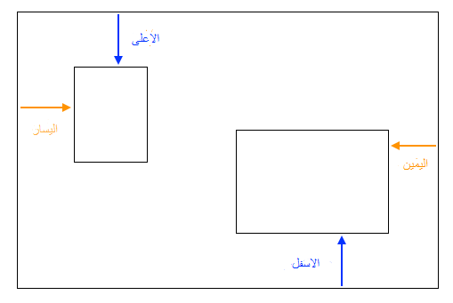

## ملصقات الصور

في هذه البطاقة ، ستتعلم استخدام CSS لوضع عناصر HTML بدقة وإنشاء صورة مجمعة.


+ أضف ` div` إلى صفحتك وضع فية صور بقدر ما تريد. إعطي الوسم ` div ` و ` img ` ` معرف ` id.

```html
    <div id="photoBox" class="relPos">
        
        
    </div>
```

ستظهر الصور واحدة تلو الأخرى على صفحة الويب ، بالترتيب الذي تظهر به في الكود.

+ في ملف CSS الخاص بك ، أضف فئة CSS التالية للعناصر الموجودة داخل القسم ` div `: 

```css
    .absPos {
        position: absolute;
    }
```

+ بعد ذلك ، تحتاج إلى إضافة الخاصية `position: relative;` إلى الحاوية نفسها وتحديد حجمها. هذا يجعل من مواضع العناصر الأخرى محددة ** بالنسبة إلى ** الحاوية ( من الداخل).

```css
    .relPos {
        position: relative;
    }

    #photoBox {
        width: 800px;
        height: 400px;
    }
```

+ ثم قم بإنشاء مجموعة من قواعد الأنماط لكل عنصر من العناصر باستخدام محددات المعرّف ** id ** لتعيين خصائص أحجامها (`) width ` و / أو ` height `) وكذلك مواقعها بالضبط.

لتحديد موضع عنصر ، هناك أربع خصائص يمكنك استخدامها: ` اليسار left ` ، ` اليمين right ` ، ` أعلى top ` و ` اسفل bottom `. إنها تمثل المدى الذي يجب أن تكون عليه كل حافة من حواف الحاوية الرئيسية. استخدم إما ` top ` أو ` bottom ` للموضع العمودي ، وإما ` left ` أو ` right ` للموضع الأفقي.



+ اختر المواضع الدقيقة لكل صورة من صورك ، واستخدم أيًا من الخصائص `left ` ، ` right ` ، ` top ` و ` bottom ` لتحديد تلك المواقع في تعليمات CSS الخاصة بك. على سبيل المثال ، يضع هذا الرمز صورة القط 100 بكسل من الأعلى و 60 بكسل من اليسار:

```css
    #imgTeaCat {
        width: 250px;
        top: 100px;
        left: 60px;
    }
```

ملاحظة: يمكن أن تكون قيم الموضع سالبة أيضًا! إذا استخدمت قيمة سالبة ، فستدفع العنصر خارج الحاوية ، بعد الحافة التي حددتها.

### جعل الأشياء تتداخل

قد ترغب في جعل بعض الصور تتداخل. ولكن كيف تختار أي واحد يكون في الأعلي ؟

+ اختر صورتين وحدد لهما مواقع تجعلهما تتداخلان.

+ إضف هذه الخاصية الإضافية ، `z-index: 10;` إلى واحد منهما ، ثم قم بإضافة `z-index: 7;` للاخر.

+ ألق نظرة على النتيجة في صفحة الويب الخاصة بك.


+ الآن قم بتبديل قيم z-index < </code> بحيث تبدل ` 7 ` و ` 10 ` بينهما. هل ترى أي فرق على صفحة الويب الخاصة بك؟


## \--- collapse \---

## title: كيف تعمل خاصية z-index؟

تتيح لك خاصية `z-index` تحديد كيفية تداخل عنصرين أو أكثر. يمكن أن تكون القيمة أي عدد صحيح.

العنصر الذي يحمل ** الرقم الاكبر ** يكون في ** أعلى ** المجموعة ، أو بعبارة أخرى في ** الواجهة **. العنصر الذي يحتوي على الرقم الأعلى التالي يكون خلف ذلك ، وأمام الآخرين ، وهكذا ، حتى تصل إلى العنصر ذي الرقم الأدنى ، والذي يظهر خلف كل العناصر الأخرى.

\--- collapse \---

يمكنك وضع أي من عناصر HTML بهذه الطريقة ، وليس فقط الصور. على سبيل المثال ، يمكنك استخدام عنصر ` p ` لإضافة نص على الصورة.

\--- challenge \---

## Challenge: عمل صور مجمعة

+ حاول إنشاء الصور المجمعة الخاصة بك كما موضح أدناه! استخدم الموضع الدقيق مع `z-index` بقيم مختلفة للحصول على تأثير التداخل بالطريقة التي تريدها.

\--- hints \---

\--- hint \---

يوجد أدناه كود HTML لصور مجمّعة على موقع ويب ايرلندا الخاص بي. هناك ست صور و نص كلها داخل قسم ` div`.

```html
    <div id="photoBox" class="relPos">
        
        
        
        
        
        
        <p id="photoText" class="absPos">Ireland</p>
    </div>
```

\--- hint/ \---

\--- hint \---

فيما يلي قواعد CSS التي تحدد المواضع لكل صورة من الصور في المجموعة:

```css
    #imgHorse {
        width: 120px;
        top: 200px;
        left: 390px;
        z-index: 10;
    }
    #imgSheep {
        width: 200px;
        top: 100px;
        left: 20px;
        z-index: 8;
    }
    #imgCoast {
        width: 150px;
        top: 250px;
        left: 10px;
        z-index: 5;
    }
    #imgTrees {
        width: 110px;
        top: 65px;
        left: 205px;
        z-index: 9;
    }
    #imgTeaCat {
        width: 250px;
        top: 210px;
        left: 160px;
        z-index: 7;
    }
    #imgStreet {
        width: 180px;
        top: 90px;
        left: 310px;
        z-index: 6;
    }
    #photoText {
        font-family: "brush script MT";
        color: lightgreen;
        font-size: 4em;
        left: 35px;
        top: 15px;
        z-index: 20;
    }
```

\--- hint/ \---

\--- hint \---

فيما يلي فئات CSS التي استخدمتها:

```css
    .collagePhoto {
        border: 1px solid white;
    }
    .relPos {
        position: relative;
    }
    .absPos {
        position: absolute;
    }
```

\--- hint/ \---

\--- hints/ \---


\--- challenge/ \---