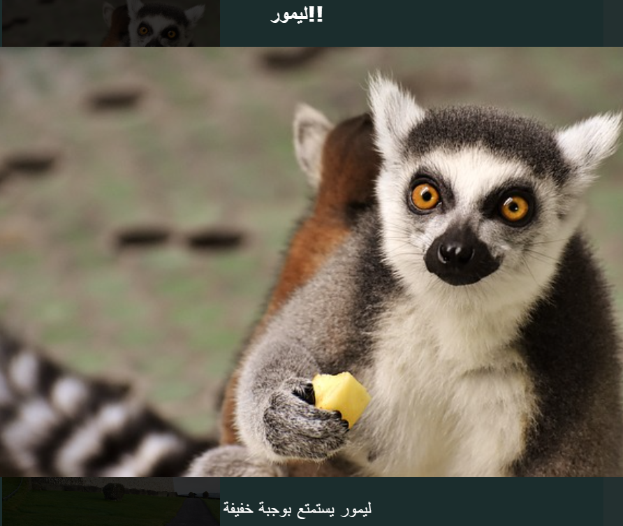

## مؤثرات خاصة

في هذه البطاقة ، ستتعرف على بعض التأثيرات اللطيفة التي يمكنك انجازها باستخدام CSS.

### الظلال والحركة

دعنا نضيف حركة صغيرة عندما تمرر مؤشر الماوس فوق البطاقات التي قمت بإنشائها مسبقًا.

+ ابحث عن `.card: hover` فئة CSS من ماسبق وقم بتغييرها إلى ما يلي:

```css
    .card:hover {
        box-shadow: 0px 2px 2px rgba(0,0,0,0.2); 
        transform: translateY(-2px);
    }
```

+ جرب قيمًا مختلفة في `دالة` الترجمة!

--- collapse ---
---
title: خاصية التحويل `transform`
---

إذا قمت بإكمال بطاقات سوشي HTML / CSS ، فقد تتذكر استخدام خاصية التحويل `transform` في بعض الإطارات المفتاحية للرسوم المتحركة `@keyframes`. هنا ترى أنه يمكنك أيضًا استخدام الخاصية وحدها داخل كتلة CSS اعتيادية.

نوع من القيم التي يمكنك تعيينها هي `rotate` ، لجعل عنصر يدور. الخاصية الآخرى `translate Y` ، التي تحرك شيئًا ما لأعلى أو لأسفل ، و `translateX` ، للحركة من جانب إلى آخر.

--- /collapse ---

+ حاول التلاعب بقيم بكسل مختلفة في خاصية `box-shadow` لمعرفة ماذا تفعل. 

--- collapse ---
---
title: ماهي `rgba` ؟
---

`rgba(0,0,0,0.2)` هي طريقة أخرى لتحديد اللون.

تحتوي على الأرقام الثلاثة المعتادة (من `0` حتى `255`) للأحمر والأخضر والأزرق.

الرقم الرابع ، يدعي قيمة الفا **alpha** ، وتحدد الشفافية **transparent** (أو النظر من خلال) شيء ما. وهو رقم عشري بين `0` و `1` ، حيث `1` تمثل معتم تماما و `0` شفاف تماما. هذا يعني أنه كلما انخفضت قيمة ألفا لعنصر ما ، زادت درجة شفافيته.

--- /collapse ---

+ أخيرًا ، اجعل الحركة سلسة عن طريق إضافة الخاصية التالية إلى `.card` من ما سبق: 

```css
    transition: all 0.2s ease-out;
```

مدة `0.2 ثانية` تعني الانتقال `transition` يستمر لمدة 0.2 ثانية.

### الصندوق المضئ Lightbox

من التأثيرات الأخرى التي ربما تراها على الكثير من مواقع الويب هو **lightbox**: حيث تنقر على شيء ما فيظلم موقع الويب بينما يظهر شيء آخر ، مثل صورة أكبر أو مربع منبثق ، يظهر في المقدمة.



للحصول على هذا التأثير ، ستقوم بإنشاء رابطين: واحد لصندوق الضوء الفعلي (الشيء الذي ينبثق) ، وواحد للشيء الذي تنقر عليه لإظهار صندوق الضوء. سأقوم بعمل التأثير في صفحة "الجذب السياحي" على موقعي. تستطيع العمل مع أي صفحة لديك فيها صور!

+ حدد الأشياء التي تريد ظهورها عند النقر فوقها وأضفها جميعًا إلى صفحتك بين زوج من علامات `a` لعمل الرابط. تأكد من إعطاء الرابط معرف `id`. يمكن أن تضع الكود في أي مكان في الصفحة: ستجعل العناصر غير مرئية في الخطوة التالية!

```html
    <a href="#_" class="lightbox" id="boxLemur">
        <h3>ليمور!!</h3>
        
        <p>ليمور يستمتع بوجبة خفيفة</p>
    </a>
```

يمكنك وضع أي شيء تريده بين علامات الارتباط. لدي صورة كبيرة ، عنوان ، ونص قصير. ربما تريد فقط الصورة وليس النص!

+ أضف كود CSS التالي الي lightbox. هل يمكنك معرفة ما يفعله كل جزء من هذا الكود؟

```css
    .lightbox{
        background: rgba(0,0,0,0.8);
        color: #ffffff;
        text-align: center;
        text-decoration: none;
        width: 100%;
        height: 100%;
        top: 0;
        left: 0;
        position: fixed;
        visibility: hidden;
        z-index: 999;
    }
```

ملاحظة: تعيين الخاصية `الموضع` إلى `ثابت` يعني أن الموضع الذي قمت بتعيين سيكون بصلة إلى نافذة المتصفح، لذلك ستبقى موضوعة عند التمرير.

+ بعد ذلك، قم بتحديد الشيء الذي تريد النقر عليه لجعل صندوق الضوء يظهر ، وإضافة زوج من `a` حول هذا العنصر (في حالتي هي صورة أصغر من lemur). الهدف **target** للرابط سيكون هو lightbox ، الذي تقوم بتعيينه باستخدام المعرف `id`. قد تتعرف على هذه التقنية من ماسبق!

```html
    <a href="#boxLemur">
        
    </a>
```

+ أخيرًا أضف كود CSS التالي. لاحظ أن هذه فئة **pseudo-class**. يجب أن تأتي بعد التعليمات البرمجية لـ `.lightbox` وليس داخلها!

```css
    .lightbox:target {
        visibility: visible;
    }
```

يتم تطبيق فئة `:target` و pseudo-class كلما كان صندوق الضوء هو الهدف من النقر على الرابط الأخير. لذلك عند النقر فوق أي مكان ، فإن الرؤية `visibility` سيتم تعيينها مرة أخرى إلى `hidden`.

+ حاول النقر على الرابط الجديد الخاص بك لرؤية صندوق الضوء يظهر! لجعله يختفي ، فقط انقر في أي مكان على الصفحة.

يمكنك إضافة العديد من صناديق الضوء إلى الصفحة كما تشاء. يمكنهم جميعًا استخدام نفس فئة CSS - فقط تأكد من أن لكل واحد معرف `id` مختلف! لكل واحد ، تحتاج إلى جعل شيء ما على صفحة الويب الخاصة بك في رابط يمكنك النقر فوقه لإظهار مربع الضوء ، ثم استخدام المعرف `id` كقيمة لــ `href` في هذا الرابط ، تمامًا كما فعلت أعلاه!


***
تمت ترجمة هذا المشروع بواسطة متطوعين:

طيبة باسم محمد

نور يحيى شاكر

بفضل المتطوعين ، يمكننا إعطاء الناس في جميع أنحاء العالم فرصة للتعلم بلغتهم الخاصة. يمكنك مساعدتنا في الوصول إلى المزيد من الأشخاص من خلال التطوع للترجمة - مزيد من المعلومات على [rpf.io/translate](https://rpf.io/translate).