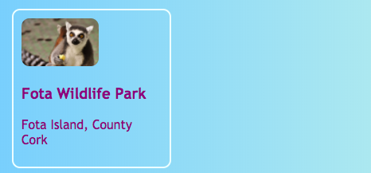

## Klickbare Karten

Hier ist eine Technik, mit der Du eine Fotogalerie oder eine Portfolio-Seite mit Deinen Projekten erstellen kannst: kleine **Vorschau-Karten**.


+ Füge den folgenden HTML-Code an einer beliebigen Stelle deiner Website hinzu. Ich mache das auf `index.html`. Du kannst die Bilder und Texte so ändern, dass sie zu Deinen eigenen Vorschaukarten passen. Ich werde ein paar Höhepunkte der Touristenattraktionen in Irland machen.

```html
    <article class="card">
        
        <h3>Fota Wildpark</h3>
        <p>Fota Island, Grafschaft Cork</p>
    </article>
```


+ Füge den folgenden CSS-Code hinzu, um die Klassen `card` und `tinyPicture` zu erstellen:

```css
    .tinyPicture {
        height: 60px;
        border-radius: 10px;
    }
    .card {
        width: 200px;
        height: 200px;
        border: 2px solid #F0FFFF;
        border-radius: 10px;
        box-sizing: border-box;
        padding: 10px;
        margin-top: 10px;
        font-family: "Trebuchet MS", sans-serif;
    }
    .card:hover {
        border-color: #1E90FF;
    }
```



Lass uns die gesamte Vorschau-Karte in einen Link verwandeln, damit Leute mit einem Klick mehr Informationen sehen.

+ Platziere das gesamte `article`-Element in einem Link-Element. Stelle sicher, dass das schließende `</a&gt`-Tag nach dem schließenden `</article>`-Tag steht! Du kannst die link **URL** ändern, wie du möchtest. Das könnte eine andere Seite auf Deiner Website sein, oder es könnte eine ganz andere Website sein.

```html
    <a href="attractions.html#scFota">  
        <article class="card ">
            
            <h3>Fota Wildpark</h3>
            <p>Fota Island, Grafschaft Cork</p>
        </article>
    </a>
```


--- collapse ---
---
title: Auf einen bestimmten Teil einer Seite verlinken
---

Ist Dir aufgefallen, wie der Wert von `href` in meinem Link auf `#scFota` endet? Das ist ein toller Trick, den Du nutzen kannst, um zu einem bestimmten Teil einer Seite zu springen.

+ Gib zuerst die URL der Seite ein, auf die verlinkt werden soll, gefolgt von `#`.

+ In der Code-Datei für die Seite, auf die Du verlinkt, finde den Teil zu dem du springen möchtest und gib diesem Element eine `id`, zum Beispiel `<section id="scFota"`. Der Wert der `id` ist, das was Du nach der `#` in Deinen Link eingibst.

--- /collapse ---

--- collapse ---
---
title: Stile zurücksetzen
---

Jetzt, da die gesamte Vorschaukarte ein Link ist, hat sich möglicherweise die Schriftart geändert.

+ In diesem Fall kannst du das beheben, indem du dem Link eine **CSS-Klasse** hinzufügst: `class="cardLink"`. Hier ist der CSS-Code, zum Einfügen in dein Style-Sheet:

```css
    .cardLink {
        color: inherit;
        text-decoration: none;
    }
```

Wenn Du den Wert irgendeiner Eigenschaft auf `inherit` (engl.: erben) setzt, wird der Wert verwendet, den das **Eltern** Element hat. In diesem Fall entspricht die Textfarbe also dem restlichen Text auf der Homepage.

--- /collapse ---

+ Erstelle mindestens vier oder fünf dieser Karten. Wenn Du mit meiner Beispiel-Website arbeitest, kannst Du eine für jeden Bereich ("section") auf der Seite Attraktionen machen. Auf der nächsten Sushi Card wirst du lernen, wie du die Karten mit einem coolen Trick anordnen kannst!