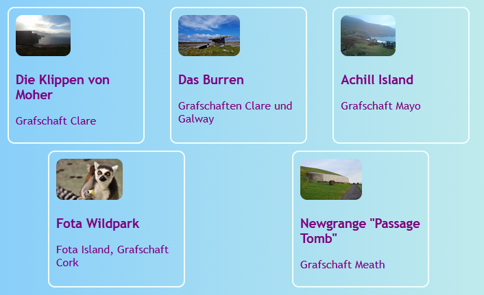
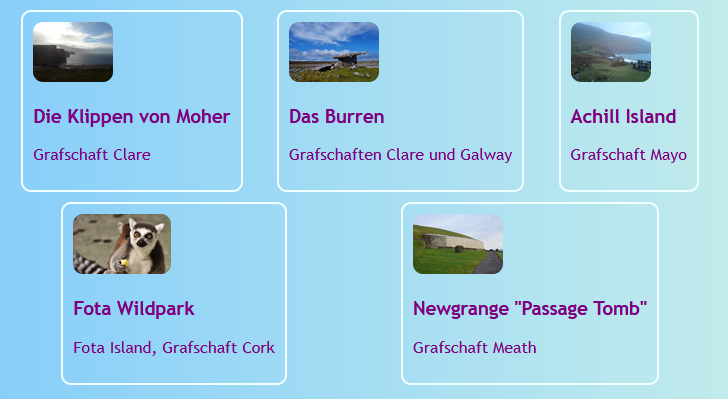
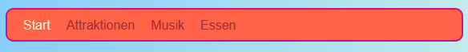
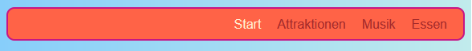

## Alles in einer Reihe

Auf dieser Karte lernst Du einige Tricks, um Dinge **horizontal** auf einer Seite anzuordnen. Zuerst wirst du sehen, wie man Dinge zentriert. Dann wirst Du Elemente nebeneinander in einer Zeile anordnen.

+ Füge die folgenden CSS Eigenschaften zur `.card` Klasse hinzu:

```css
    margin-left: auto;
    margin-right: auto;
```

Du solltest sehen, wie die Karten sich in die Mitte der Seite bewegen. Durch Setzen der linken und rechten Abstände (engl.: margins) auf `auto`, kannst Du jedes Element in die Mitte setzen, statt ganz links.


+ Ziehe den Rand des Browserfensters, um die Seite schmaler und breiter zu machen. Beachte dass die Karten zentriert bleiben.

+ Setze alle Karten-Links die Du gerade erstellt hast in ein neues "Container-Element". Es wird kein `article` oder ein `section` sein, sondern etwas das `div` genannt wird. Das ist ein universeller Container, mit dem Du Dinge gruppieren und schöne Layouts erstellen kannst.

```html
    <div class="cardContainer">
```

+ Füge folgenden CSS-Code in dein Sylesheet ein:

```css
    .cardContainer {
        display: flex;
        flex-wrap: wrap;
        justify-content: space-around;
        padding: 10px;
    }
```

Voilà! Dank **Flex** werden Deine Karten jetzt nebeneinander angezeigt!

+ Ziehe den Rand Deines Fensters, um die Website breiter und schmaler zu machen, und beobachte, wie sich die Karten bewegen, um sich der Fenstergröße anzupassen und manchmal in die nächste Zeile übergehen.



+ Versuche, die `width` und `height` Eigenschaften aus der `.card`-Klasse zu löschen und beobachte was passiert: `flex` fügt die Karten auf clevere Weise, wie ein Puzzle zusammen und behält dabei eine gleichmäßige Höhe für alle Elemente in derselben Reihe bei.



Falls Du ein Navigations-Menu oben auf Deiner Seite hast, kannst du diesen Trick auch da anwenden. Für den nächsten Teil muss dein Menu aus Listen-Elementen ( `li` ) bestehen. Wenn Du willst, kannst Du es mit meiner Website ausprobieren.

+ Finde die CSS-Regeln für das Menu. Auf meiner Website sind das die Blöcke `nav ul`, `nav ul li` und `nav ul li a`.

+ Lösche die Eigenschaft `display: inline;` aus den Listenelementen. Füge dann, in der Liste `nav ul`, Folgendes hinzu:

```css
    display: flex;
    justify-content: flex-start;
```



Am Ende hast du ziemlich genau das gleiche Menu wie vorher, oder? Das Coole an `flex` ist, dass Du das Layout mit der Eigenschaft `justify-content` steuern kannst.

+ Ändere den Wert von `justify-content` zu `flex-end` und sieh was passiert. Oder ändere ihn zu `space-around`, um die Menüpunkte gleichmäßig zu verteilen, genau wie Du es für die Karten getan hast.




**`flex`** ist ein ziemlich leistungsfähiges Layout-Werkzeug, das alleine eine ganze Sushi-Karten Serie füllen könnte. Auf [dojo.soy/html3-flex](http://dojo.soy/html3-flex) kannst Du mehr darüber erfahren.