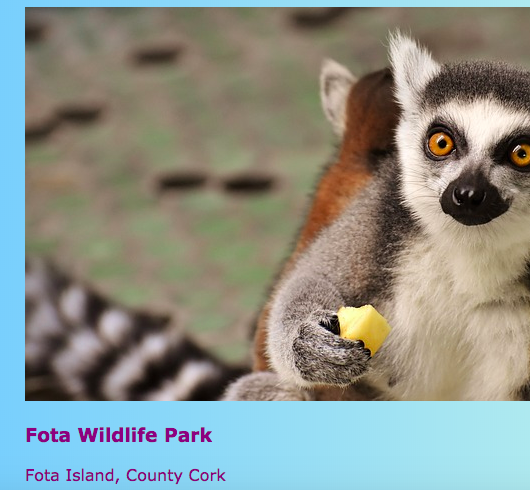

## Anklickbare Karten

Hier ist eine Technik , die Sie verwenden , könnte eine Foto - Galerie zu machen, oder eine Portfolio - Seite vorführt Ihre Projekte: wenig **Vorschau Karten**.


+ Fügen Sie Ihrer Website den folgenden HTML-Code hinzu, wo immer Sie möchten. Ich mache meine auf `index.html`. Sie können das Bild und den Text an Ihre eigenen Vorschaukarten anpassen. Ich werde einige Highlights der Touristenattraktionen in Irland machen.

```html
    <article class="card">
        
        <h3>Fota Wildpark</h3>
        <p>Fota Island, County Cork</p>
    </article>
```



+ Fügen Sie den folgenden CSS-Code hinzu, um die Klassen `Karte` und `tinyPicture`zu erstellen:

```css
    .tinyPicture {Höhe: 60px; Rand-Radius: 10px; } .card {Breite: 200px; Höhe: 200px; Grenze: 2px fest # F0FFFF; Rand-Radius: 10px; Box-Sizing: Rand-Box; Auffüllen: 10px; Rand oben: 10px; Schriftfamilie: "Trebuchet MS", Sans-Serif; } .card: hover {border-color: # 1E90FF; }
```


Lassen Sie uns die ganze Vorschaukarte zu einem Link machen, damit die Leute klicken können, um mehr Informationen zu sehen.

+ Platziere das ganze `Artikel` Element in einem Verbindungselement. Stellen Sie sicher, dass das schließende `</a>` -Tag hinter dem schließenden `</article>` -Tag steht! Fühlen Sie sich frei, den Link **URL** zu dem zu ändern, mit dem Sie verlinken möchten. Das könnte eine andere Seite Ihrer Website sein oder eine andere Website.

```html
    <a href="attractions.html#scFota">  
        <article class="card ">
            
            <h3>Fota Wildpark</h3>
            <p>Fota Island, County Cork</p>
        </article>
    </a>
```


## \--- Einsturz \---

## title: Verknüpfen mit einem bestimmten Teil einer Seite

Beachten Sie, wie der Wert von `href` in meinem Link in `#scFota`endet? Dies ist ein netter Trick, mit dem Sie zu einem bestimmten Teil einer Seite springen können.

+ Geben Sie zuerst die URL der zu verknüpfenden Seite ein, gefolgt von `#`.

+ Suchen Sie in der Codedatei für die Seite, zu der Sie verlinken, den Teil, zu dem Sie springen möchten, und geben Sie diesem Element eine `ID`, z. B. `<Abschnitt ID = "scFota"`. Der Wert der `ID` ist, was Sie nach den `#` in Ihrem Link eingeben.

\--- / einklappen \---

## \--- Einsturz \---

## titel: Stile zurücksetzen

Jetzt, da die gesamte Vorschaukarte ein Link ist, hat sich möglicherweise die Textschriftart geändert.

+ Wenn ja, können Sie es beheben, indem Sie dem Link eine **CSS-Klasse** hinzufügen: `class = "cardLink"`. Hier ist der CSS-Code, der in Ihr Stylesheet eingefügt werden soll:

```css
    .cardLink {Farbe: erben; Textdekoration: keine; }
```

Wenn Sie den Wert einer Immobilie zu `vererben` macht es den Wert verwenden, der das **Elternteil** Element hat. In diesem Fall stimmt die Textfarbe mit dem restlichen Text auf der Startseite überein.

\--- / einklappen \---

+ Mache mindestens vier oder fünf dieser Karten. Wenn Sie von meiner Beispielwebsite aus arbeiten, können Sie für jeden der Abschnitte auf der Seite "Attraktionen" einen Bericht erstellen. Auf der nächsten Sushi Card lernst du, wie du die Karten mit einem coolen Trick anordnest!