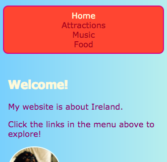

## Machen Sie Ihr Menü ansprechend

Eine **responsive** Website ist eine, die sich an die Bildschirmgröße anpasst, so dass sie immer gut aussieht, egal, ob Sie sie auf einem Computer, Mobiltelefon oder Tablet betrachten. Lassen Sie uns Ihre Speisekarte ansprechen!

Sie beginnen mit den regulären Stilen: Dies ist Ihr **Standard** Verhalten.

## \--- Einsturz \---

## Titel: Was bedeutet 'Standard'?

Die Standardstile sind Ihre normalen Stilregeln. Sie werden angewendet, egal was passiert, bevor Sie besondere Bedingungen überprüfen.

Sie können Code hinzufügen, der dann die Größe des Bildschirms überprüft und bei Bedarf einige Anpassungen vornimmt.

\--- / einklappen \---

+ Fügen Sie Ihrem Menü die folgenden CSS-Regeln hinzu. Sie haben wahrscheinlich auch Farben und Grenzen definiert; Ich habe sie hier gelassen, um Platz zu sparen! Wenn Sie für Ihr Menü bereits CSS-Regeln definiert haben, fügen Sie einfach die Eigenschaften und Werte hinzu, die Ihnen fehlen.

```css
    Nav ul {Auffüllen: 0.5em; Anzeige: flex; Flex-Richtung: Spalte; } nav ul li {Textausrichtung: Mitte; Listenart-Typ: keine; Rand rechts: 0.5em; Rand links: 0.5em; }
```

Mit dem obigen CSS-Code eignet sich Ihr Menü am besten für kleine Bildschirme. Dies wird **Mobile-First-** Entwicklung genannt.



## \--- Einsturz \---

## titel: Was bedeutet "zuerst mobil"?

Wenn Sie eine Website programmieren, verwenden Sie häufig einen Computerbildschirm, und Sie werden wahrscheinlich Ihre Stile basierend darauf definieren, wie sie auf diesem Bildschirm aussehen.

Wenn Sie zuerst für Mobilgeräte codieren, wählen Sie stattdessen Standardstile aus, die für kleine Bildschirme wie Smartphones geeignet sind. Sie fügen dann zusätzlichen Code hinzu, um Anpassungen für größere Bildschirme vorzunehmen.

Da immer mehr Menschen im Internet auf ihren Smartphones oder Tablets surfen anstatt auf einem Computer, ist es eine gute Übung, Ihre Website in diesem Sinne zu entwickeln.

\--- / einklappen \---

+ Fügen Sie Ihrem Stylesheet jetzt den folgenden Code hinzu:

```css
    @media all and (Mindestbreite: 1000px) {nav ul {flex-direction: row; justify-content: räumlicher Raum; }}
```

Die erste Zeile des obigen Codes überprüft, wie groß das Browserfenster ist. Wenn das Fenster **1000 Pixel** breit oder mehr, wird es alle Stilregeln innerhalb des Blocks gelten.


## \--- Einsturz \---

## Titel: Wie funktioniert es?

Der Block enthält nur für einige Eigenschaften des Menüs `nav ul` neue Werte.

Wenn das Fenster breiter als 1000 Pixel ist, werden diese neuen Werte anstelle der Werte verwendet, die Sie bereits für `nav ul`.

Der Rest der Eigenschaften, die Sie zuvor für `nav ul` bleibt unverändert.

\--- / einklappen \---

+ Wenn Sie Schmuck zum Schreiben von Code verwenden, kann es hilfreich sein, das Projekt herunterzuladen, damit Sie es auf einem Bildschirm in voller Größe testen können.

\--- Herausforderung \---

## Herausforderung: Stellen Sie Ihr Menü auf große Bildschirme ein

+ Können Sie einen weiteren Block für Bildschirme hinzufügen, die größer als **1600 Pixel**, mit `Flex-End` anstelle von `Space-Around`?


\--- Hinweise \---

\--- Hinweis \---

Der folgende Code definiert Flex-Eigenschaften für Menüelemente, wenn der Bildschirm größer als 1600 Pixel ist:

```css
    @media all und (min-width: 1600px) {nav ul {Flex-Richtung: Zeile; justify-content: Flex-Ende; }}  
```

\--- /Hinweis \---

\--- / Hinweise \---

\--- /Herausforderung \---

Sie können beliebige CSS-Regeln in Blöcke wie diese einfügen, um verschiedene Stile für verschiedene Bildschirmgrößen zu definieren. Dies ist besonders nützlich, wenn Sie später CSS-Rasterlayouts erstellen.