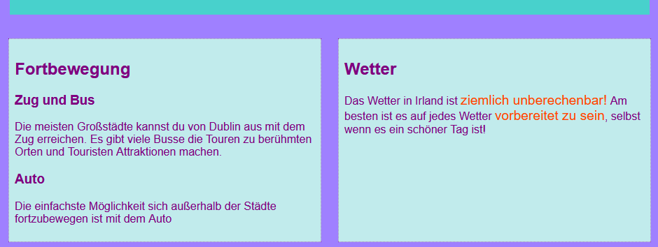
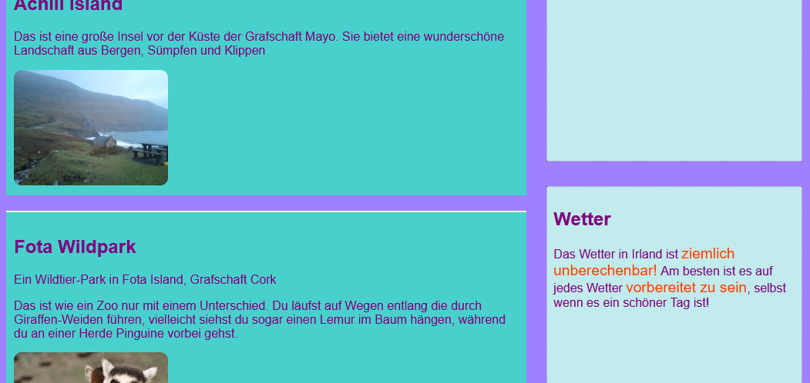
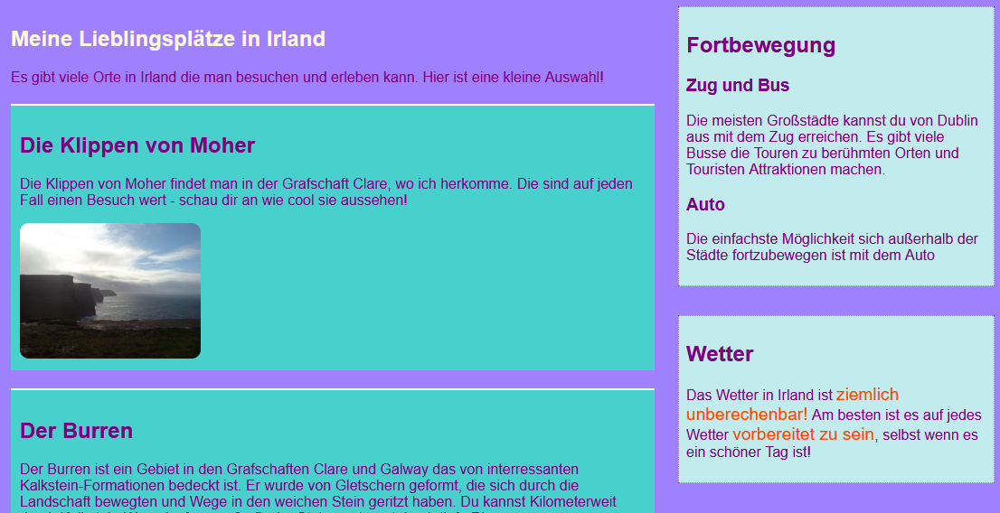

## Gestalte coole Seitenlayouts

+ Für diese Karte solltest Du mit einer Seite arbeiten, die ein `main`Element mit drei Elementen beinhaltet: ein `article` und zwei `aside`-Elemente. Erstelle diese zuerst, wenn Du musst. Wenn Du mit meiner Website arbeiten möchtest, füge den `aside` Code von der vorherigen Sushi-Karte zur Attraktionen-Seite hinzu. 

Hier sind drei verschiedene Seitenlayouts die du anwenden wirst:


+ Füge neue CSS-Klassen zum `main` und jedem der drei Elementen darin hinzu.

```html
    <main class="attPageLayoutGrid">
        <article class="attGridArticle">
            <!--Anderes Zeug hier-->
        </article>
        <aside class="attGridAside1">
            <!--Anderes Zeug hier-->
        </aside>
        <aside class="attGridAside2">
            <!--Anderes Zeug hier-->
        </aside>
    </main>
```

Der Container, für den Du das Layout ändern wirst, ist `main`, aber Du kannst das mit jeder Art von Container tun, zum Beispiel mit einem `div` oder `article` oder sogar der ganzen Seite `body`. Die Technik, die Du verwenden wirst, heißt **CSS Grid**.

In diesem Beispiel werden die Kopfzeile (`header`) und Fußzeile (`footer`) aus dem Entwurf herausgenommen, aber es ist durchaus üblich, sie auch in das Grid (Raster) aufzunehmen.

+ Setze die Eigenschaft `display` auf `grid` für den umfassenden Container:

```css
    .attPageLayoutGrid {
        display: grid;
        grid-column-gap: 0.5em;
        grid-row-gap: 1em;
    }
```

Was glaust Du, was die Eigenschaften `grid-coulmn-gap` (Raster-Spalten-Lücke) und `grid-row-gap` (Raster-Zeilen-Lücke) bewirken?

+ Als nächstes benennst Du eine `grid-area` (engl.: Raster-Fläche) für jedes Element: 

```css
    .attGridArticle {
        grid-area: agArticle;
    }
    .attGridAside1 {
        grid-area: agAside1;
    }
    .attGridAside2 {
        grid-area: agAside2;
    }
```

Dann gestaltest Du dein Layout! Lass uns die beiden `aside` Elemente nebeneinander am unteren Rand der Seite platzieren. Dazu benötigst Du zwei Spalten (engl.: **columns**) gleicher Breite. Du kannst die Zeilen-Höhe (engl.: **row**) automatisch belassen.

+ Füge den folgenden Code innerhalb der `.attPageLayoutGrid` CSS-Regel hinzu:

```css
    grid-template-rows: auto;
    grid-template-columns: 1fr 1fr;
    grid-template-areas: 
        "agArticle agArticle"
        "agAside1 agAside2";
```

`fr` steht für **fraction** (engl.: Bruchteil). Beachte, wie Du den "Artikel" (`article`) den gesamten Platz über die beiden Spalten belegen lässt.

## \--- collapse \---

## title: Hilfe! Ich habe Fehler und Warnungen erhalten!

Wenn Du Trinket verwendest, werden möglicherweise einige Fehler und Warnungen angezeigt, auch wenn Du den Code genau wie oben eingegeben hast. Das liegt daran, dass Trinket die CSS-Raster Eigenschaften noch nicht erkennt. Der Code wird jedoch trotzdem funktionieren.

Falls der CSS-Grid-Code Dir "unknown property"-Warnungen (also "unbekannte Eigenschaft") oder einen Fehler wie "unexpected token 1fr" ("unerwartetes Zeichen") ausgibt, kannst Du diese einfach ignorieren.

\--- /collapse \---



Lass uns die `aside` Elemente nach rechts schieben und sie halb so breit machen wie das `article` Element.

+ Ändere die Werte von `grid-template-columns` und `grid-template-areas` in:

```css
    grid-template-columns: 2fr 1fr;
    grid-template-areas: 
        "agArticle agAside1"
        "agArticle agAside2";
```



+ Wenn du nicht willst, dass die `aside` Elemente sich bis nach unten strecken, kannst Du einen leeren Bereich mit einem Punkt hinzufügen: 

```css
    grid-template-areas: 
        "agArticle agAside1"
        "agArticle agAside2"
        "agArticle . ";
```



\--- challenge \---

## Herausforderung: Erstelle unterschiedliche Layouts für unterschiedliche Bildschirmgrößen

+ Kannst Du die Überprüfungen der Bildschirmgröße, die Du vorhin hinzugefügt hast, verwenden damit sich das Layout ändert, je nach dem wie breit der Bildschirm ist? Hinweis: Wenn Du bereits CSS-Blöcke für jede Bildschirmgröße erstellt hast, kannst Du diesen Blöcken den neuen CSS-Code hinzufügen, anstatt neue zu erstellen.

\--- hints \---

\--- hint \---

Der folgende Code definiert ein Layout für die CSS-Klasse von oben, wenn der Bildschirm größer als 1000 Pixel ist:

```css
    @media all and (min-width: 1000px) {
        .attPageLayoutGrid {
            grid-template-columns: 1fr 1fr;
            grid-template-areas: 
                "agArticle agArticle"
                "agAside1 agAside2";
        }
    }  
```

\--- /hint \---

\--- hint \---

Der folgende Code definiert ein Layout für die CSS-Klasse von oben, wenn der Bildschirm größer als 1600 Pixel ist:

```css
    @media all and (min-width: 1600px) {
        .attPageLayoutGrid {
            grid-template-columns: 1fr 1fr;
            grid-template-areas: 
                "agArticle agAside1"
                "agArticle agAside2"
                "agArticle .";
        }
    }  
```

\---/hint\---

\---/hints\---

\--- /challenge \---

Mit **CSS Grid** kannst Du fast jedes Layout erstellen, das Du möchtest. Wenn Du mehr erfahren möchtest, gehe auf [dojo.soy/html3-css-grid](http://dojo.soy/html3-css-grid){:target="_ blank"}.