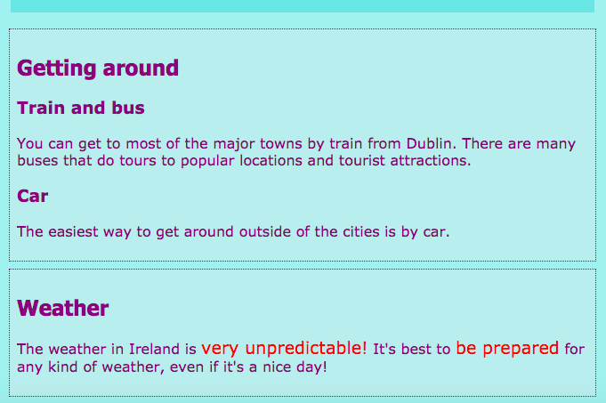

## Bildunterschriften und Randnotizen

Auf dieser Karte lernst du zwei weitere Arten von **Container-** Elementen kennen: eines, mit dem du einem Bild eine Beschriftung (ein Text wie ein Titel oder eine kurze Beschreibung) hinzufügen kannst, und eine weitere, wenn du zusätzliche Sachen hast gehören nicht wirklich zu den wichtigsten Informationen auf einer Seite.

### Bilder mit Bildunterschriften

+ Finden Sie ein `img` Element, in dem Sie Text oberhalb oder unterhalb des Bildes haben. Ich arbeite mit dem Tito Bild auf `index.html`, aber Sie können mit was auch immer auf Ihrer Website gehen. 

```html
            
  <p>
    Reiseführer Tito!
  </p>
```

+ Fügen Sie in der Zeile über dem Code das öffnende Tag `<figure>`. Platzieren Sie in einer neuen Zeile unter dem Code das schließende Tag `<\ figure>`.

+ Als nächstes entfernen Sie die `p` Tags oder welche Tags Sie haben um den Text (vielleicht ist es eine Überschrift, wie `h2`?), Und setzen Sie den Text stattdessen zwischen `<figcaption> <\ figcaption>` Tags. Das Ganze sollte ungefähr so ​​aussehen:

```html
  <figure>
                
      <figcaption>
      Reiseführer Tito!
      </figcaption>
  </figure>
```

Das Element `figcaption` ist Ihre **Beschriftung**. Es kann entweder über das Element `img` oder darunter gehen.


## \--- Einsturz \---

## titel: Warum ist das nützlich?

Das Element `Abbildung` fungiert als eine Art von **Container** für Ihr Bild und seine Beschriftung. Dadurch können Sie sie beim Definieren von Stilen als eine Einheit behandeln.

Sie logisch zusammen zu gruppieren hilft auch, gute Struktur in Ihrem Website-Code beizubehalten.

\--- / einklappen \---

Sie können CSS-Code verwenden, um `Abbildung` und `Abbildung` wie jedes andere Element, das Klassen, IDs oder Elementselektoren verwendet, zu stylen. Ich füge die folgenden Regeln hinzu, um den zusätzlichen Abstand zu entfernen, der vom neuen Container hinzugefügt wurde:

```css
  Abbildung {margin-top: 0px; Rand unten: 0px; Rand links: 0px; Rand rechts: 0px; }
```

### Seitliche Notizen

Die Seite "Sehenswürdigkeiten" auf meiner Website enthält eine Liste mit Orten, die Sie besuchen möchten. Ich möchte einige Anmerkungen zum Wetter und zur Fortbewegung machen. Diese Information gehört nicht wirklich in das Element `Artikel` mit allen Attraktionen. Dies ist ein Beispiel dafür, wann Sie das Element `sided` verwenden könnten.

+ Gehe zu einer Seite deiner Webseite, die ein `Artikel` Element enthält - ich benutze `attractions.html`.

+ **Draußen** der `Artikel` Element, fügen Sie ein oder mehrere Paare von `<aside> <beiseite>` Tags mit Ihren zusätzlichen Sachen.

```html
  <aside class="sideNoteStyle">
      <h2>Fortbewegung in der Stadt</h2>
      <h3>Zug und Bus</h3>
      <p>Von Dublin aus erreichen Sie die meisten größeren Städte mit dem Zug. Es gibt viele Busse, die Touren zu beliebten Orten und Touristenattraktionen machen.</p>
      <h3>Auto</h3>
      <p>Der einfachste Weg, sich außerhalb der Städte fortzubewegen, ist mit dem Auto.</p>
    </aside>
    <aside class="sideNoteStyle">
      <h2>Wetter</h2>
      <p>Das Wetter in Irland ist <span class="specialText">sehr unberechenbar!</span> Es ist am besten zu <span class="specialText">hergestellt werden ,</span> für jede Art von Wetter, auch wenn es ein schöner Tag ist!</p>
  </aside>
```

## \--- Einsturz \---

## titel: Warum ist das nützlich?

Die `beiseite`, `Artikel`und andere Behälter sind alle ähnlich. Der einzige wirkliche Unterschied ist in der **Bedeutung**, das heißt, was Sie sie für verwenden.

Es ist wichtig, wann immer möglich aussagekräftige HTML-Elemente zu verwenden. Es verleiht Ihrer Website eine bessere Struktur und ist besonders hilfreich für Personen, die **Bildschirmleseprogramme verwenden**.

\--- / einklappen \---

Hast du das andere Element dort gefunden, `span`? Dies ist ein spezielles Tag, das Sie nur zum Hinzufügen zusätzlichen CSS-Codes verwenden können! Sie können alles zwischen ein Paar von `Span` Tags setzen. Es ist nützlich für Dinge wie Styling eines **Teil** des Textes in einem Absatz.

+ Fügen Sie Ihrem Stylesheet den folgenden CSS-Code hinzu, um den Stil für den obigen HTML-Code zu vervollständigen.

```css
  .sideNoteStyle {border: gepunktet 1px lila; Hintergrundfarbe: # c1ebec; Auffüllen: 0.5em; Marge: 0.5em; } .SpezialText {color: # FF4500; Schriftgröße: größer; }
```



Auf der nächsten Karte erfahren Sie, wie Sie das Layout Ihrer Website interessanter gestalten können!

+ Um sich fertig zu machen, erstellen Sie eine Seite, die einen `Artikel` und zwei `Seiten` Elemente innerhalb der `<main> </main>` Tags enthält. Oder wenn Sie möchten, können Sie mit der Seite "Attraktionen" auf meiner Website arbeiten.