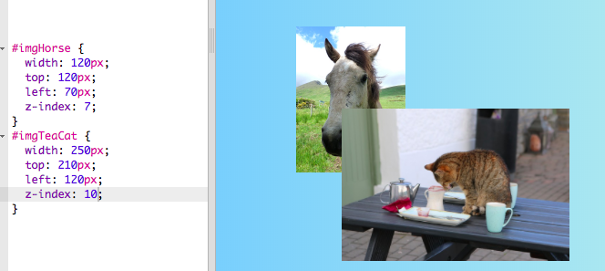

## Fotocollage

Auf dieser Karte lernst Du, wie Du CSS verwenden kannst um HTML-Elemente genau zu positionieren und eine Fotocollage zu erstellen.


+ Füge ein `div` zu Deiner Seite hinzu und packe so viele Bilder hinein wie du möchtest. Gib dem `div`- und den `img`-Elementen `id` Werte.

```html
    <div id="photoBox" class="relPos">
        
        
    </div>
```

Die Fotos werden nacheinander auf der Webseite angezeigt, in der Reihenfolge, in der sie in Deinem Code auftauchen.

+ Füge in Deiner CSS-Datei die folgende CSS-Klasse für die Elemente im `div` hinzu: 

```css
    .absPos {
        position: absolute;
    }
```

+ Als nächstes musst Du die Eigenschaft `position: relative;` zum Container selbst hinzufügen und eine Größe für ihn definieren. Das bewirkt, dass die Positionen der anderen Elemente **relativ zum** (d. h. innerhalb des) Container definiert werden.

```css
    .relPos {
        position: relative;
    }

    #photoBox {
        width: 800px;
        height: 400px;
    }
```

+ Erstelle dann eine Reihe von Stilregeln für jedes der Elemente, indem Du **ID-Selektoren** verwendest, um deren Größeeigenschaften `width`- (Breite) und/oder `height`- (Höhe), sowie deren genaue Position festzulegen.

Um die Position eines Elements zu definieren, kannst Du vier Eigenschaften verwenden: `left` (links), `right` (rechts), `top` (oben) und `bottom` (unten). Sie geben an, wie weit die Kanten vom Rand des übergeordneten Elements entfernt sein sollen. Verwende entweder `top` oder `bottom` für die vertikale Position und entweder `left` oder `right` für die horizontale Position.


+ Wähle genaue Positionen für jedes deiner Bilder aus und definiere diese Positionen in deinen CSS-Regeln mithilfe der Eigenschaften `left`, `right`, `top` und `bottom`. Zum Beispiel platziert dieser Code das Katzenbild auf 100 Pixel von oben und 60 Pixel von links:

```css
    #imgTeaCat {
        width: 250px;
        top: 100px;
        left: 60px;
    }
```

Hinweis: Die Positionswerte können auch negativ sein! Wenn Du einen negativen Wert verwendest, wird das Element außerhalb des Containers, über die angegebene Kante hinaus, verschoben.

### Dinge überlappen lassen

Vielleicht möchtest Du einige der Bilder überlappen lassen. Aber wie kannst du auswählen, welches oben drauf liegt?

+ Wähle zwei Bilder aus und weise ihnen Positionen zu, die zu einer Überlappung führen.

+ Füge eine zusätzliche Eigenschaft, `z-index: 10;` zu einem von ihnen hinzu, und füge dann `z-index: 7;` zum anderen hinzu.

+ Wirf einen Blick auf das Ergebnis auf Deiner Webseite.


+ Tausche jetzt die `z-Index` Werte, sodass `7` und `10` genau umgekehrt sind. Siehst Du einen Unterschied auf Deiner Webseite?



## \--- collapse \---

## title: Wie funktioniert ein z-Index?

Mit der `z-index` Eigenschaft kannst Du festlegen, wie sich zwei oder mehr Elemente überlappen sollen. Der Wert kann jede beliebige ganze Zahl sein.

Das Element mit der **höchsten** Nummer landet ganz **oben**auf dem Stapel oder, mit anderen Worten, ganz **vorne**. Das Element mit der nächsthöheren Nummer befindet sich dahinter und vor den anderen und so weiter, bis Du zu dem Element mit der niedrigsten Nummer kommst, das hinter allen anderen Elementen angezeigt wird.

\--- /collapse \---

Du kannst auf diese Weise beliebige HTML-Elemente positionieren, nicht nur Bilder. Zum Beispiel kannst Du ein `p` Element verwenden, um Text über ein Foto zu legen.

\--- challenge \---

## Herausforderung: Erstelle eine Fotocollage

+ Versuche, Deine eigene Collage mit Fotos, wie die unten abgebildeten, zu erstellen! Verwende exakte Positionierung zusammen mit verschiedenen `z-index` Werten, um den Überlappungseffekt so hinzubekommen, wie Du es willst.

\--- hints \---

\--- hint \---

Unten ist der HTML-Code für die Fotocollage auf meiner Irland-Website. Es befinden sich sechs Fotos und ein Stück Text in einem `div` Element.

```html
    <div id="photoBox" class="relPos">
        
        
        
        
        
        
        <p id="photoText" class="absPos">Irland</p>
    </div>
```

\---/hint\---

\--- hint \---

Hier sind die CSS-Regeln, die die Positionen für jedes meiner Bilder in der Collage festlegen:

```css
    #imgHorse {
        width: 120px;
        top: 200px;
        left: 390px;
        z-index: 10;
    }
    #imgSheep {
        width: 200px;
        top: 100px;
        left: 20px;
        z-index: 8;
    }
    #imgCoast {
        width: 150px;
        top: 250px;
        left: 10px;
        z-index: 5;
    }
    #imgTrees {
        width: 110px;
        top: 65px;
        left: 205px;
        z-index: 9;
    }
    #imgTeaCat {
        width: 250px;
        top: 210px;
        left: 160px;
        z-index: 7;
    }
    #imgStreet {
        width: 180px;
        top: 90px;
        left: 310px;
        z-index: 6;
    }
    #photoText {
        font-family: "brush script MT";
        color: lightgreen;
        font-size: 4em;
        left: 35px;
        top: 15px;
        z-index: 20;
    }
```

\--- /hint \---

\--- hint \---

Hier sind die CSS-Klassen, die ich verwendet habe:

```css
    .collagePhoto {
        border: 1px solid white;
    }
    .relPos {
        position: relative;
    }
    .absPos {
        position: absolute;
    }
```

\--- /hint \---

\---/hints\---


\--- /challenge \---