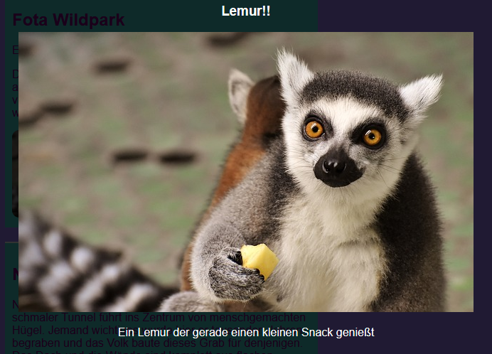

## Spezialeffekte

Auf dieser Karte erfährst Du ein paar weitere nette Effekte, die Du mit CSS erzielen kannst.

### Schatten und Bewegung

Lass uns ein bisschen Bewegung hinzufügen, wenn du deinen Mauspfeil über die Karten bewegst, die du vorhin gemacht hast.

+ Finde die `.card:hover` CSS-Klasse von vorhin und ändere sie wie folgt:

```css
    .card:hover {
        box-shadow: 0px 2px 2px rgba(0,0,0,0.2); 
        transform: translateY(-2px);
    }
```

+ Probiere verschiedene Werte in der `translate` (engl.: Übersetzen) Funktion aus!

--- collapse ---
---
title: Die `transform` Eigenschaft
---

Falls Du die Intermediate HTML/CSS Sushi Karten abgeschlossen hast, kannst Du dich vielleich daran erinnern, die Eigenschaft `transform` in einigen `@keyframes` Animationen verwendet zu haben. Hier siehst Du, dass Du die Eigenschaft auch für sich alleine in einem regulären CSS-Block verwenden kannst.

Ein Wert, auf den Du sie setzen kannst, ist `rotate`, um ein Element zu drehen. Andere sind `translateY`, das etwas nach oben oder unten bewegt und `translateX`, für Bewegungen von einer Seite zur anderen.

--- /collapse ---

+ Spiele mit verschiedenen Pixelwerten in der Eigenschaft `box-shadow` um zu sehen, was sie tut. 

--- collapse ---
---
title: Was ist `rgba`?
---

`rgba (0,0,0,0.2)` ist eine andere Möglichkeit, eine Farbe zu definieren.

Es hat die üblichen drei Zahlen (von `0` bis zu `255`) für Rot, Grün und Blau.

Die vierte Zahl, die als **Alpha**-Wert bezeichnet wird, definiert, wie **transparent** (oder durchsichtig) etwas ist. Es ist eine Dezimalzahl zwischen `0` und `1`, wobei `1` überhaupt nicht durchsichtig und `0` vollständig unsichtbar ist. Das bedeutet, je niedriger der Alpha-Wert eines Elements ist, desto durchsichtiger ist es.

--- /collapse ---

+ Zum Schluss "glättest" Du die Bewegung, indem Du der Klasse `.card`, von vorhin, die folgende Eigenschaft hinzufügst: 

```css
    transition: all 0.2s ease-out;
```

Eine Dauer von `0.2s` bedeutet, dass der Übergang (engl.: `transition`) 0,2 Sekunden dauert.

### Leuchtkasten

Ein weiterer Effekt, den Du wahrscheinlich auf vielen Websites gesehen hast, ist die **lightbox** (engl.: Leuchtkasten): Du klickst auf etwas und die Website wird abgedunkelt, während etwas anderes, zum Beispiel ein größeres Bild oder ein Popup-Fenster, vor allem Anderen angezeigt wird.



Um diesen Effekt zu erzielen, erstellst Du zwei Links: einen für die eigentliche "Lightbox" (das was angezeigt wird) und einen für die Sache, die Du anklickst, um die "Lightbox" erscheinen zu lassen. Ich werde meine auf der Seite "Attraktionen" meiner Website hinzufügen. Du nimmst einfach irgendeine Seite auf der Du Bilder hast!

+ Entscheide, welche Dinge angezeigt werden sollen, wenn Du klickst und füge sie alle zu Deiner Seite, zwischen einem Satz von `a` Tags hinzu, um einen Link zu erstellen. Stell sicher dem Link eine `id` zu geben. Der Code kann überall auf der Seite stehen: Du machst die Elemente im nächsten Schritt unsichtbar!

```html
    <a href="#_" class="lightbox" id="boxLemur">
        <h3>Lemur!!</h3>
        
        <p>Ein Lemur der seinen kleinen Imbiss genießt</p>
    </a>
```

Du kannst zwischen die Link-Tags alles setzen, was Du willst. Ich habe ein großes Bild, eine Überschrift und einen Text. Vielleicht möchtest Du nur ein Bild und keinen Text!

+ Füge den folgenden CSS-Code für die Lightbox hinzu. Kannst du herausfinden, was einiges davon macht?

```css
    .lightbox{
        background: rgba(0,0,0,0.8);
        color: #ffffff;
        text-align: center;
        text-decoration: none;
        width: 100%;
        height: 100%;
        top: 0;
        left: 0;
        position: fixed;
        visibility: hidden;
        z-index: 999;
    }
```

Hinweis: Das Setzen der `position` Eigenschaft auf `fixed` bedeutet, dass die Position, die Du setzt, relativ zum Browserfenster ist, sie also beim Scrollen gesetzt bleibt.

+ Entscheide als Nächstes, auf welches Element Du klicken möchtest, um die Lightbox anzuzeigen und füge ein Paar von `a` Tags um dieses Element hinzu (in meinem Fall handelt es sich um ein kleineres Bild eines Lemurs). Das Ziel (engl.: **target**) des Links wird die Lightbox sein, die Du mit der `id` festlegst. Du wirst diese Technik vielleicht von früher erkennen!

```html
    <a href="#boxLemur">
        
    </a>
```

+ Füge abschließend den folgenden CSS-Code hinzu. Beachte, dass das eine **Pseudoklasse** ist. Sie sollte nach dem Code für die `.lightbox` Klasse stehen und nicht innerhalb der Klasse!

```css
    .lightbox:target {
        visibility: visible;
    }
```

Die `:target` Pseudoklasse wird angewendet, wann immer die lightbox das Ziel des letzten Links war. Wenn Du also irgendwo klickst, wird die Eigenschaft `visibility` (engl.: Sichtbarkeit) zurück auf `hidden` (engl.: versteckt) gesetzt.

+ Versuch auf deinen neuen Link zu klicken, um zu sehen wie deine Lightbox erscheint! Um sie verschwinden zu lassen, klicke einfach irgendwo auf der Seite.

Du kannst so viele Lightboxen, wie du willst zu einer Seite hinzufügen. Sie können alle dieselbe CSS-Klasse verwenden - stelle nur sicher, dass jede eine andere `id` verwendet! Für jede musst Du etwas auf Deiner Webseite zu einem Link machen, den Du anklicken kannst, um die Lightbox erscheinen zu lassen, nutze dann die `id` als `href` Wert in diesem Link, wie Du es oben getan hast!


***
Dieses Projekt wurde von freiwilligen Helfern übersetzt:

Tassilo Scherrer

Dennis Weber

Dank freiwilliger Helfer können wir Menschen auf der ganzen Welt die Möglichkeit geben, in ihrer eigenen Sprache zu lernen. Du kannst uns helfen, mehr Menschen zu erreichen, indem Du dich freiwillig zum Übersetzen meldest - weitere Informationen unter [rpf.io/translate](https://rpf.io/translate).