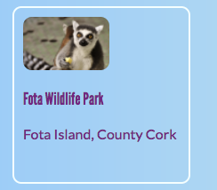

## Clickable cards

Here's a technique you could use to make a photo gallery, or a portfolio page showing off all of your projects: little **preview cards**. 



- Add the following HTML code to your website, anywhere you like. I'm doing mine on `index.html`. You can change the picture and text to suit your own preview cards. I'm going to do a bunch of highlights of the tourist attractions in Ireland.

```html
    <article class="card">
        
        <h4>Fota Wildlife Park</h4>
        <p>Fota Island, County Cork</p>
    </article>
```
    
- Add the following CSS code for the classes `card` and `smallPics` as well as for the heading `h3`:

```css
    .smallPics {
        height: 60px;
        border-radius: 10px;
    }
    .card {
        width: 200px;
        height: 200px;
        border: 2px solid #F0FFFF;
        border-radius: 10px;
        box-sizing: border-box;
        margin-top: 10px;
        font-family: "Lato", sans-serif;
    }
    .card:hover {
        border-color: #1E90FF;
    }
```

The `Lato` font-family is used a lot in CoderDojo materials. You can also use `League Gothic` for a "CoderDojo-y" heading:

```css
    h3 {
        font-family: "League Gothic", sans-serif;
        font-style: normal;
        font-weight: 400;
    }
```

- Let's turn the whole thing into a link so people can click to see more information. Place the whole `article` element inside a link element. Make sure the closing `</a>` tag is after the closing `</article>` tag! Feel free to change the link **URL** to whatever you want to link to. That could be another page on your website or it could be another website entirely.

```html
    <a href="attractions.html#scFota">  
        <article class="card ">
            
            <h3>Fota Wildlife Park</h3>
            <p>Fota Island, County Cork</p>
        </article>
    </a>
```

Notice how the value of `href` in my link ends in `#scFota`? This is a neat trick you can use to jump to a particular part of a page. First you type the URL of the page to link to, followed by `#`. In the code file for the page you are linking to, find the part you want to jump to and give that element an `id`, for example, `<section id="scFota"`. The value of the `id` is what you type after the `#` in your link.

- Now that the whole thing is a link, the text font may have changed. You can fix it by adding a **CSS class** to the link, `class="cardLink"`. Here's the CSS code to put in your stylesheet:

```css
    .cardLink {
        color: inherit;
        text-decoration: none;
    }
```
   
Setting the value of any property to `inherit` makes it use the value that the **parent** element has, so in this case the text colour will match the rest of the text on the homepage.

- Make at least four or five of these cards. If you are working from my example website you could do one for each of the sections on the attractions page. On the next Sushi Card you'll arrange the cards with a cool trick!