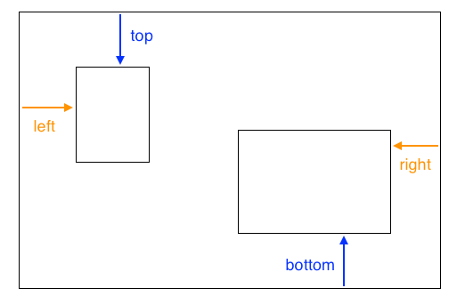

## Photo collage

On this card you will use CSS to position HTML elements exactly and make a photo collage. 


+ Add a `div` to your page and put as many images in it as you like. Give the `div` and the `img` elements `id` values.

```html
    <div id="photoBox" class="relPos">
        
        
    </div>
```
   
The photos will appear one after the other on the web page, in the order they appear in your code.
   
+ In your CSS file, add the following CSS class for the elements inside the `div`. The property `position: absolute;` lets you choose exact positions for them.  create an empty set of style rules for each of the elements using **id selectors**, and choose a size for each picture.

```css
    .absPos {
        position: absolute;
    }
```

+ Next, you need to add the property `position: relative;` to the container itself and define a size for it. This makes it so that the positions of the other elements are defined **relative to** (i.e. **within**) the container.

```css
    .relPos {
        position: relative;
    }
    #photoBox {
        width: 800px;
        height: 400px;
    }
```

+ Then, choose the exact size and position you want for each picture. There are four properties you can use: `left`, `right`, `top`, and `bottom`. They represent how far each of the edges should be from the parent's edge. Use either `top` or `bottom` for the vertical position and use either `left` or `right` for the horizontal position.



This code places the cat picture **100 pixels** from the top and **60 pixels** in from the left.
```css
    #imgTeaCat {
        width: 250px;
        top: 100px;
        left: 60px;
    }
```

Note: The position values can also be negative!

+ 

+ Try using the `z-index` property to make some of your images overlap.

```css
    #imgHorse {
        width: 120px;
        top: 20px;
        left: 10px;
        z-index: 10;
    }
    #imgTeaCat {
        width: 250px;
        top: 100px;
        left: 60px;
        z-index: 7;
    }
```

--- collapse ---
---
title: How does z-index work?
---

The `z-index` property lets you decide how the elements should overlap.

The value can be any whole number. 

The element with the **highest** number ends up on **top** of the pile!

--- /collapse ---

You can position any html elements in this way, not just images. 

+ Try creating your own collage of photos, perhaps with some text over the top! Use exact positioning together with different `z-index` values to get the overlap effect the way you want it.
