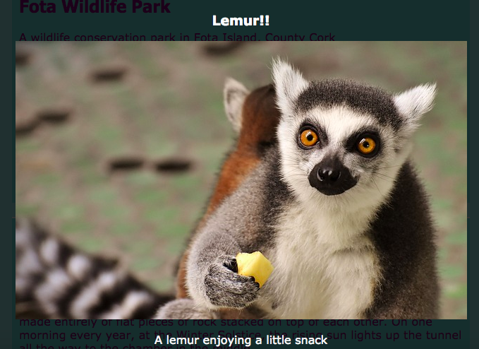

## Efectos especiales

En esta tarjeta, aprenderás algunos efectos más bonitos que puedes lograr con CSS.

### Sombras y movimiento

Agreguemos un pequeño movimiento cuando coloque el cursor sobre las cartas que hizo anteriormente.

+ Encuentra el `.card: hover` clase CSS de antes y el cambio a la siguiente:

```css
    .card: hover {box-shadow: 0px 2px 2px rgba (0,0,0,0.2); transformar: traducirY (-2px); }
```

+ ¡Pruebe diferentes valores en la función `translate`!

## \--- colapso \---

## título: La propiedad `transform`

Si completó las tarjetas intermedias HTML / CSS Sushi, puede recordar el uso de la propiedad `transform` en algunas animaciones de `@keyframes`. Aquí puede ver que también puede usar la propiedad por sí solo dentro de un bloque de CSS normal.

Un tipo de valor que puede establecer es `rotar`, para hacer que un elemento gire. Otros son `translateY`, que mueve algo hacia arriba o hacia abajo, y `translateX`, para el movimiento de un lado a otro.

\--- /colapso \---

+ Juega con diferentes valores de píxeles en la propiedad `box-shadow` para ver lo que hacen. 

## \--- colapso \---

## título: ¿Qué es `rgba`?

`rgba (0,0,0,0.2)` es otra forma de definir un color.

Tiene los tres números habituales (desde `0` hasta `255`) para rojo, verde y azul.

El cuarto número, llamado el valor de **alfa** , define cómo es **transparente** (o transparente). Es un número decimal entre `0` y `1`, donde `1` no es transparente y `0` es completamente invisible. Esto significa que cuanto menor sea el valor alfa de un elemento, más transparente será.

\--- /colapso \---

+ Finalmente, suavice el movimiento agregando la siguiente propiedad a la clase `.card` de antes: 

```css
    transición: todos los 0.2 segundos de alivio;
```

Una duración de `0.2 s` significa que la `transición` dura 0.2 segundos.

### Caja ligera

Otro efecto que probablemente haya visto en muchos sitios web es **lightbox**: hace clic en algo y el sitio web se oscurece, mientras que otra cosa, como una imagen más grande o un cuadro emergente, aparece delante de todo.



Para obtener este efecto, creará dos enlaces: uno para el lightbox real (el bit que aparece) y otro para el que haga clic para que aparezca el lightbox. Voy a hacer el mío en la página de Atracciones de mi sitio web. ¡Vaya con la página en la que tenga fotos!

+ Decida qué cosas desea que aparezca cuando haga clic y agréguelas a su página entre un conjunto de etiquetas de `a` para crear un enlace. Asegúrate de darle al enlace un `id`. El código puede ir a cualquier parte de la página: ¡hará que los elementos sean invisibles en el siguiente paso!

```html
    <a href="#_" class="lightbox" id="boxLemur">
        <h3>Lemur !!</h3>
        
        <p>Un lémur disfrutando de un pequeño refrigerio</p>
    </a>
```

Puedes poner lo que quieras entre las etiquetas de enlace. Tengo una imagen grande, un encabezado y algo de texto. ¡Quizás solo quieras una foto y no texto!

+ Agregue el siguiente código CSS para el lightbox. ¿Puedes averiguar qué hace algo de eso?

```css
    .lightbox {background: rgba (0,0,0,0.8); color: #ffffff; text-align: center; texto-decoración: ninguno; ancho: 100%; altura: 100%; arriba: 0; izquierda: 0; posición: fija; visibilidad: oculta; índice z: 999; }
```

Nota: Ajuste del `posición` propiedad a `fija` significa la posición que fije se relativa a la ventana del navegador, por lo que quedarse cuando se desplaza.

+ Luego, decida en qué cosa desea hacer clic para que aparezca el lightbox, y agregue agregar un par de etiquetas de `a` alrededor de ese elemento (en mi caso, es una imagen más pequeña de un lémur). El **objetivo** del enlace será el lightbox, que se establece con el `id`. ¡Podrías reconocer esta técnica desde antes!

```html
    <a href="#boxLemur">
        
    </a>
```

+ Finalmente agregue el siguiente código CSS. Tenga en cuenta que esta es una **pseudo-clase**; ¡debe ir después del código para la clase `.lightbox` y no dentro de él!

```css
    .lightbox: target {visibility: visible; }
```

La pseudo-clase `: target` se aplica siempre que el lightbox sea el objetivo del último enlace en el que se hizo clic. Entonces, cuando haces clic en cualquier lugar, la `visibilidad` volverá a ser `ocultos`.

+ Intente hacer clic en su nuevo enlace para ver que aparece el lightbox. Para que desaparezca, simplemente haga clic en cualquier lugar de la página.

Puede agregar tantos lightboxes como desee a una página. Todos pueden usar la misma clase de CSS, ¡solo asegúrense de que cada uno tenga una `id`diferente! Para cada uno, necesitas hacer algo en tu página web en un enlace en el que puedas hacer clic para que aparezca el lightbox, y luego usar el `id` como el valor de `href` en ese enlace, tal como lo hiciste arriba.