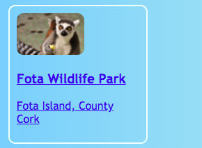

## Tarjetas interactivas

Aquí tiene una técnica que puede usar para crear una galería de fotos, o una cartera de proyectos: pequeño **tarjetas previsualizadas**.


+ Añada el siguiente código HTML a su sitio web, en el lugar que prefiera. Estoy haciendo el mío en ` index.html `. Puede cambiar la imagen y el texto para adaptarse a sus propias tarjetas de vista previa. Voy a hacer unos cuantos puntos de interés de las atracciones turísticas de Irlanda.

```html
    <article class="card">
        
        <h3>Fota Wildlife Park</h3>
        <p>Fota Island, County Cork</p>
    </article>
```


+ Añada el siguiente código CSS para crear las clases `tarjeta` y `tinyPicture`:

```css
    .tinyPicture {
        altura: 60px;
        radio del borde: 10px;
    }
    .tarjeta {
        ancho: 200 px;
        altura: 200px;
        borde: 2px sólido # F0FFFF;
        radio del borde: 10px; 
       Tamaño de las cajas: caja de borde;
        relleno: 10px;
        margen superior: 10px;
        familia de fuentes: "Trebuchet MS", sans-serif;
    }
    .tarjeta: hover {
        color del borde: # 1E90FF;
}
```


Vamos a convertir toda la tarjeta de vista previa en un enlace para que la gente pueda hacer clic para ver más información.

+ Coloque todo el elemento `artículo` dentro de un elemento de enlace. ¡Asegúrese de que la etiqueta de cierre `</a>` es después de la etiqueta de cierre `</article>`! No dude en cambiar el enlace **URL** a lo que quiera enlazar. Eso podría ser otra página en su sitio web, o podría ser otro sitio web completamente distinto.

```html
    <a href="attractions.html#scFota">  
        <article class="card ">
            
            <h3>Fota Wildlife Park</h3>
            <p>Fota Island, County Cork</p>
        </article>
    </a>
```



## \--- collapse \---

## título: Enlazando a una parte específica de una página

¿Puede observar cómo el valor de ` href ` en mi enlace termina en ` #scFota `? Este es un truco muy bueno que puede usar para saltar a una parte específica de una página.

+ Primero, escriba la URL de la página a la que va a enlazar, seguido de `#`.

+ En el archivo de código de la página a la que se enlaza, encuentre la parte a la que desea saltar y dé a ese elemento un `id`, por ejemplo, `<section id="scFota"`. El valor de `id` es lo que escribe después de `#` en su enlace.

\--- /collapse \---

## \--- collapse \---

## título: Restableciendo estilos

Ahora que toda la tarjeta de vista previa es un enlace, la fuente de texto puede haber cambiado.

+ Si es así, puede arreglarlo añadiendo **CSS class** al enlace: `class="cardLink"`. Aquí está el código CSS para poner en su hoja de estilo:

```css
    .cardLink {
        color: heredar;
        decoración de texto: ninguno;
    }
```

Configurar el valor de cualquier propiedad a `heredar` hace que utilice el valor que tiene el elemento **padre**. Así que en este caso, el color de texto coincidirá con el resto del texto en la página principal.

\--- /collapse \---

+ Haga al menos cuatro o cinco de estas cartas. Si está trabajando desde mi sitio web de ejemplo, podría hacer una para cada una de las secciones de la página de Atracciones. ¡En la próxima tarjeta Sushi, aprenderás a organizar las cartas con un truco super guay!