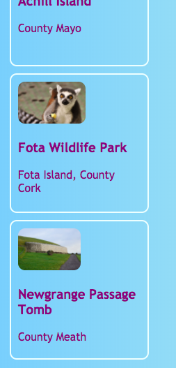

## Tarjetas clicables

Esta es una técnica que puede usar para crear una galería de fotos o una página de cartera que muestre sus proyectos: tarjetas de vista previa **pequeñas**.



+ Agregue el siguiente código HTML a su sitio web, en cualquier lugar que desee. Estoy haciendo lo mío en `index.html`. Puede cambiar la imagen y el texto para adaptarlo a sus propias tarjetas de vista previa. Voy a hacer un montón de aspectos más destacados de las atracciones turísticas en Irlanda.

```html
    <article class="card">
        
        <h3>Fota Wildlife Park</h3>
        <p>Fota Island, Condado de Cork</p>
    </article>
```


+ Agregue el siguiente código CSS para crear las clases `card` y `tinyPicture`:

```css
    .tinyPicture {height: 60px; radio del borde: 10px; } .card {ancho: 200px; altura: 200px; borde: 2px sólido # F0FFFF; radio del borde: 10px; tamaño de caja: border-box; relleno: 10px; margin-top: 10px; familia de fuentes: "Trebuchet MS", sans-serif; } .card: hover {border-color: # 1E90FF; }
```


Vamos a convertir toda la tarjeta de vista previa en un enlace para que las personas puedan hacer clic para ver más información.

+ Coloque todo el elemento `artículo` dentro de un elemento de enlace. ¡Asegúrese de que la etiqueta de cierre `</a>` esté después de la etiqueta de cierre `</article>`! Siéntase libre de cambiar el enlace **URL** a lo que quiera vincular. Esa podría ser otra página en su sitio web, o podría ser otro sitio web completo.

```html
    <a href="attractions.html#scFota">  
        <article class="card ">
            
            <h3>Fota Wildlife Park</h3>
            <p>Fota Island, Condado de Cork</p>
        </article>
    </a>
```


## \--- colapso \---

## título: vincular a una parte específica de una página

¿Nota cómo el valor de `href` en mi enlace termina en `#scFota`? Este es un truco ingenioso que puede usar para saltar a una parte particular de una página.

+ Primero, escriba la URL de la página a la que enlazar, seguida de `#`.

+ En el archivo de código para la página a la que está enlazando, busque la parte a la que desea saltar y otorgue a ese elemento un `id`, por ejemplo, `<sección id = "scFota"`. El valor de `id` es lo que escribe después de `#` en su enlace.

\--- /colapso \---

## \--- colapso \---

## título: Restablecer estilos

Ahora que toda la tarjeta de vista previa es un enlace, la fuente del texto puede haber cambiado.

+ Si es así, puede solucionarlo agregando un **CSS clase** al enlace: `class = "cardLink"`. Aquí está el código CSS para poner en su hoja de estilo:

```css
    .cardLink {color: inherit; texto-decoración: ninguno; }
```

Establecer el valor de cualquier propiedad en `inherit` hace que use el valor que tiene el elemento **parent**. Entonces, en este caso, el color del texto coincidirá con el resto del texto en la página de inicio.

\--- /colapso \---

+ Haga al menos cuatro o cinco de estas tarjetas. Si está trabajando desde mi sitio web de ejemplo, podría hacer uno para cada una de las secciones en la página de Atracciones. En la próxima tarjeta de sushi, ¡aprenderás a organizar las cartas con un truco genial!