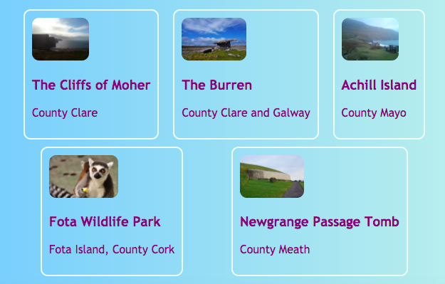
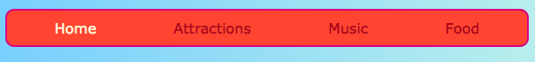
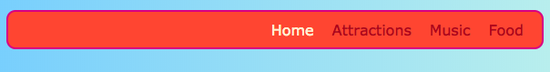

## Todo en una fila

En esta tarjeta aprenderá algunos trucos para organizar las cosas **horizontalmente** en una página. Primero, verás cómo enfocar las cosas. Luego, organizará los elementos uno al lado del otro en una fila.

+ Agregue las siguientes propiedades de CSS a la clase `.card`:

```css
    margin-left: auto; margen-derecha: auto;
```

Deberías ver que las cartas se mueven al centro de la página. Al establecer los márgenes izquierdo y derecho en `automático`, puede hacer que cualquier elemento esté en el medio en lugar de hacia la izquierda.


+ Arrastre el borde de la ventana del navegador para hacer que la página sea más estrecha y amplia: observe que las tarjetas permanecen centradas.

+ Coloque todos los enlaces de tarjeta que acaba de crear en un nuevo elemento de contenedor. No va a ser un `artículo` o un `sección`, sino uno llamado `div`. Este es un contenedor de propósito general que puede usar para agrupar elementos y hacer diseños agradables.

```html
    <div class="cardContainer">
```

+ Agregue el siguiente código CSS en su hoja de estilos:

```css
    .cardContainer {display: flex; flex-wrap: wrap; justify-content: space-around; relleno: 10px; }
```

Voilà! ¡Gracias a **Flex**, tus cartas ahora se muestran una al lado de la otra!

+ Arrastre el borde de la ventana para hacer que el sitio web sea más ancho y más angosto, y observe cómo se mueven las tarjetas para ajustarse al tamaño de la ventana, a veces hasta la siguiente línea.


+ Intente borrar el `anchura de` y `de altura` propiedades del `.card` clase y ver lo que sucede: `Flex` se ajusta inteligentemente las tarjetas juntas como un rompecabezas, manteniendo una altura incluso a través de todo lo que está en la misma fila.



Si tiene un menú de navegación en la parte superior de su página, ese es otro lugar donde puede usar este truco. Su menú debe estar compuesto de elementos de lista ((`li`) para este próximo bit. Si lo prefiere, puede probarlo con mi sitio web.

+ Encuentra las reglas de CSS para el menú. En mi sitio web, esos son los bloques `nav ul`, `nav ul li`y `nav ul li a`.

+ Eliminar la pantalla de la propiedad `: en línea;` de los elementos de la lista. Luego, en la lista `nav ul`, agregue:

```css
    pantalla: flexión; justify-content: flex-start;
```


Terminas con el mismo menú, ¿verdad? Lo bueno de `flex` es que puedes controlar el diseño con la propiedad `justify-content`.

+ Cambie el valor de `justify-content` a `flex-end` y vea qué sucede. O cámbielo a `espacio alrededor de` para que los elementos del menú estén espaciados uniformemente, tal como lo hizo para las tarjetas.





**`flex`** es una herramienta de diseño bastante poderosa que podría llenar toda su propia serie de tarjetas de Sushi; puede obtener más información al respecto en [dojo.soy/html3-flex](http://dojo.soy/html3-flex).