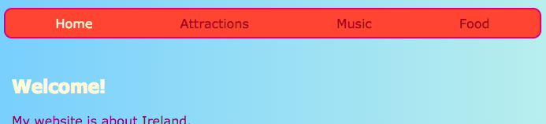

## Haga que su menú responda

A **responda** sitio web es uno que se ajusta al tamaño de pantalla por lo que siempre se ve muy bien, ya sea que esté mirando en un ordenador, teléfono móvil o tableta. ¡Hagamos que su menú responda!

Vamos a empezar con los estilos regulares: este será su **por defecto** comportamiento.

## \--- colapso \---

## title: ¿Qué significa 'default'?

Los estilos predeterminados son su conjunto normal de reglas de estilo. Se aplican sin importar qué, antes de verificar cualquier condición especial.

Puede agregar código que luego verifica el tamaño de la pantalla y realiza algunos ajustes si es necesario.

\--- /colapso \---

+ Agregue las siguientes reglas de CSS a su menú. Probablemente también tenga colores y bordes definidos; ¡Los dejé para ahorrar espacio aquí! Si ya tiene reglas CSS definidas para su menú, solo agregue o cambie las propiedades y los valores que se encuentran debajo de los que falta.

```css
    nav ul {relleno: 0.5em; pantalla: flexión; flexión: columna; } nav ul li {text-align: center; list-style-type: none; margen-derecha: 0.5em; margen-izquierda: 0.5em; }
```

Con el código CSS anterior, su menú será más adecuado para pantallas pequeñas. Esto se llama desarrollo de **primero móvil**.


## \--- colapso \---

## title: ¿Qué significa 'mobile-first'?

Muy a menudo, al codificar un sitio web, utilizará una pantalla de computadora, y probablemente definirá sus estilos en función de cómo se ve en esa pantalla.

Cuando primero codifica para dispositivos móviles, en su lugar elige estilos predeterminados que sean adecuados para pantallas pequeñas como teléfonos inteligentes. A continuación, agrega un código adicional para hacer ajustes para pantallas más grandes.

Dado que cada vez más personas navegan por Internet en sus teléfonos inteligentes o tabletas en lugar de en una computadora, es una buena práctica desarrollar su sitio web con esto en mente.

\--- /colapso \---

+ Ahora agregue el siguiente código a su hoja de estilo:

```css
    @media all y (min-width: 1000px) {nav ul {flex-direction: row; justify-content: space-around; }}
```

La primera línea del código anterior comprueba qué tamaño tiene la ventana del navegador. Si la ventana tiene **1000 píxeles** ancho o más, aplicará todas las reglas de estilo dentro del bloque.



## \--- colapso \---

## título: ¿Cómo funciona?

El bloque contiene nuevos valores para solo algunas propiedades del menú `nav ul`.

Siempre que la ventana tenga más de 1000 píxeles, se aplicarán estos nuevos valores en lugar de los que ya definió para `nav ul`.

El resto de las propiedades que definió previamente para `nav ul` se mantendrá igual.

\--- /colapso \---

+ Si está utilizando Trinket para escribir código, puede ser útil descargar el proyecto para que pueda probarlo en una pantalla de tamaño completo.

\--- desafío \---

## Desafío: haga que su menú se ajuste solo para pantallas grandes

+ ¿Se puede agregar otro bloque para pantallas de más de **1600 píxeles**, con `extremos flexibles` lugar de `espacios -alrededor de`?


\--- consejos \---

\--- insinuación \---

El siguiente código define las propiedades flexibles para los elementos del menú cuando la pantalla tiene más de 1600 píxeles:

```css
    @media all y (min-width: 1600px) {nav ul {flex-direction: row; justify-content: flex-end; }}  
```

\--- /insinuación \---

\--- / consejos \---

\--- / desafío \---

Puede poner cualquier regla de CSS que desee en bloques como estos para definir diferentes estilos para diferentes tamaños de pantalla. ¡Será especialmente útil cuando hagas diseños de cuadrículas CSS más tarde!