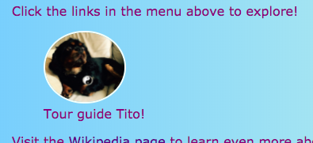

## Leyendas y notas secundarias

En esta tarjeta aprenderá sobre dos tipos más de elementos **contenedor** : uno que puede usar para agregar un título (texto como un título o una breve descripción) a una imagen, y otro para cuando tenga material extra que no lo incluya. realmente pertenece con la información principal en una página.

### Imágenes con subtítulos

+ Encuentre un elemento `img` donde tenga el texto arriba o abajo que vaya con la imagen. Estoy trabajando con la imagen de Tito en `index.html`, pero puede ir con lo que esté en su sitio web. 

```html
            
  <p>
    Guía de turismo Tito!
  </p>
```

+ En la línea arriba del código, agregue la etiqueta de apertura `<figure>`. On a new line below the code, place the closing tag `</figure>`.

+ Next, remove the `p` tags, or whatever tags you have around the text (maybe it's a heading, like `h2`?), and put the text in between `<figcaption> </figcaption>` tags instead. Todo debe verse más o menos así:

```html
  <figure>
                
      <figcaption>
      Guía de turismo Tito!
      </figcaption>
  </figure>
```

El elemento `figcaption` es tu **caption**. Puede ir arriba del elemento `img` o debajo.



## \--- colapso \---

## title: ¿Por qué es esto útil?

El elemento `figura` actúa como una especie de **contenedor** para su imagen y su título. Esto le permite tratarlos como una unidad al definir estilos.

Agruparlos lógicamente también ayuda a mantener una buena estructura en el código de su sitio web.

\--- /colapso \---

Puede usar el código CSS para el estilo `figura` y `figura` como lo haría con cualquier otro elemento usando clases, identificadores o selectores de elementos. Estoy agregando las siguientes reglas para eliminar el espaciado adicional que fue agregado por el nuevo contenedor:

```css
  figure {margin-top: 0px; margin-bottom: 0px; margin-left: 0px; margen-derecha: 0px; }
```

### Notas laterales

La página de Atracciones en mi sitio web es una lista de lugares para visitar. Quiero agregar algunas notas sobre el clima y cómo moverse. Esa información realmente no pertenece al elemento `artículo` con todas las atracciones. Este es un ejemplo de cuándo podría usar el elemento `aside`.

+ Vaya a una página de su sitio web que tiene un elemento de `artículo` en él: estoy usando `atracciones.html`.

+ **Outside** of the `article` element, add one or more pairs of `<aside> </aside>` tags containing your extra stuff.

```html
  <aside class="sideNoteStyle">
      <h2>Cómo desplazarse</h2>
      <h3>Tren y autobús</h3>
      <p>Puede llegar a la mayoría de las principales ciudades en tren desde Dublín. Hay muchos autobuses que realizan recorridos por lugares populares y atracciones turísticas.</p>
      <h3>Coche</h3>
      <p>La forma más fácil de moverse fuera de las ciudades es en automóvil.</p>
    </aside>
    <aside class="sideNoteStyle">
      <h2>Tiempo</h2>
      <p>El clima en Irlanda es <span class="specialText">muy impredecible!</span> Lo mejor es <span class="specialText">estar preparado</span> para cualquier tipo de clima, ¡incluso si es un buen día!</p>
  </aside>
```

## \--- colapso \---

## title: ¿Por qué es esto útil?

El `aparte`, `artículo`y otros contenedores son todos similares. La única diferencia real está en el **significado**, es decir, para qué los usas.

Es importante usar elementos HTML significativos siempre que sea posible. Le da a su sitio web una mejor estructura y es especialmente útil para las personas que usan **lectores de pantalla**.

\--- /colapso \---

¿Viste el otro elemento allí, `span`? ¡Esta es una etiqueta especial que puedes usar solo para agregar código CSS adicional! Puedes poner cualquier cosa entre un par de `etiquetas de span`. Es útil para cosas como diseñar una **parte** del texto en un párrafo.

+ Agregue el siguiente código CSS a su hoja de estilos para completar el diseño del código HTML anterior.

```css
  .sideNoteStyle {border: punteado 1px violeta; color de fondo: # c1ebec; relleno: 0.5em; margen: 0.5em; } .specialText {color: # FF4500; tamaño de fuente: más grande; }
```


En la siguiente tarjeta, aprenderá cómo hacer que el diseño de su sitio web sea más interesante.

+ Para prepararse, haga una página que tenga un `artículo` y dos `aparte` elementos dentro de las `<main> </main>` etiquetas. O si lo prefiere, puede trabajar con la página de Atracciones en mi sitio web.