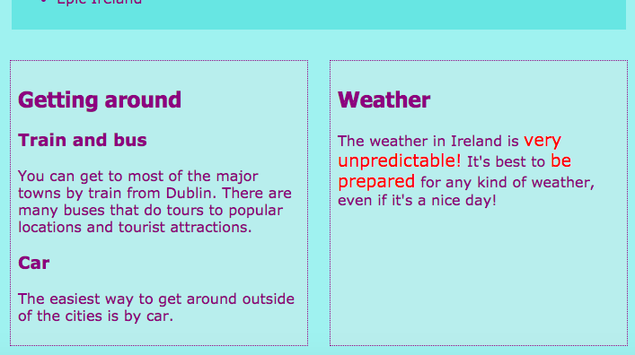

## Diseño de diseños de página geniales

+ Para esta tarjeta, debe trabajar con una página que contiene un `elemento principal` con tres elementos en su interior: uno `artículo` y dos `aparte`s. Adelante, cree estos primero si lo necesita. Si desea trabajar con mi sitio web, agregue el código de `un lado` de la Tarjeta de Sushi anterior a la página de Atracciones. 

Aquí hay tres diseños de página diferentes que aplicará:


+ Agregue nuevas clases de CSS a `principales` y a cada uno de los tres elementos que contiene.

```html
    <main class="attPageLayoutGrid">
        <article class="attGridArticle">
            <! - otras cosas aquí-->
        </article>
        <aside class="attGridAside1">
            <! - otras cosas aquí-->
        </aside>
        <aside class="attGridAside2">
            <! - otras cosas aquí-->
        </aside>
    </main>
```

El contenedor en el que cambiarás el diseño es `principal`, pero puedes hacer esto con cualquier tipo de contenedor, como un `div` o `artículo`, o incluso toda la página `cuerpo`. La técnica que vas a utilizar se llama **CSS grid**.

En este ejemplo, el encabezado `` y `pie` página </code> quedarán fuera del diseño, pero es bastante común incluirlos también en la cuadrícula.

+ Establezca la propiedad `display` en `grid` en el contenedor general:

```css
    .attPageLayoutGrid {display: grid; grid-column-gap: 0.5em; grid-row-gap: 1em; }
```

¿Qué crees que tienen las propiedades `grid-column-gap` y `grid-row-gap`?

+ A continuación, nombre un área de cuadrícula `` para cada elemento: 

```css
    .attGridArticle {grid-area: agArticle; } .attGridAside1 {grid-area: agAside1; } .attGridAside2 {grid-area: agAside2; }
```

¡Entonces diseñas tu diseño! Pongamos los dos `aparte` elementos uno al lado del otro en la parte inferior de la página. Para esto necesitas dos **columnas** de igual ancho. Puede mantener la altura de **fila** automática.

+ Coloque el siguiente código dentro de las reglas de `.attPageLayoutGrid` CSS:

```css
    grid-template-rows: auto; grid-template-columns: 1fr 1fr; grid-template-areas: "agArticle agArticle" "agAside1 agAside2";
```

`fr` representa **fracciones**. Observe cómo se hace el `artículo` , ocupan todo el espacio sobre las dos columnas.

## \--- colapso \---

## título: ¡Ayuda! ¡Tengo errores y advertencias!

Si está utilizando Trinket, es posible que observe algunos errores y advertencias, incluso si escribió el código exactamente como se indicó anteriormente. Esto se debe a que Trinket aún no reconoce las propiedades de la cuadrícula CSS. Sin embargo, el código seguirá funcionando.

Si el código de cuadrícula CSS le da advertencias de 'propiedad desconocida' o un error como 'token inesperado 1fr', simplemente puede ignorarlos.

\--- /colapso \---



Vamos a poner los `a un lado` elementos más a la derecha y hacer que la mitad de la anchura de la `del artículo`.

+ Cambie los valores de `grid-template-columns` y `grid-template-areas` a:

```css
    grid-template-columns: 2fr 1fr; grid-template-areas: "agArticle agAside1" "agArticle agAside2";
```


+ Si no desea que los elementos `lado` extiendan hasta el final, puede agregar un espacio en blanco con un punto: 

```css
    grid-template-areas: "agArticle agAside1" "agArticle agAside2" "agArticle. ";
```


\--- desafío \---

## Desafío: hacer diferentes diseños para diferentes tamaños de pantalla

+ ¿Puede usar las comprobaciones de tamaño de pantalla que agregó anteriormente para hacer que el diseño cambie dependiendo de qué tan ancha es la pantalla? Nota: si ya ha creado bloques CSS para cada tamaño de pantalla, puede agregar el nuevo código CSS a esos bloques en lugar de crear bloques nuevos.

\--- consejos \---

\--- insinuación \---

El siguiente código define un diseño para la clase CSS anterior cuando la pantalla tiene más de 1000 píxeles:

```css
    @media all y (min-width: 1000px) {.attPageLayoutGrid {grid-template-columns: 1fr 1fr; grid-template-areas: "agArticle agArticle" "agAside1 agAside2"; }}  
```

\--- /insinuación \---

\--- insinuación \---

El siguiente código define un diseño para la clase CSS anterior cuando la pantalla es más grande que 1600 píxeles:

```css
    @media all y (min-width: 1600px) {.attPageLayoutGrid {grid-template-columns: 1fr 1fr; grid-template-areas: "agArticle agAside1" "agArticle agAside2" "agArticle."; }}  
```

\--- /insinuación \---

\--- / consejos \---

\--- / desafío \---

Con **CSS grid**, puedes hacer casi cualquier diseño que te guste. Si desea obtener más información, vaya a [dojo.soy/html3-css-grid](http://dojo.soy/html3-css-grid){: target = "_ blank"}