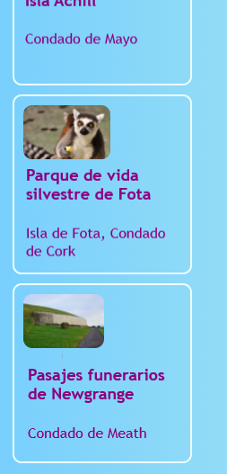
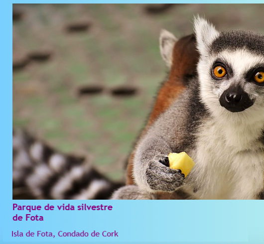
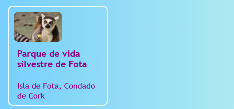

## Tarjetas interactivas

Here's a technique you could use to make a photo gallery, or a portfolio page showing off your projects: little **preview cards**.



+ Añade el siguiente código HTML a tu sitio web, donde quieras. Estoy haciendo el mío en `index.html`. You can change the picture and text to suit your own preview cards. I'm going to do a bunch of highlights of the tourist attractions in Ireland.

```html
    <article class="card">
        
        <h3>Fota Wildlife Park</h3>
        <p>Fota Island, County Cork</p>
    </article>
```



+ Add the following CSS code to create the classes `card` and `tinyPicture`:

```css
    .tinyPicture {
        height: 60px;
        border-radius: 10px;
    }
    .card {
        width: 200px;
        height: 200px;
        border: 2px solid #F0FFFF;
        border-radius: 10px;
        box-sizing: border-box;
        padding: 10px;
        margin-top: 10px;
        font-family: "Trebuchet MS", sans-serif;
    }
    .card:hover {
        border-color: #1E90FF;
    }
```



Vamos a convertir toda la tarjeta de vista previa en un enlace para que la gente pueda hacer clic para ver más información.

+ Coloca todo el elemento `artículo` dentro de un elemento de enlace. Make sure the closing `</a>` tag is after the closing `</article>` tag! Feel free to change the link **URL** to whatever you want to link to. That could be another page on your website, or it could be another website entirely.

```html
    <a href="attractions.html#scFota">  
        <article class="card ">
            
            <h3>Parque de vida silvestre de Fota</h3>
            <p>Isla de Fota, Condado de Cork</p>
        </article>
    </a>
```


## \--- collapse \---

## título: Enlazando a una parte específica de una página

Notice how the value of `href` in my link ends in `#scFota`? This is a neat trick you can use to jump to a particular part of a page.

+ First, type the URL of the page to link to, followed by `#`.

+ In the code file for the page you are linking to, find the part you want to jump to and give that element an `id`, for example, `<section id="scFota"`. El valor del `id` es lo que escribes después del `#` en tu enlace.

\--- /collapse \---

## \--- collapse \---

## title: Resetting styles

Ahora que toda la tarjeta de vista previa es un enlace, la fuente de texto podría haber cambiado.

+ Si es así, puedes arreglarlo añadiendo una clase **CSS** al enlace: `class="cardLink"`. Aquí está el código CSS para poner en tu hoja de estilo:

```css
    .cardLink {
        color: inherit;
        text-decoration: none;
    }
```

Setting the value of any property to `inherit` makes it use the value that the **parent** element has. Así que en este caso, el color del texto coincidirá con el resto del texto de la página principal.

\--- /collapse \---

+ Haz al menos cuatro o cinco de estas cartas. If you are working from my example website, you could do one for each of the sections on the Attractions page. On the next Sushi Card, you'll learn how to arrange the cards with a cool trick!