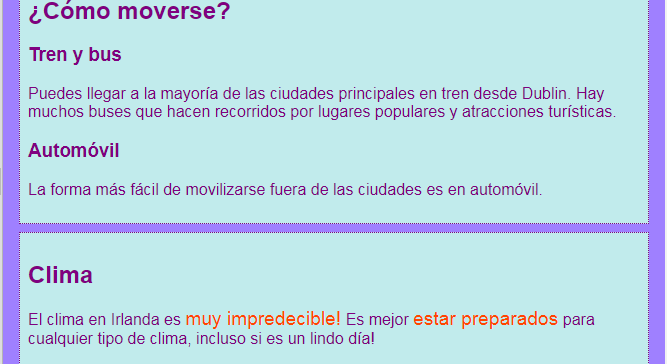

## Leyendas y notas al margen

On this card you'll learn about two more types of **container** element: one that you can use to add a caption (some text like a title or short description) to a picture, and another for when you have extra stuff that doesn't really belong with the main information on a page.

### Pictures with captions

+ Find an `img` element where you have text above or below that goes with the picture. I'm working with the Tito picture on `index.html`, but you can go with whatever is on your website. 

```html
            
  <p>
    Tour guide Tito!
  </p>
```

+ En la línea superior del código, añade la etiqueta de apertura `<figure>`. En una nueva línea debajo del código, coloque la etiqueta de cierre `</figure>`.

+ Next, remove the `p` tags, or whatever tags you have around the text (maybe it's a heading, like `h2`?), and put the text in between `<figcaption> </figcaption>` tags instead. The whole thing should look something like this:

```html
  <figure>
                
      <figcaption>
      Tour guide Tito!
      </figcaption>
  </figure>
```

The `figcaption` element is your **caption**. It can go either above the `img` element or below it.


## \--- collapse \---

## title: Why is this useful?

The `figure` element acts as a sort of **container** for your picture and its caption. This allows you to treat them as one unit when defining styles.

Grouping them together logically also helps to maintain good structure in your website code.

\--- /collapse \---

You can use CSS code to style `figure` and `figcaption` as you would any other element using classes, IDs, or element selectors. Estoy agregando las siguientes reglas para eliminar el espaciado extra que fue añadido por el nuevo contenedor:

```css
  figure { 
      margin-top: 0px;
      margin-bottom: 0px;
      margin-left: 0px;
      margin-right: 0px;
  }
```

### Notas al margen

La página de atracciones de mi sitio web es una lista de lugares a visitar. I want to add some notes about weather and how to get around. Esa información no pertenece realmente al elemento `artículo` con todas las atracciones. This is an example of when you might use the `aside` element.

+ Ve a una página de tu sitio web que tenga un elemento `article` en él — estoy usando `attractions.html`.

+ **Outside** of the `article` element, add one or more pairs of `<aside> </aside>` tags containing your extra stuff.

```html
  <aside class="sideNoteStyle">
      <h2>Getting around</h2>
      <h3>Train and bus</h3>
      <p>You can get to most of the major towns by train from Dublin. There are many buses that do tours to popular locations and tourist attractions.</p>
      <h3>Car</h3>
      <p>The easiest way to get around outside of the cities is by car.</p>
    </aside>
    <aside class="sideNoteStyle">
      <h2>Weather</h2>
      <p>The weather in Ireland is <span class="specialText">very unpredictable!</span> It's best to <span class="specialText">be prepared</span> for any kind of weather, even if it's a nice day!</p>
  </aside>
```

## \--- collapse \---

## title: Why is this useful?

The `aside`, `article`, and other containers are all similar. La única diferencia real es el **significado**, es decir, para qué los usas.

Siempre que puedas, es importante utilizar elementos HTML significativos. Da a tu sitio web una mejor estructura y es especialmente útil para personas que utilizan **lectores de pantalla**.

\--- /collapse \---

Did you spot the other element in there, `span`? This is a special tag you can use just for adding extra CSS code! Puedes poner cualquier cosa entre un par de etiquetas `span`. It's useful for things like styling a **part** of the text in a paragraph.

+ Add the following CSS code to your style sheet to complete the styling for the HTML code above.

```css
  .sideNoteStyle {
    border: dotted 1px purple;
    background-color: #c1ebec;
    padding: 0.5em;
    margin: 0.5em;
  }
  .specialText {
      color: #FF4500;
      font-size: larger;
  }
```



On the next card, you're going to learn how to make your website's layout more interesting!

+ To get ready, make a page that has one `article` and two `aside` elements inside the `<main> </main>` tags. O si lo prefieres, puedes trabajar con la página de Atracciones en mi sitio web.