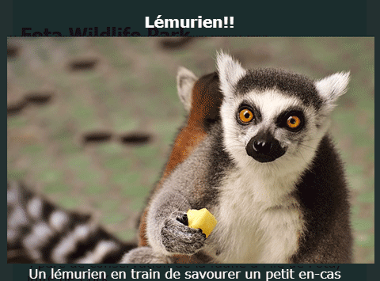

## Effets spéciaux

Sur cette carte, vous apprendrez quelques autres effets sympas que vous pouvez réaliser avec CSS.

### Ombres et mouvement

Ajoutons un petit mouvement lorsque vous passez votre curseur sur les cartes que vous avez faites plus tôt.

+ Trouvez la `.card: hover` CSS classe de plus tôt et le changer pour le suivant:

```css
    .card: hover {box-shadow: 0px 2px 2px rgba (0,0,0,0.2); transformer: translateY (-2px); }
```

+ Essayez différentes valeurs dans la fonction `translate`!

## \--- effondrer \---

## title: La propriété `transform`

Si vous avez terminé les cartes de sushi HTML / CSS intermédiaires, vous pouvez vous souvenir d'utiliser la propriété `transform` dans `@keyframes` animations. Vous voyez ici que vous pouvez également utiliser la propriété seule dans un bloc CSS normal.

Un type de valeur que vous pouvez définir est `rotation`, pour faire tourner un élément. D'autres sont `translateY`, qui déplace quelque chose vers le haut ou vers le bas, et `translateX`, pour le mouvement d'un côté à l'autre.

\--- /effondrer \---

+ Jouez avec différentes valeurs de pixel dans la propriété `box-shadow` pour voir ce qu'elles font. 

## \--- effondrer \---

## title: Qu'est-ce que `rgba`?

`rgba (0,0,0,0.2)` est une autre façon de définir une couleur.

Il a les trois nombres habituels (de `0` à `255`) pour le rouge, le vert et le bleu.

Le quatrième nombre, appelé **alpha** valeur, définit la façon dont **transparent** (ou transparent) est quelque chose. C'est un nombre décimal compris entre `0` et `1`, avec `1` n'étant pas du tout transparent, et `0` étant complètement invisible. Cela signifie que plus la valeur alpha d'un élément est faible, plus il est transparent.

\--- /effondrer \---

+ Enfin, assouplissez le mouvement en ajoutant la propriété suivante à la classe `.card` précédemment: 

```css
    transition: tous les 0.2s d'assouplissement;
```

Une durée de `0,2s` désigne le `transition` dure pendant 0,2 seconde.

### Boite à lumière

Un autre effet que vous avez probablement vu sur des tas de sites Web est **lightbox**: vous cliquez sur quelque chose et le site Web s'assombrit tandis que quelque chose d'autre, comme une image plus grande ou une boîte popup, apparaît devant tout.



Pour obtenir cet effet, vous allez créer deux liens: un pour la lightbox réelle (le bit qui apparaît), et un pour la chose sur laquelle vous cliquez pour faire apparaître la lightbox. Je vais faire le mien sur la page Attractions de mon site Web. Vous allez avec quelle que soit la page sur laquelle vous avez des photos!

+ Décidez des choses que vous voulez voir apparaître lorsque vous cliquez, et ajoutez-les à votre page entre un ensemble de balises `a` pour créer un lien. Assurez-vous de donner au lien un `id`. Le code peut aller n'importe où sur la page: vous rendrez les éléments invisibles à l'étape suivante!

```html
    <a href="#_" class="lightbox" id="boxLemur">
        <h3>Lemur !!</h3>
        
        <p>Un lémurien bénéficiant d'une petite collation</p>
    </a>
```

Vous pouvez mettre tout ce que vous aimez entre les balises de lien. J'ai une grande image, une rubrique et du texte. Peut-être que vous voulez juste une image et pas de texte!

+ Ajoutez le code CSS suivant pour la visionneuse. Pouvez-vous déterminer ce que cela fait?

```css
    .lightbox {arrière-plan: rgba (0,0,0,0.8); couleur: #ffffff; text-align: centre; text-decoration: aucun; largeur: 100%; hauteur: 100%; en haut: 0; gauche: 0; position: fixe; visibilité: cachée; indice z: 999; }
```

Remarque: La définition de la propriété `position` sur `fixe` signifie que la position que vous définissez sera relative à la fenêtre du navigateur, elle restera donc activée lors du défilement.

+ Ensuite, décidez de la chose sur laquelle vous voulez cliquer pour faire apparaître la lightbox et ajoutez une paire de balises `a` autour de cet élément (dans mon cas, c'est une image plus petite d'un lémurien). Le **objectif** du lien sera la visionneuse, que vous définissez à l' aide du `id`. Vous pourriez reconnaître cette technique plus tôt!

```html
    <a href="#boxLemur">
        
    </a>
```

+ Enfin, ajoutez le code CSS suivant. Notez que ceci est un **pseudo-classe**; il devrait aller après le code pour la classe `.lightbox` et pas à l'intérieur!

```css
    .lightbox: target {visibilité: visible; }
```

La pseudo-classe `: target` est appliquée chaque fois que la lightbox est la cible du dernier lien cliqué. Ainsi , lorsque vous cliquez n'importe où, la `visibilité` sera remis à `caché`.

+ Essayez de cliquer sur votre nouveau lien pour voir apparaître la visionneuse! Pour le faire disparaître, il suffit de cliquer n'importe où sur la page.

Vous pouvez ajouter autant de visionneuses que vous le souhaitez à une page. Ils peuvent tous utiliser la même classe CSS - assurez-vous simplement que chacun a un `id`! Pour chacun d'entre eux, vous devez créer quelque chose sur votre page Web dans un lien sur lequel vous pouvez cliquer pour faire apparaître la visionneuse, puis utiliser la valeur `id` comme valeur `href` dans ce lien, comme vous l'avez fait ci-dessus!