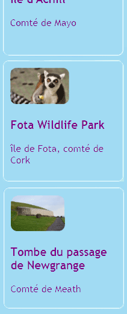
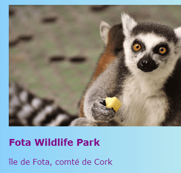
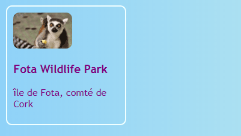
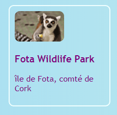

## Cartes cliquables

Voici une technique que tu peux utiliser pour créer une galerie de photos ou une page portfolio présentant tes projets: petites **cartes de prévisualisation**.



+ Ajoute le code HTML suivant à ton site Web, là où tu souhaites. Je fais le mien sur `index.html`. Tu peux modifier l’image et le texte en fonction de tes propres cartes de prévisualisation. Je vais faire un tas de points forts des attractions touristiques en Irlande.

```html
    <article class="card">
        
        <h3>Fota Wildlife Park</h3>
        <p>île Fota, comté de Cork </p>
    </article>
```



+ Ajoute le code CSS suivant pour créer les classes `card` et `tinyPicture`:

```css
    .tinyPicture {
        height: 60px;
        border-radius: 10px;
    }
    .card {
        width: 200px;
        height: 200px;
        border: 2px solid #F0FFFF;
        border-radius: 10px;
        box-sizing: border-box;
        padding: 10px;
        margin-top: 10px;
        font-family: "Trebuchet MS", sans-serif;
    }
    .card:hover {
        border-color: #1E90FF;
    }
```



Transformons l'intégralité de la carte de prévisualisation en un lien afin que les gens puissent cliquer pour voir plus d'informations.

+ Place l'intégralité de l'élément `article` à l'intérieur d'un élément de lien. Assure-toi que la balise de fermeture `</a>` est après la balise de fermeture `</article>` ! N'hésite pas à changer le lien **URL** à tout ce que tu veux lier. Cela pourrait être une autre page de ton site Web, ou ça pourrait être tout à fait un autre site Web.

```html
    <a href="attractions.html#scFota">  
        <article class="card ">
            
            <h3>Fota Wildlife Park</h3>
            <p>île Fota, comté de Cork</p>
        </article>
    </a>
```



## \--- collapse \---

## title: Lier vers une partie spécifique d'une page

Remarque comment la valeur de `href` dans mon lien se termine par `#scFota` ? C'est une astuce que tu peux utiliser pour aller directement à une partie particulière d'une page.

+ En premier, tape l'URL de la page à lier, suivi de `#`.

+ Dans le fichier de code de la page vers laquelle tu crées un lien, recherche la partie à laquelle tu veux aller et attribue à cet élément un `id`, par exemple, `<section id = "scFota"`. La valeur de l'`id` est ce que tu tapes après le `#` dans ton lien.

\--- /collapse \---

## \--- collapse \---

## title: Réinitialisation des styles

Maintenant que la carte de prévisualisation entière est un lien, la police du texte pourrait avoir changé.

+ Si c'est le cas, tu peux y remédier en ajoutant une **classe CSS** vers le lien: `class="cardLink"`. Voici le code CSS à mettre dans ta feuille de style:

```css
    .cardLink {
        color: inherit;
        text-decoration: none;
    }
```

Définir la valeur de toute propriété à `hériter` le fait utiliser la valeur que l'élément **parent** a. Donc, dans ce cas, la couleur du texte correspondra au reste du texte sur la page d'accueil.

\--- /collapse \---

+ Crée au moins quatre ou cinq de ces cartes. Si tu travailles à partir de mon exemple de site Web, tu peux en créer une pour chacune des sections de la page Attractions. Sur la prochaine carte Sushi, tu apprendras à organiser les cartes avec une astuce géniale!