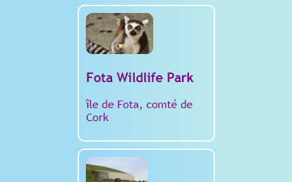
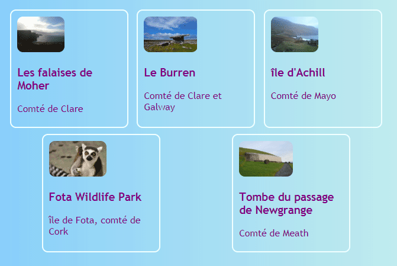
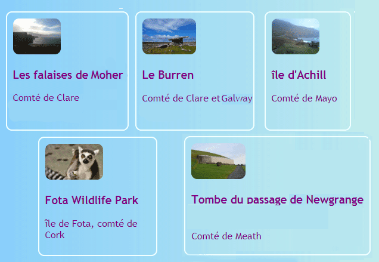
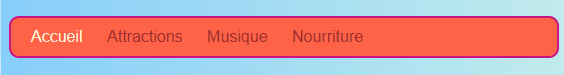
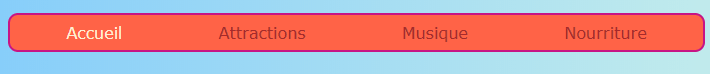
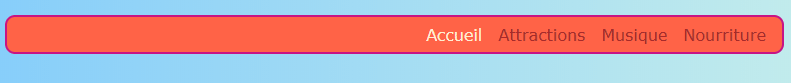

## Tout à la suite

Sur cette carte, tu apprendras quelques astuces pour organiser des choses **horizontalement** sur une page. Tout d'abord, tu verras comment centrer les choses. Ensuite, tu disposeras des éléments côte à côte dans une rangée.

+ Ajoute la propriété CSS suivante à ta classe `.card`:

```css
    margin-left: auto;
    margin-right: auto;
```

Tu devrais voir les cartes se déplacer au centre de la page. En définissant les marges gauche et droite sur `auto`, tu peux placer n'importe quel élément au milieu plutôt que vers la gauche.



+ Fais glisser le bord de la fenêtre du navigateur pour rendre la page plus étroite et plus large - remarque que les cartes restent centrées.

+ Mets tous les liens de carte que tu viens de créer dans un nouvel élément conteneur. Ça ne va pas être un `article` ou une `section`, mais un appelé `div`. Il s’agit d’un conteneur polyvalent que tu peux utiliser pour regrouper des éléments et réaliser de belles présentations.

```html
    <div class="cardContainer">
```

+ Ajoute le code CSS suivant à ta feuille de style:

```css
    .cardContainer {
        display: flex;
        flex-wrap: wrap;
        justify-content: space-around;
        padding: 10px;
    }
```

Voilà ! Grâce à **Flex**, tes cartes sont maintenant affichées côte à côte !

+ Fais glisser le bord de ta fenêtre pour agrandir ou réduire le site Web, et observe le mouvement des cartes pour s’adapter à la taille de la fenêtre, en passant parfois à la ligne suivante.



+ Essaie de supprimer les propriétés `width` et `height` de la classe `.card` et vois ce qui se passe: `flex` adapte intelligemment les cartes comme un puzzle en gardant une hauteur uniforme sur tout ce qui se trouve dans la même rangée.



Si tu as un menu de navigation en haut de ta page, c'est un autre endroit où tu peux utiliser cette astuce. Ton menu doit être composé d’éléments de liste ((`li`) pour ce prochain morceau. Si tu préfères, tu peux l'essayer avec mon site web.

+ Trouve les règles CSS pour le menu. Sur mon site, c’est les blocs `nav ul`, `nav ul li` et `nav ul li a`.

+ Supprime la propriété `display: inline;` de la liste des éléments. Ensuite, dans la liste `nav ul`, ajoutes-y :

```css
    display: flex;
    justify-content: flex-start;
```



Tu te retrouves à peu près avec le même menu, n'est-ce pas ? La chose cool à propos de `flex` c'est que tu peux contrôler la mise en page avec la propriété `justify-content`.

+ Change la valeur de `justify-content` en `flex-end` et vois ce qui se passe. Ou change-le en `space-around` pour que les éléments du menu soient régulièrement espacés, comme tu l'as fait pour les cartes.





**`flex`** est un outil de mise en page assez puissant qui pourrait remplir toute une série de cartes Sushi tout seul - tu peux en apprendre plus à ce sujet sur [dojo.soy/html3-flex](http://dojo.soy/html3-flex).