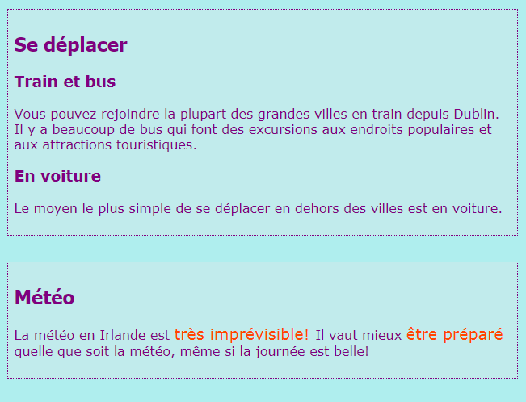

## Légendes et notes annexes

Sur cette carte, tu apprendras deux autres types d'élément **conteneur**: un que tu peux utiliser pour ajouter une légende (un texte tel qu'un titre ou une courte description) à une image, et un autre pour les éléments supplémentaires qui ne correspondent pas vraiment aux informations principales d'une page.

### Photos avec légendes

+ Trouve un élément `img` où tu as du texte au-dessus ou en dessous qui va avec l'image. Je travaille avec l'image de Tito sur `index.html`, mais tu peux aller avec tout ce qui est sur ton site web. 

```html
            
  <p>
    Guide Touristique Tito!
  </p>
```

+ Sur la ligne au-dessus du code, ajoute la balise d'ouverture `<figure>`. Sur la ligne au-dessous du code, ajoute la balise de fermeture `</figure>`.

+ Ensuite, supprime les balises `p` ou les balises que tu as autour du texte (c’est peut-être un titre, comme `h2`?), et mets le texte entre les balises `<figcaption> </figcaption>` à la place. Le tout devrait ressembler à ceci:

```html
  <figure>
                
      <figcaption>
      Guide Touristique Tito!
      </figcaption>
  </figure>
```

L'élément `figcaption` est ta **légende**. Il peut aller soit au-dessus de l'élément `img` ou en dessous.


--- collapse ---
---
title: Pourquoi est-ce utile?
---

L'élément `figure` agit comme une sorte de **conteneur** pour ton image et sa légende. Cela te permet de les traiter comme une seule unité lors de la définition des styles.

Les regrouper logiquement aide également à maintenir une bonne structure dans le code de ton site Web.

--- /collapse ---

Tu peux utiliser du code CSS pour styler `figure` et `figcaption` comme n'importe quel autre élément utilisant des classes, des ID ou des sélecteurs d'éléments. J'ajoute les règles suivantes pour supprimer l'espacement supplémentaire ajouté par le nouveau conteneur:

```css
  figure { 
      margin-top: 0px;
      margin-bottom: 0px;
      margin-left: 0px;
      margin-right: 0px;
  }
```

### Notes à part

La page Attractions de mon site Web contient une liste de lieux à visiter. Je veux ajouter quelques notes sur la météo et la façon de se déplacer. Cette information n'appartient pas vraiment à l'élément `article` avec toutes les attractions. Ceci est un exemple de quand tu pourrais utiliser l'élément `aside`.

+ Accède à une page de ton site Web contenant un élément `article` dessus - J'utilise `attractions.html`.

+ **À l'extérieur** de l'élément `article`, ajoute une ou plusieurs paires de balises `<aside> </aside>` contenant tes trucs supplémentaires.

```html
  <aside class="sideNoteStyle">
      <h2>Se déplacer</h2>
      <h3>Train et bus</h3>
      <p>Tu peux accéder à la plupart des villes importantes en train à partir de Dublin. Il y a beaucoup de bus qui font des excursions aux endroits populaires et aux attractions touristiques. </p>
      <h3>Voiture</h3>
      <p> Le moyen le plus simple de se déplacer en dehors des villes est en voiture. </p>
    </aside>
    <aside class="sideNoteStyle">
      <h2>Météo</h2>
      <p>La météo en Irlande est <span class="specialText">très imprévisible!</span> Il vaut mieux <span class="specialText">être préparé</span> quelle que soit la météo, même si la journée est belle!</p>
  </aside>
```
    
--- collapse ---
---
title: Pourquoi est-ce utile?
---

Le `aside`, `article` et les autres conteneurs sont tous similaires. La seule différence réelle réside dans la **signification**, c’est-à-dire pour quoi tu les utilises.
    
Il est important d'utiliser des éléments HTML significatifs chaque fois que tu le peux. Cela donne une meilleure structure à ton site Web et est particulièrement utile pour les utilisateurs utilisant les **lecteurs d'écran** .
    
--- /collapse ---
    
As-tu repéré l'autre élément à l'intérieur, `span`? Ceci est une balise spéciale que tu peux utiliser uniquement pour ajouter du code CSS supplémentaire! Tu peux mettre n'importe quoi entre une paire de balises `span`. C'est utile pour des choses comme styler une **partie** du texte dans un paragraphe.
    
+ Ajoute le code CSS suivant à ta feuille de style pour compléter le style du code HTML ci-dessus.
    
    ```css
      .sideNoteStyle {
        border: dotted 1px purple;
        background-color: #c1ebec;
        padding: 0.5em;
        margin: 0.5em;
      }
      .specialText {
          color: #FF4500;
          font-size: larger;
      }
    ```
    

    
Sur la carte suivante, tu vas apprendre à rendre la mise en page de ton site Web plus intéressante!
    
+ Pour te préparer, crée une page comportant un `article` et deux éléments `aside` à l'intérieur des balises `<main> </main>`. Ou si tu préfères, tu peux utiliser la page Attractions de mon site Web.