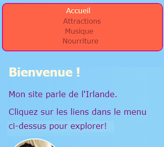
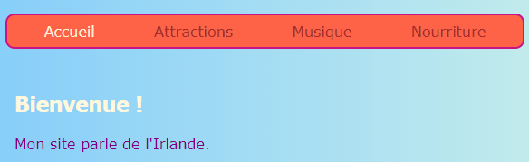
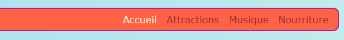

## Rendez votre menu réactif

Un site Web **responsive** s'adapte à la taille de l'écran, de sorte qu'il est toujours superbe, que vous le regardiez sur un ordinateur, un téléphone mobile ou une tablette. Rendons votre menu réactif!

Vous allez commencer avec les styles réguliers: ce sera votre **défaut** comportement.

## \--- effondrer \---

## title: Que signifie 'default'?

Les styles par défaut sont votre ensemble normal de règles de style. Ils sont appliqués quoi qu'il arrive, avant de vérifier les conditions particulières.

Vous pouvez ajouter du code qui vérifie ensuite la taille de l'écran et apporte quelques ajustements si nécessaire.

\--- /effondrer \---

+ Ajoutez les règles CSS suivantes à votre menu. Vous avez probablement défini des couleurs et des bordures; Je les ai laissés pour économiser de l'espace ici! Si vous avez déjà défini des règles CSS pour votre menu, ajoutez ou modifiez les propriétés et valeurs ci-dessous qui vous manquent.

```css
    nav ul {padding: 0.5em; affichage: flex; flex-direction: colonne; } nav ul li {text-align: center; type de style de liste: none; marge-droite: 0,5em; marge gauche: 0,5em; }
```

Avec le code CSS ci-dessus, votre menu sera mieux adapté aux petits écrans. C'est ce qu'on appelle le développement **mobile-first**.



## \--- effondrer \---

## title: Que signifie 'mobile-first'?

Assez souvent, lors du codage d'un site Web, vous utiliserez un écran d'ordinateur, et vous définirez probablement vos styles en fonction de leur aspect sur cet écran.

Lorsque vous codez d'abord le mobile, vous choisissez plutôt des styles par défaut adaptés aux petits écrans tels que les smartphones. Vous ajoutez ensuite du code supplémentaire pour faire des ajustements pour les écrans plus grands.

Étant donné que de plus en plus de gens naviguent sur Internet sur leur téléphone intelligent ou leur tablette plutôt que sur un ordinateur, il est recommandé de développer votre site Web en gardant cela à l'esprit.

\--- /effondrer \---

+ Maintenant, ajoutez le code suivant à votre feuille de style:

```css
    @media all et (min-width: 1000px) {nav ul {flex-direction: ligne; justify-content: espace-autour; }}
```

La première ligne de code ci-dessus vérifie la taille de la fenêtre du navigateur. Si la fenêtre est **1000 pixels** large ou plus, elle appliquera toutes les règles de style à l'intérieur du bloc.



## \--- effondrer \---

## title: Comment ça marche?

Le bloc contient de nouvelles valeurs pour seulement certaines propriétés du menu `nav ul`.

Chaque fois que la fenêtre est plus large que 1000 pixels, ces nouvelles valeurs seront appliquées à la place de celles que vous avez déjà définies pour `nav ul`.

Le reste des propriétés que vous avez définies précédemment pour `nav ul` restera le même.

\--- /effondrer \---

+ Si vous utilisez Trinket pour écrire du code, il peut être utile de télécharger le projet afin de pouvoir le tester sur un écran en taille réelle.

\--- défi \---

## Défi: faites que votre menu s'adapte aux grands écrans

+ Pouvez-vous ajouter un autre bloc pour les écrans de plus de **1600 pixels**, avec `flex-end` au lieu de `space-around`?



\--- astuces \---

\--- indice \---

Le code suivant définit les propriétés flex pour les éléments de menu lorsque l'écran est plus grand que 1600 pixels:

```css
    @media all et (min-width: 1600px) {nav ul {flex-direction: ligne; justify-content: flex-end; }}  
```

\--- / indice \---

\--- /astuces \---

\--- /défi \---

Vous pouvez placer les règles CSS que vous aimez dans des blocs comme ceux-ci pour définir différents styles pour différentes tailles d'écran. Ce sera particulièrement utile lorsque vous faites des mises en forme de grille CSS plus tard!