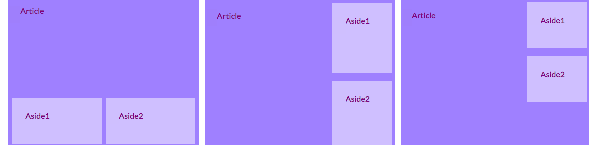
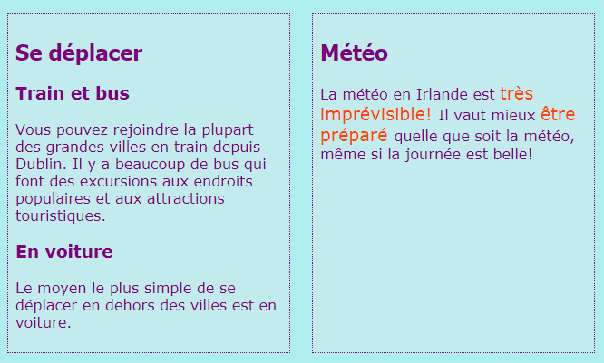
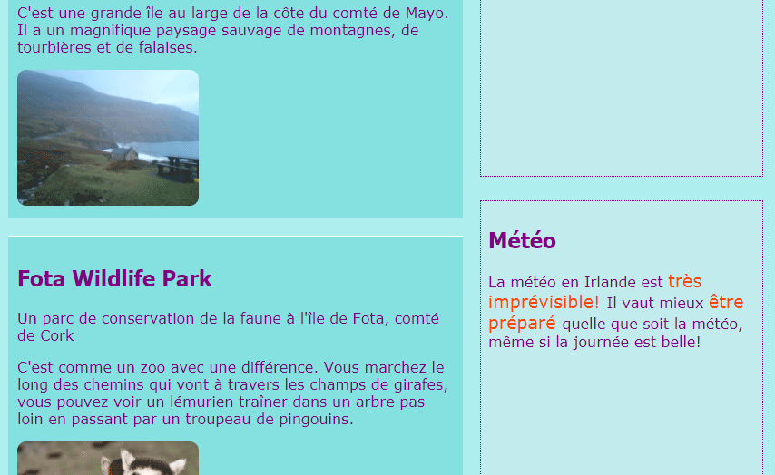
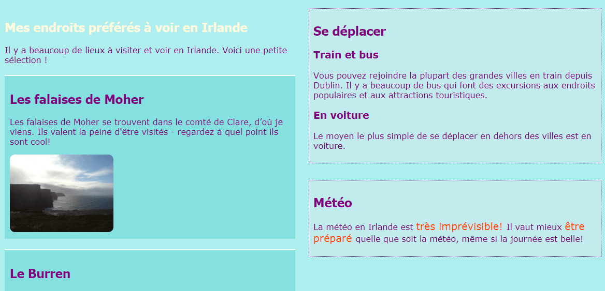

## Concevoir des mises en page sympas

+ Pour cette carte, vous devez travailler avec une page qui contient un `élément principal` avec trois éléments à l'intérieur: un `article` et deux `côté`s. Allez-y et créez-les en premier si vous en avez besoin. Si vous voulez travailler avec mon site Web, ajoutez le `côté` du code de la précédente carte Sushi à la page Sites. 

Voici trois mises en page différentes que vous appliquerez:



+ Ajoutez de nouvelles classes CSS à `main` et chacun des trois éléments à l'intérieur.

```html
    <main class="attPageLayoutGrid">
        <article class="attGridArticle">
            <! - D'autres trucs ici-->
        </article>
        <aside class="attGridAside1">
            <! - D'autres trucs ici-->
        </aside>
        <aside class="attGridAside2">
            <! - D'autres trucs ici-->
        </aside>
    </main>
```

Le conteneur va changer la mise en page est `principale`, mais vous pouvez le faire avec tout type de conteneur, comme un `div` ou `l' article`, ou même toute la page `corps`. La technique que vous allez utiliser s'appelle **CSS grid**.

Dans cet exemple, le `- tête` et `Pied de page` sera laissé hors de la conception, mais il est assez fréquent de les inclure dans la grille aussi.

+ Définissez la propriété `display` sur `grid` sur le conteneur global:

```css
    .attPageLayoutGrid {display: grid; grille-colonne-écart: 0.5em; grille-rangée-écart: 1em; }
```

À votre avis, que font les `propriétés grid-column-gap` et `grid-row-gap`?

+ Ensuite, vous nommez une zone de grille `` pour chaque élément: 

```css
    .attGridArticle {grid-area: agArticle; } .attGridAside1 {grid-area: agAside1; } .attGridAside2 {grid-area: agAside2; }
```

Ensuite, vous concevez votre mise en page! Mettons les deux `côte à côte` éléments côte à côte en bas de la page. Pour cela , vous avez besoin de deux **colonnes** de largeur égale. Vous pouvez garder la ligne **rangée** automatique.

+ Placez le code suivant dans les règles `.attPageLayoutGrid` CSS:

```css
    grid-template-rows: auto; grid-template-columns: 1fr 1fr; grid-template-areas: "agArticle agArticle" "agAside1 agAside2";
```

`fr` signifie **fraction**. Remarquez comment vous faites l'article</code> `prendre tout l'espace sur les deux colonnes.</p>

<h2>--- effondrer ---</h2>

<h2>titre: Aide! J'ai des erreurs et des avertissements!</h2>

<p>Si vous utilisez Trinket, vous remarquerez peut-être des erreurs et des avertissements, même si vous avez tapé le code exactement comme ci-dessus. C'est parce que Trinket ne reconnaît pas encore les propriétés de la grille CSS. Cependant, le code fonctionnera toujours.</p>

<p>Si le code de grille CSS vous donne des avertissements de 'propriété inconnue' ou une erreur comme 'jeton inattendu 1fr', vous pouvez simplement les ignorer.</p>

<p>--- /effondrer ---</p>

<p></p>

<p>Mettons les <code>à part` éléments sur le droit et les faire la moitié de la largeur du `article`.

+ Changez les valeurs de `grid-template-columns` et `grid-template-areas` à:

```css
    grid-template-columns: 2fr 1fr; grid-template-areas: "agArticle agAside1" "agArticle agAside2";
```



+ Si vous ne voulez pas que les éléments `côté` s'étendent jusqu'au fond, vous pouvez ajouter un espace vide en utilisant un point: 

```css
    grid-template-areas: "agArticle agAside1" "agArticle agAside2" "agArticle. ";
```



\--- défi \---

## Défi: faire différentes mises en page pour différentes tailles d'écran

+ Pouvez-vous utiliser les contrôles de taille d'écran que vous avez ajoutés précédemment pour modifier la disposition en fonction de la largeur de l'écran? Remarque: si vous avez déjà créé des blocs CSS pour chaque taille d'écran, vous pouvez ajouter le nouveau code CSS à ces blocs au lieu d'en créer de nouveaux.

\--- astuces \---

\--- indice \---

Le code suivant définit une disposition pour la classe CSS ci-dessus lorsque l'écran est plus grand que 1000 pixels:

```css
    @media all et (min-width: 1000px) {.attPageLayoutGrid {grille-template-colonnes: 1fr 1fr; grid-template-areas: "agArticle agArticle" "agAside1 agAside2"; }}  
```

\--- / indice \---

\--- indice \---

Le code suivant définit une disposition pour la classe CSS ci-dessus lorsque l'écran est plus grand que 1600 pixels:

```css
    @media all et (min-width: 1600px) {.attPageLayoutGrid {grille-template-colonnes: 1fr 1fr; grid-template-areas: "agArticle agAside1" "agArticle agAside2" "agArticle."; }}  
```

\--- / indice \---

\--- /astuces \---

\--- /défi \---

Avec **grille CSS**, vous pouvez faire presque n'importe quelle disposition que vous aimez. Si vous voulez en savoir plus, allez à [dojo.soy/html3-css-grid](http://dojo.soy/html3-css-grid){: target = "_ blank"}