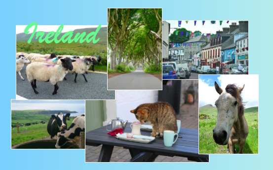

## Collage de photos

Sur cette carte, tu apprendras à utiliser CSS pour positionner avec précision des éléments HTML et réaliser un collage de photos.


+ Ajoute un `div` sur ta page et mets-y autant d'images que tu le souhaites. Donne au `div` et les éléments `img` les valeurs `id`.

```html
    <div id="photoBox" class="relPos">
        
        
    </div>
```

Les photos apparaîtront les unes après les autres sur la page Web, dans l'ordre dans lequel elles apparaissent dans ton code.

+ Dans ton fichier CSS, ajoute la classe CSS suivante pour les éléments à l'intérieur du `div` : 

```css
    .absPos {
        position: absolute;
    }
```

+ Ensuite, tu dois ajouter la propriété `position: relative;` au conteneur lui-même et définir une taille pour celui-ci. Cela permet de définir les positions des autres éléments **par rapport à** (c'est-à-dire à l'intérieur) du conteneur.

```css
    .relPos {
        position: relative;
    }

    #photoBox {
        width: 800px;
        height: 400px;
    }
```

+ Crée ensuite un ensemble de règles de style pour chacun des éléments à l'aide de **id selectors** pour définir leurs tailles (les propriétés `width` et / ou `height`) ainsi que leurs positions exactes.

Pour définir la position d'un élément, tu peux utiliser quatre propriétés: `left` , `right` , `top` et `bottom`. Ils représentent la distance qui sépare chacun des bords du bord du parent. Utilise soit `top` ou `bottom` pour la position verticale, et soit `left` ou `right` pour la position horizontale.


+ Choisis les positions exactes pour chacune de tes images et utilise l’une des propriétés `left` , `right` , `top` et `bottom` pour définir ces positions dans tes règles CSS. Par exemple, ce code place l'image du chat à 100 pixels du haut et à 60 pixels de la gauche:

```css
    #imgTeaCat {
        width: 250px;
        top: 100px;
        left: 60px;
    }
```

Remarque: Les valeurs de position peuvent également être négatives ! Si tu utilises une valeur négative, l'élément sera déplacé hors du conteneur, sur le bord que tu as spécifié.

### Faire chevaucher les choses

Tu voudrais peut-être avoir quelques-unes des images qui se chevauchent. Mais comment choisis-tu celui qui ira en haut?

+ Choisis deux images et donne-leur des positions qui les font se chevaucher.

+ Ajoute une propriété supplémentaire, `z-index: 10;` à l'un d'eux, puis ajoute `z-index: 7;` à l'autre.

+ Regarde le résultat sur ta page Web.


+ Maintenant, échange les valeurs `z-index` , de sorte que le `7` et le `10` soient l'inverse. Vois-tu une différence sur ta page Web ?


## \--- collapse \---

## title: Comment z-index fonctionne-t-il ?

La propriété `z-index` te permet de décider comment deux ou plusieurs éléments doivent se chevaucher. La valeur peut être n'importe quel nombre entier.

L'élément avec **le plus haut ** numéro se termine sur **le haut** de la pile ou, en d'autres termes, à l'**avant même**. L'élément avec le nombre le plus élevé suivant est derrière cela, et devant les autres, et ainsi de suite, jusqu'à ce que tu obtiennes l'élément avec le nombre le plus bas, qui apparaît à l'arrière derrière tous les autres éléments.

\--- /collapse \---

Tu peux positionner tous les éléments HTML de cette manière, pas seulement les images. Par exemple, tu peux utiliser un élément `p` pour ajouter du texte sur une photo.

\--- challenge \---

## Défi : faire un collage photo

+ Essaie de créer ton propre collage de photos comme celui présenté ci-dessous! Utilise le positionnement exact avec différents valeurs `z-index` pour obtenir l’effet de chevauchement comme tu le souhaites.

\--- hints \---

\--- hint \---

Tu trouveras ci-dessous le code HTML du collage de photos sur mon site Web de l'Irlande. Il y a six photos et un texte à l'intérieur d'un `div`.

```html
    <div id="photoBox" class="relPos">
        
        
        
        
        
        
        <p id="photoText" class="absPos">Irlande</p>
    </div>
```

\--- /hint \---

\--- hint \---

Voici les règles CSS qui définissent les positions pour chacune de mes images dans le collage:

```css
    #imgHorse {
        width: 120px;
        top: 200px;
        left: 390px;
        z-index: 10;
    }
    #imgSheep {
        width: 200px;
        top: 100px;
        left: 20px;
        z-index: 8;
    }
    #imgCoast {
        width: 150px;
        top: 250px;
        left: 10px;
        z-index: 5;
    }
    #imgTrees {
        width: 110px;
        top: 65px;
        left: 205px;
        z-index: 9;
    }
    #imgTeaCat {
        width: 250px;
        top: 210px;
        left: 160px;
        z-index: 7;
    }
    #imgStreet {
        width: 180px;
        top: 90px;
        left: 310px;
        z-index: 6;
    }
    #photoText {
        font-family: "brush script MT";
        color: lightgreen;
        font-size: 4em;
        left: 35px;
        top: 15px;
        z-index: 20;
    }
```

\--- /hint \---

\--- hint \---

Voici les classes CSS que j'ai utilisées:

```css
    .collagePhoto {
        border: 1px solid white;
    }
    .relPos {
        position: relative;
    }
    .absPos {
        position: absolute;
    }
```

\--- /hint \---

\--- /hints \---



\--- /challenge \---