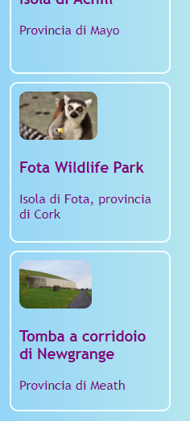
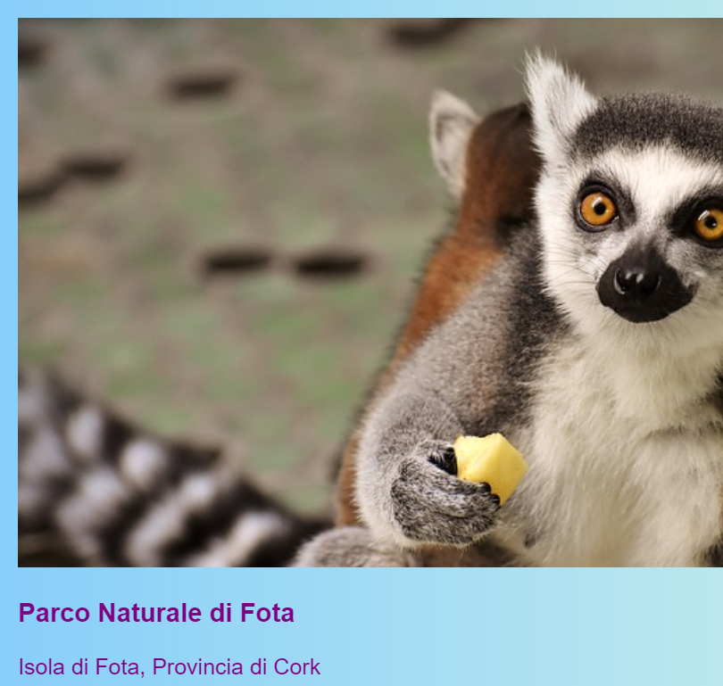
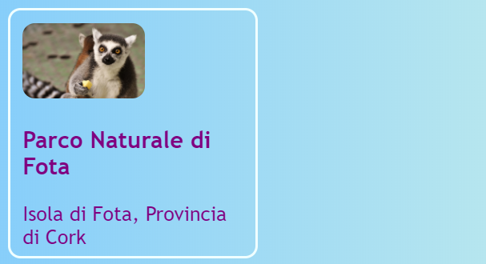
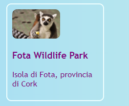

## Schede selezionabili

Ecco una tecnica che puoi utilizzare per creare una galleria fotografica, o una pagina del portfolio per mostrare i tuoi progetti: piccole **schede di anteprima**.



+ Aggiungi il seguente codice HTML al tuo sito web, ovunque desideri. Io farò il mio su `index.html`. È possibile modificare l'immagine e il testo per adattarli alle tue schede di anteprima. Preparerò un po' di punti salienti delle attrazioni turistiche in Irlanda.

```html
    <article class="card">
        
        <h3>Parco Naturale di Fotak</h3>
        <p>Isola di Fota, Provincia di Cork</p>
    </article>
```



+ Aggiungi il seguente codice CSS per creare le classi `card` e `tinyPicture`:

```css
    .tinyPicture {
        height: 60px;
        border-radius: 10px;
    }
    .card {
        width: 200px;
        height: 200px;
        border: 2px solid #F0FFFF;
        border-radius: 10px;
        box-sizing: border-box;
        padding: 10px;
        margin-top: 10px;
        font-family: "Trebuchet MS", sans-serif;
    }
    .card:hover {
        border-color: #1E90FF;
    }
```



Trasformiamo l'intera scheda di anteprima in un link in modo che le persone possano fare clic per visualizzare ulteriori informazioni.

+ Posiziona l'intero elemento `article` all'interno di un elemento di collegamento. Assicurati che il tag di chiusura `</a>` sia dopo il tag di chiusura `</article>`! Sentiti libero di cambiare l'**URL** del link in qualsiasi cosa tu voglia collegare. Potrebbe essere un'altra pagina del tuo sito web o un sito totalmente diverso.

```html
    <a href="attractions.html#scFota">  
        <article class="card ">
            
            <h3>Parco Naturale di Fota</h3>
            <p>Isola di Fota, Contea di Cork</p>
        </article>
    </a>
```



## \--- collapse \---

## title: Collegamento a una parte specifica di una pagina

Hai notato come il valore di `href` nel mio collegamento termina con `#scFota`? Questo è un trucchetto che puoi usare per saltare direttamente a una particolare parte di una pagina.

+ Innanzitutto, digita l'URL della pagina a cui collegarti, seguito da `#`.

+ Nel file di codice della pagina che stai collegando, trova la parte a cui vuoi saltare e assegna a quell'elemento un `id`, ad esempio, `<section id="scFota"`. Il valore dell'`id` è ciò che scrivi dopo il `#` nel tuo link.

\--- /collapse \---

## \--- collapse \---

## title: Reimpostare gli stili

Ora che l'intera scheda di anteprima è un link, il carattere del testo potrebbe essere cambiato.

+ In tal caso, puoi correggerlo aggiungendo una **classe CSS** al link: `class="cardLink"`. Ecco il codice CSS da inserire nel tuo stylesheet:

```css
    .cardLink {
        color: inherit;
        text-decoration: none;
    }
```

Impostando il valore di qualsiasi proprietà su `inherit` le farà usare il valore che ha l'elemento **parent**. Così, in questo caso, il colore del testo sarà quello del resto del testo sulla home page.

\--- /collapse \---

+ Crea almeno quattro o cinque di queste schede. Se stai lavorando dal mio sito web di esempio, puoi crearne una per ciascuna delle sezioni della pagina Attrazioni. Sulla prossima Sushi Card imparerai come organizzare le carte con un bel trucco!