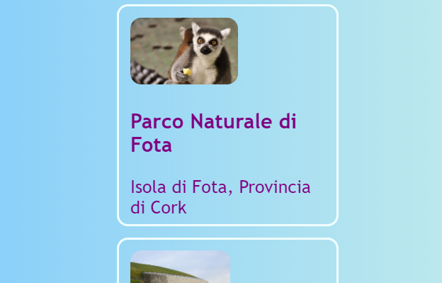
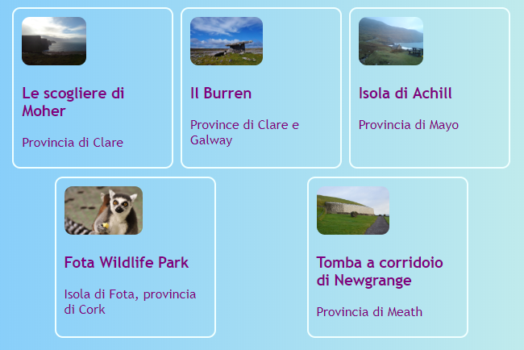
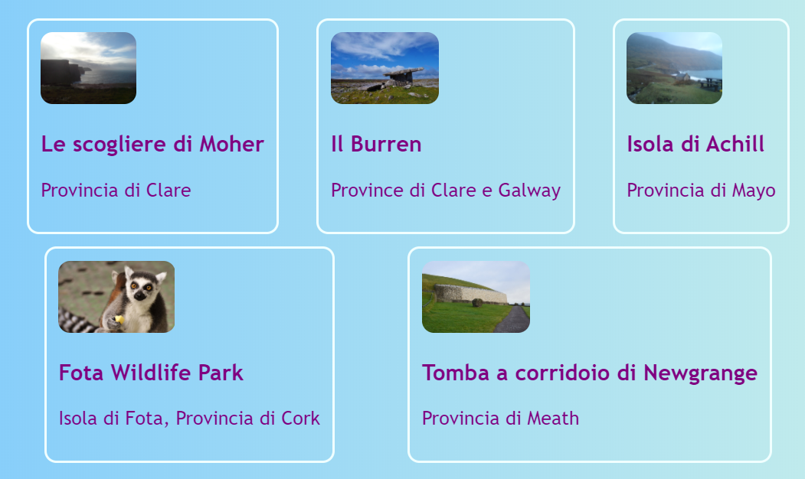
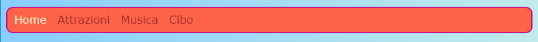
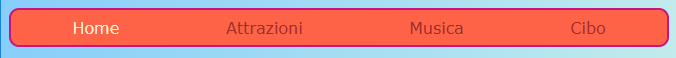

## Tutto su una fila

In questa scheda imparerai alcuni trucchi per sistemare gli oggetti ** orizzontalmente ** su una pagina. In primo luogo, vedrai come centrare gli elementi. Quindi sistemerai gli elementi fianco a fianco, in fila.

+ Aggiungi le seguenti proprietà CSS alla classe `.card`:

```css
    margin-left: auto;
    margin-right: auto;
```

Dovresti vedere le schede spostarsi al centro della pagina. Impostando i margini sinistro e destro su `auto`, è possibile impostare qualsiasi elemento al centro anziché a sinistra.



+ Trascina il bordo della finestra del browser per rendere la pagina più stretta e più ampia - nota che le schede rimangono centrate.

+ Metti tutti i link delle schede che hai appena creato in un nuovo elemento contenitore. Non sarà un `articolo` o una `sezione`, ma uno chiamato `div`. Questo è un contenitore a scopo generale che puoi utilizzare per raggruppare gli oggetti e per creare dei layout piacevoli.

```html
    <div class="cardContainer">
```

+ Aggiungi il seguente codice CSS al tuo foglio di stile:

```css
    .cardContainer {
        display: flex;
        flex-wrap: wrap;
        justify-content: space-around;
        padding: 10px;
    }
```

Voilà! Grazie a **Flex**, le tue carte ora vengono visualizzate una accanto all'altra!

+ Trascina il bordo della finestra per allargare e restringere il sito web, e osserva come le schede si muovono per adattarsi alle dimensioni della finestra, a volte andando alla linea successiva.



+ Prova a eliminare le proprietà `width` e `height` dalla classe `.card` e guarda cosa succede: `flex` adatta abilmente le carte insieme come un puzzle, mantenendo tutto ciò che è nella stessa riga con la stessa altezza.



Se hai un menu di navigazione nella parte superiore della pagina, questo è un altro posto dove puoi usare questo trucco. Il tuo menu deve essere composto da elementi di lista `li` (per le liste) per il prossimo passo. Se preferisci, puoi provarlo con il mio sito web.

+ Trova le regole CSS per il menu. Nel mio sito web, sono i blocchi `nav ul`, `nav ul li` e `nav ul li a`.

+ Elimina la proprietà `display: inline;` dalle voci dell'elenco. Quindi, nella lista `nav ul`, aggiungi:

```css
    display: flex;
    justify-content: flex-start;
```



Ottieni praticamente lo stesso menu, giusto? La cosa interessante di `flex` è che puoi controllare il layout con la proprietà `justify-content`.

+ Cambia il valore di `justify-content` a `flex-end` e guarda cosa succede. Oppure cambialo a `space-around` per rendere le voci del menu uniformemente distanziate, proprio come hai fatto per le schede.




**`flex`** è uno strumento di layout piuttosto potente che può riempire un'intera serie di Sushi Card da solo - per saperne di più visita il link [dojo.soy/html3-flex](http://dojo.soy/html3-flex).