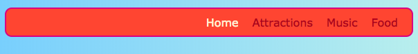

## Tutto di fila

Su questa carta imparerai alcuni trucchi per sistemare le cose **orizzontalmente** su una pagina. In primo luogo, vedrai come ottenere le cose centrate. Quindi sistemerai gli elementi fianco a fianco in fila.

+ Aggiungere le seguenti proprietà CSS al `.card` classe:

```css
    margin-left: auto; margin-right: auto;
```

Dovresti vedere le carte spostarsi al centro della pagina. Impostando i margini sinistro e destro su `auto`, è possibile impostare qualsiasi elemento al centro anziché a sinistra.


+ Trascina il bordo della finestra del browser per rendere la pagina più stretta e più ampia - nota che le carte rimangono centrate.

+ Metti tutti i link delle carte che hai appena creato in un nuovo elemento contenitore. Non sarà uno `articolo` o `sezione`, ma uno chiamato `div`. Questo è un contenitore per tutti gli usi che puoi usare per raggruppare le cose e fare dei bei layout.

```html
    <div class="cardContainer">
```

+ Aggiungi il seguente codice CSS nel tuo foglio di stile:

```css
    .cardContainer {display: flex; flex-wrap: wrap; justify-content: space-around; imbottitura: 10px; }
```

Ecco! Grazie a **Flex**, le tue carte ora vengono visualizzate una accanto all'altra!

+ Trascina il bordo della finestra per allargare e restringere il sito web e osserva come le carte si muovono per adattarsi alle dimensioni della finestra, a volte spostando la linea successiva.


+ Prova a eliminare la `larghezza` e `altezza` proprietà dal `.card` classe e vedere cosa succede: `flex` adatta abilmente le carte insieme come un puzzle, mantenendo un'altezza anche attraverso tutto ciò che è nella stessa riga.


Se hai un menu di navigazione nella parte superiore della pagina, questo è un altro posto dove puoi usare questo trucco. Il tuo menu deve essere composto da elementi della lista ((`li`) per questo prossimo bit. Se preferisci, puoi provarlo con il mio sito web.

+ Trova le regole CSS per il menu. Nel mio sito web, sono i blocchi `nav ul`, `nav ul li`e `nav ul li a`.

+ Elimina la proprietà `display: inline;` dalle voci dell'elenco. Quindi, nella lista `nav ul`, aggiungere:

```css
    display: flex; justify-content: flex-start;
```


Finisci praticamente nello stesso menu, giusto? La cosa interessante di `flex` è che puoi controllare il layout con la proprietà `justify-content`.

+ Cambia il valore di `justify-content` a `flex-end` e vedi cosa succede. Oppure cambialo a `spazio-intorno a` per rendere le voci del menu uniformemente distanziate, proprio come hai fatto per le carte.




**`flex`** è uno strumento di layout piuttosto potente che può riempire un'intera serie di schede di Sushi proprie - puoi saperne di più a proposito di [dojo.soy/html3-flex](http://dojo.soy/html3-flex).