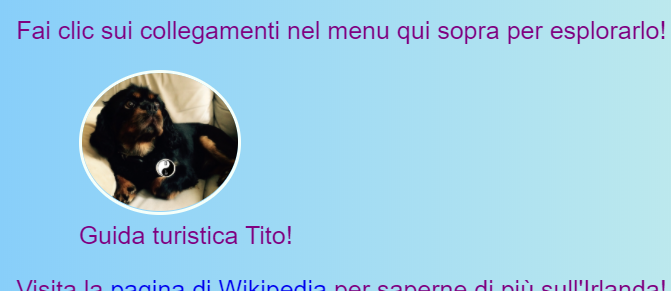
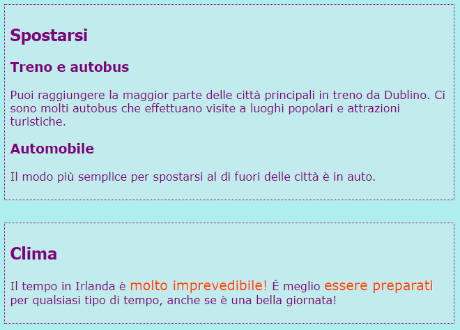

## Didascalie e note a margine

Con questa scheda imparerai altri due tipi di elementi **container**: uno che puoi usare per aggiungere una didascalia (del testo in funzione del titolo o di una breve descrizione) ad un'immagine, e un'altra per quando hai elementi extra che in realtà non appartengono alle informazioni principali della pagina.

### Immagini con didascalie

+ Trova un ` img ` elemento in cui hai testo sopra o sotto che va con l'immagine. Sto lavorando con l'immagine di Tito su `index.html`, ma puoi usare qualunque cosa si trovi sul tuo sito web. 

```html
            
  <p>
    La guida Tito!
  </p>
```

+ Sulla riga sopra il codice, aggiungi il tag di apertura `<figure>`. Su una nuova riga in fondo al codice, inserisci il tag di chiusura `</figure>`.

+ Poi, rimuovi i tag `p`, o qualsiasi tag che avevi attorno al testo (forse è un'intestazione `h2`?), e inserisci il testo tra i tag `<figcaption></figcaption>`. Il tutto dovrebbe assomigliare a questo:

```html
  <figure>
                
      <figcaption>
      La guida Tito!
      </figcaption>
  </figure>
```

L'elemento `figcaption` è la tua **didascalia**. Può andare sopra o sotto l'elemento `img`.



## \--- collapse \---

## titolo: Perché è utile?

L'elemento `figure` agisce come una sorta di **contenitore** per la tua immagine e la sua didascalia. Questo ti permette di trattarli come un tutt'uno quando definisci gli stili.

Raggrupparli insieme aiuta anche a mantenere una buona struttura nel codice del tuo sito web.

\--- /collapse \---

Puoi usare il codice CSS per applicare stili a `figure` e `figcaption` come faresti con qualsiasi altro elemento usando classi, ID o selettori di elementi. Sto aggiungendo il seguente codice per rimuovere la spaziatura aggiuntiva che è stata aggiunta dal nuovo contenitore:

```css
  figure { 
      margin-top: 0px;
      margin-bottom: 0px;
      margin-left: 0px;
      margin-right: 0px;
  }
```

### Note a margine

La pagina delle attrazioni sul mio sito web è un elenco di luoghi da visitare. Voglio aggiungere alcune note sul tempo e su come spostarsi. Quell'informazione non appartiene veramente all'elemento `article` con tutte le attrazioni. Questo è un esempio di quando puoi usare l'elemento `aside`.

+ Vai a una pagina del tuo sito web che contiene un elemento `article` - io sto utilizzando `attractions.html`.

+ **Fuori** dall'elemento `article`, aggiungi un paio, o più, di tag `<aside> </aside>` contenente i tuoi elementi extra.

```html
  <aside class="sideNoteStyle">
      <h2>Come muoversi</h2>
      <h3>Treno e autobus</h3>
      <p>È possibile raggiungere la maggior parte delle città principali in treno da Dublino. Ci sono molti autobus che effettuano visite a luoghi popolari e attrazioni turistiche.</p>
      <h3>Auto</h3>
      <p>Il modo più semplice per spostarsi fuori città è in auto.</p>
    </aside>
    <aside class="sideNoteStyle">
      <h2>Meteo</h2>
      <p>Il tempo in Irlanda è <span class="specialText">davvero imprevedibile!</span> È meglio <span class="specialText">essere pronti</span> per qualsiasi tipo di tempo, anche se è una bella giornata!</p>
  </aside>
```

## \--- collapse \---

## title: Perché è utile?

L'`aside`, l'`article` e altri contenitori sono tutti simili. L'unica vera differenza è nello **scopo**, cioè per cosa li usi.

È importante utilizzare i giusti elementi HTML ogni volta che puoi. Dà al tuo sito una migliore struttura ed è particolarmente utile per chi usa degli **screen readers**.

\--- /collapse \---

Hai notato l'altro elemento, `span`? Questo è un tag speciale che puoi usare solo per aggiungere del codice CSS extra! Puoi inserire qualsiasi cosa tra una coppia di tag `span`. È utile per cose come lo styling di una **parte** del testo in un paragrafo.

+ Aggiungi il seguente codice CSS al tuo stylesheet per completare lo stile per il codice HTML sopra.

```css
  .sideNoteStyle {
    border: dotted 1px purple;
    background-color: #c1ebec;
    padding: 0.5em;
    margin: 0.5em;
  }
  .specialText {
      color: #FF4500;
      font-size: larger;
  }
```



Con la prossima scheda, imparerai come rendere più interessante il layout del tuo sito web!

+ Per prepararti, crea una pagina che contenga un `article` e due elementi `aside` all'interno dei tag `<main> </main>`. O se preferisci, puoi lavorare con la pagina Attrazioni del mio sito web.