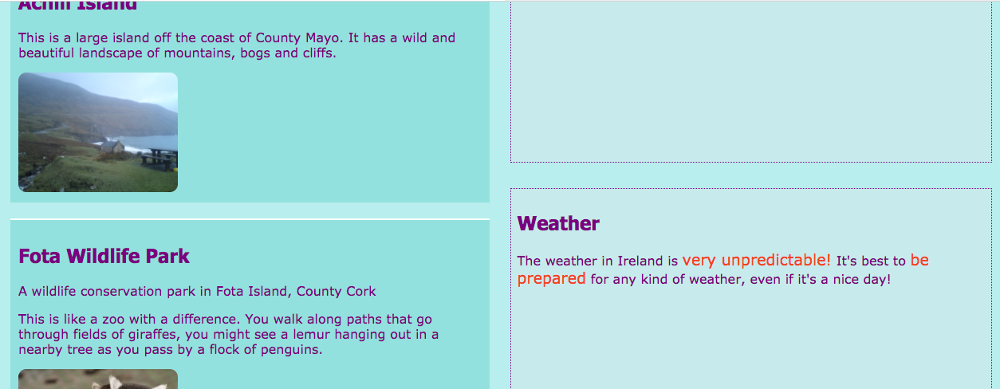
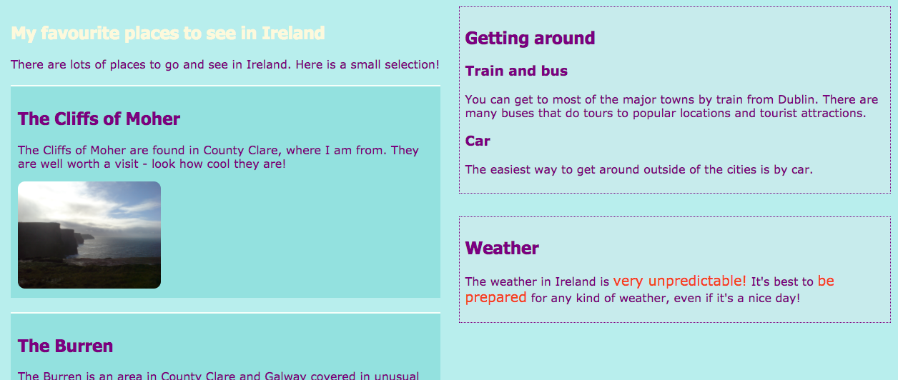

## Progettare layout di pagina interessanti

+ Per questa scheda dovresti lavorare con una pagina che contiene un elemento `main` con tre elementi al suo interno: un `article` e due `aside`. Se è necessario, vai e crea questi elementi. Se vuoi lavorare con il mio sito web, aggiungi il codice `aside` della precedente Sushi Card alla pagina delle attrazioni. 

Ecco tre diversi layout di pagina che applicherai:


+ Aggiungi nuove classi CSS a `main` e ad ognuno dei tre elementi al suo interno.

```html
    <main class="attPageLayoutGrid">
        <article class="attGridArticle">
            <!--un po' di roba qui->
        </article>
        <aside class="attGridAside1">
            <!--un po' di roba qui->
        </aside>
        <aside class="attGridAside2">
            <!--un po' di roba qui->
        </aside>
    </main>
```

Il contenitore a cui cambierai il layout è `main`, ma puoi farlo con qualsiasi tipo di contenitore, come un `div` o un `article`, o anche l'intero `body` della pagina. La tecnica che utilizzerai si chiama **CSS grid**.

In questo esempio, l'`intestazione` e `piè di pagina` saranno esclusi dal progetto, ma è abbastanza comune includerli nella griglia.

+ Imposta la proprietà `display` su `grid` nel contenitore generale:

```css
    .attPageLayoutGrid {
        display: grid;
        grid-column-gap: 0.5em;
        grid-row-gap: 1em;
    }
```

Cosa ne pensi delle proprietà `grid-column-gap` e `grid-row-gap`?

+ Successivamente, specifica una `grid-area` per ciascun elemento: 

```css
    .attGridArticle {
        grid-area: agArticle;
    }
    .attGridAside1 {
        grid-area: agAside1;
    }
    .attGridAside2 {
        grid-area: agAside2;
    }
```

Ora puoi progettare il tuo layout! Mettiamo i due elementi `aside` affiancati nella parte inferiore della pagina. Per questo hai bisogno di due **colonne** di uguale larghezza. Puoi mantenere l'altezza della **riga** su un valore automatico.

+ Inserisci il codice seguente all'interno delle regole CSS `.attPageLayoutGrid`:

```css
    grid-template-rows: auto;
    grid-template-columns: 1fr 1fr;
    grid-template-areas: 
        "agArticle agArticle"
        "agAside1 agAside2";
```

`fr` sta per **frazione**. Nota come fai in modo che l'`article` prenda tutto lo spazio sopra le due colonne.

## \--- collapse \---

## title: Aiuto! Ho degli errori e degli avvertimenti!

Se stai usando Trinket, potresti notare alcuni errori e avvertimenti, anche se hai digitato il codice esattamente come hai visto sopra. Questo perché Trinket non riconosce ancora le proprietà della griglia CSS. Tuttavia, il codice funzionerà lo stesso.

Se il codice della griglia CSS fornisce avvisi di 'proprietà sconosciuta' o un errore come 'unexpected token 1fr', puoi semplicemente ignorarli.

\--- /collapse \---


Mettiamo gli elementi `aside` sulla destra e rendiamoli larghi quanto metà `article`.

+ Modifica i valori di `grid-template-columns` e `grid-template-areas` in:

```css
    grid-template-columns: 2fr 1fr;
    grid-template-areas: 
        "agArticle agAside1"
        "agArticle agAside2";
```



+ Se non vuoi che gli elementi `aside` si estendano fino in fondo, puoi aggiungere uno spazio vuoto usando un punto: 

```css
    grid-template-areas: 
        "agArticle agAside1"
        "agArticle agAside2"
        "agArticle . ";
```



\--- challenge \---

## Sfida: crea layout diversi per dimensioni dello schermo diverse

+ È possibile utilizzare i controlli delle dimensioni dello schermo aggiunti in precedenza per modificare il layout in base alla larghezza dello schermo? Nota: se hai già creato blocchi CSS per ogni dimensione dello schermo, puoi aggiungere il nuovo codice CSS a quei blocchi invece di crearne di nuovi.

\--- hints \---

\--- hint \---

Il seguente codice definisce un layout per la classe CSS di sopra quando lo schermo è più grande di 1000 pixel:

```css
    @media all and (min-width: 1000px) {
        .attPageLayoutGrid {
            grid-template-columns: 1fr 1fr;
            grid-template-areas: 
                "agArticle agArticle"
                "agAside1 agAside2";
        }
    }  
```

\--- /hint \---

\--- hint \---

Il seguente codice definisce un layout per la classe CSS di sopra quando lo schermo è più grande di 1600 pixel:

```css
    @media all and (min-width: 1600px) {
        .attPageLayoutGrid {
            grid-template-columns: 1fr 1fr;
            grid-template-areas: 
                "agArticle agAside1"
                "agArticle agAside2"
                "agArticle .";
        }
    }  
```

\--- /hint \---

\--- /hints \---

\--- /challenge \---

Con la **griglia CSS**, puoi realizzare quasi tutti i layout che vuoi. Se vuoi saperne di più, vai a [dojo.soy/html3-css-grid](http://dojo.soy/html3-css-grid){:target="_blank"}