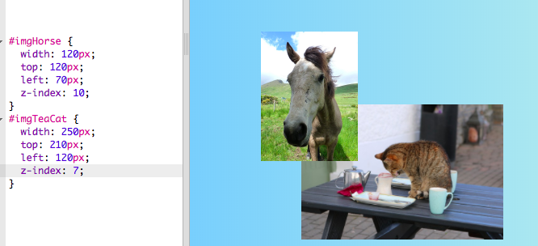

## collage di foto

Su questa scheda imparerai a usare i CSS per posizionare esattamente gli elementi HTML e creare un collage fotografico.


+ Aggiungi un `div` alla tua pagina e inserisci tutte le immagini che desideri. Assegna i valori `div` e `img` elementi `id`.

```html
    <div id="photoBox" class="relPos">
        
        
    </div>
```

Le foto verranno visualizzate una dopo l'altra nella pagina Web, nell'ordine in cui appaiono nel codice.

+ Nel tuo file CSS, aggiungi la seguente classe CSS per gli elementi all'interno di `div`: 

```css
    .absPos {position: absolute; }
```

+ Successivamente, è necessario aggiungere la posizione `della proprietà: relativa;` al contenitore stesso e definire una dimensione per esso. Questo fa sì che le posizioni degli altri elementi siano definite **rispetto a** (cioè, all'interno) del contenitore.

```css
    .relPos {position: relativo; } #photoBox {width: 800px; altezza: 400 px; }
```

+ Quindi crea una serie di regole di stile per ciascuno degli elementi usando **selettori id** per impostare le loro dimensioni (`larghezza` e / o `altezza` proprietà) e le loro posizioni esatte.

Per definire la posizione di un elemento, sono disponibili quattro proprietà: `sinistra`, `destra`, `superiore`e `inferiore`. Rappresentano quanto devono essere lontani i bordi dal margine del genitore. Utilizzare `superiore` o `inferiore` per la posizione verticale e `sinistra` o `` destra per la posizione orizzontale.


+ Scegli le posizioni esatte per ciascuna delle tue immagini e usa una delle proprietà `sinistra`, `destra`, `top`e `basso` per definire quelle posizioni nelle tue regole CSS. Ad esempio, questo codice posiziona l'immagine del gatto 100 pixel dall'alto e 60 pixel da sinistra:

```css
    #imgTeaCat {width: 250px; in alto: 100 px; a sinistra: 60 px; }
```

Nota: i valori di posizione possono anche essere negativi! Se si utilizza un valore negativo, si spinge l'elemento fuori dal contenitore, su qualsiasi bordo specificato.

### Fare le cose si sovrappongono

Potresti voler sovrapporre alcune delle immagini. Ma come si sceglie quale va avanti?

+ Scegli due immagini e dai loro posizioni che le facciano sovrapporre.

+ Aggiungi una proprietà extra, `z-index: 10;` a uno di essi, quindi aggiungi `z-index: 7;` all'altra.

+ Dai un'occhiata al risultato sulla tua pagina web.



+ Ora scambia i valori di `z-index` , in modo che il `7` e il `10` siano il contrario. Vedi qualche differenza sulla tua pagina web?


## \--- chiudi \---

## titolo: come funziona z-index?

La proprietà `z-index` ti consente di decidere come sovrapporre due o più elementi. Il valore può essere qualsiasi numero intero.

L'elemento con il **più alto** numero finisce in **superiore** della pila, o in altre parole molto **anteriore**. L'elemento con il numero più alto successivo è dietro quello, e davanti agli altri, e così via, finché non si arriva all'elemento con il numero più basso, che appare dietro a tutti gli altri elementi.

\--- / chiudi \---

Puoi posizionare qualsiasi elemento HTML in questo modo, non solo le immagini. Ad esempio, puoi usare un elemento `p` per aggiungere del testo sopra una foto.

\--- sfida \---

## Sfida: crea un collage fotografico

+ Prova a creare il tuo collage di foto come quello mostrato di seguito! Usa il posizionamento esatto insieme a diversi valori di `z-index` per ottenere l'effetto di sovrapposizione nel modo desiderato.

\--- suggerimenti \---

\--- suggerimento \---

Di seguito è riportato il codice HTML per il collage di foto sul mio sito Web in Irlanda. Ci sono sei foto e una parte di testo all'interno di uno `div`.

```html
    <div id="photoBox" class="relPos">
        
        
        
        
        
        
        <p id="photoText" class="absPos">Irlanda</p>
    </div>
```

\--- / suggerimento \---

\--- suggerimento \---

Ecco le regole CSS che definiscono le posizioni per ciascuna delle mie immagini nel collage:

```css
    #imgHorse {width: 120px; superiore: 200 px; a sinistra: 390 px; z-index: 10; } #imgSheep {width: 200px; in alto: 100 px; a sinistra: 20px; z-index: 8; } #imgCoast {width: 150px; In alto: 250 px; a sinistra: 10px; z-index: 5; } #imgTrees {width: 110px; superiore: 65 px; a sinistra: 205 px; z-index: 9; } #imgTeaCat {width: 250px; superiore: 210 px; a sinistra: 160 px; z-index: 7; } #imgStreet {width: 180px; superiore: 90 px; a sinistra: 310 px; z-index: 6; } #photoText {font-family: "brush script MT"; colore: verde chiaro; font-size: 4em; a sinistra: 35 px; inizio: 15px; z-index: 20; }
```

\--- / suggerimento \---

\--- suggerimento \---

Ecco le classi CSS che ho usato:

```css
    .collagePhoto {border: 1px solido bianco; } .relPos {position: relativo; } .absPos {position: absolute; }
```

\--- / suggerimento \---

\--- / suggerimenti \---


\--- / challenge \---