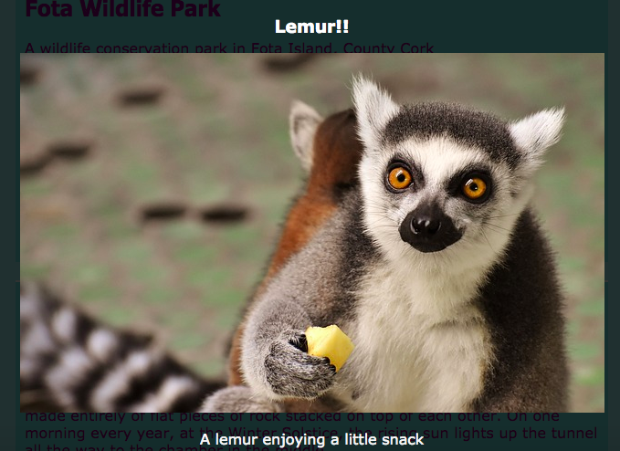

## 特殊効果

このカードでは、CSSで達成できるいくつかの素晴らしい効果を学びます。

### 影と動き

あなたが前に作ったカードの上にカーソルを置いたときに少し動きを加えましょう。

+ 以前の `.card：hover` CSSクラスを見つけて、次のように変更します。

```css
    .card：hover {box-shadow：0px 2px rgba（0,0,0,0.2）; transform：translateY（-2px）; }
```

+ `translate` 関数で異なる値を試してみてください！

## \---崩壊\---

## タイトル： `変換` プロパティ

中級のHTML / CSS寿司カードを完成した場合、 `@keyframes` アニメーションで `トランスフォーム` プロパティを使用することを覚えているかもしれません。 ここでは、通常のCSSブロック内でプロパティを単独で使用することもできます。

あなたがあるためにそれを設定することができます値の一種 `回転`要素のターンを作るために、。 その他は `移動Y`上下何かを移動し、そして `移動X`左右に移動するため、。

\--- /崩壊\---

+ 異なる画素値を用いて約プレイ `ボックスシャドウ` 彼らが何を参照してくださいプロパティ。 

## \---崩壊\---

## タイトル： `rgba`とは何ですか？

`rgba（0,0,0,0.2）` は色を定義する別の方法です。

赤、緑、青の3つの数字（ `0` から `255`）があります。

**アルファ** 値と呼ばれる4番目の数字は、 **透明な** （またはシースルー）がどのようにあるかを定義します。 それは `0` と `1`間の10進数であり、 `1` はシースルーではなく、 `0` は完全に不可視である。 これは、要素のアルファ値が低いほど、シースルーが多くなることを意味します。

\--- /崩壊\---

+ 最後に、以前の `.card` クラスに次のプロパティを追加して、動きを円滑にします。 

```css
    移行：すべて0.2秒の緩和。
```

`0.2秒` 持続時間は、 `秒` が0.2秒間続くことを意味する。

### ライトボックス

あなたがたぶん多くのウェブサイトで見た別の効果は、ライトボックス **ライトボックス**：何かをクリックするとウェブサイトが暗くなり、大きな写真やポップアップボックスのようなものがすべての目の前に現れます。



この効果を得るには、実際のライトボックス（ポップアップするビット）とライトボックスを表示するためにクリックしたものの2つのリンクを作成します。 私は私のウェブサイトのアトラクションページで私のことをするつもりです。 あなたはあなたが写真を持っているどのページでも一緒に行く！

+ クリックしたときに表示するものを決め、リンクを作成するために</code> タグ `セットの間にすべてをページに追加します。 リンクに <code>ID`。 コードはページのどこにでも置くことができます。次のステップで要素を非表示にします！

```html
    <a href="#_" class="lightbox" id="boxLemur">
        <h3>レムル！</h3>
        
        <p>少しの軽食を楽しむキュウリ</p>
    </a>
```

リンクタグの間に好きなものを置くことができます。 私は大きな絵、見出し、テキストを持っています。 たぶんあなたはただの写真とテキストがほしいと思うかもしれません！

+ ライトボックスに次のCSSコードを追加します。 あなたはそれのいくつかを解決することができますか？

```css
    .lightbox {背景：rgba（0,0,0,0.8）;色：#ffffff; text-align：center;テキスト装飾：なし;幅：100％;高さ：100％;トップ：0;左：0;位置：固定;可視性：非表示; z-インデックス：999; }
```

注： `position` プロパティを `fixed` 設定すると、設定した位置はブラウザウィンドウとの相対的なものになるため、スクロールするときはそのまま残ります。

+ 次に、ライトボックスを表示させるために何をクリックするかを決め、その要素の周りに `の` タグのペアを追加します（私の場合、それはキツネの小さな絵です）。 リンクの **ターゲット** はライトボックスになり、 `id`を使用して設定します。 早くからこのテクニックを認識するかもしれません！

```html
    <a href="#boxLemur">
        
    </a>
```

+ 最後に、次のCSSコードを追加します。 これは **疑似クラス**あることに注意してください。 `.lightbox` クラスのコードの後に​​置かなければなりません。

```css
    .lightbox：target {visibility：visible; }
```

`：ターゲット` 擬似クラスは、ライトボックスがクリックされた最後のリンクのターゲットであった場合に適用されます。 だから、どこかをクリックすると、 `可視性` は `隠された`戻ります。

+ 新しいリンクをクリックして、ライトボックスが表示されることを確認してください！ 遠ざけるには、ページのどこかをクリックしてください。

ライトボックスは、ページに必要なだけ追加できます。 彼らはすべて同じCSSクラスを使うことができます - それぞれが異なる `id`持っていることを確認してください！ それぞれについては、ウェブページ上の何かをクリックしてライトボックスを表示させるリンクにしてから、上記のように `id` を `href` 値として使用する必要があります。