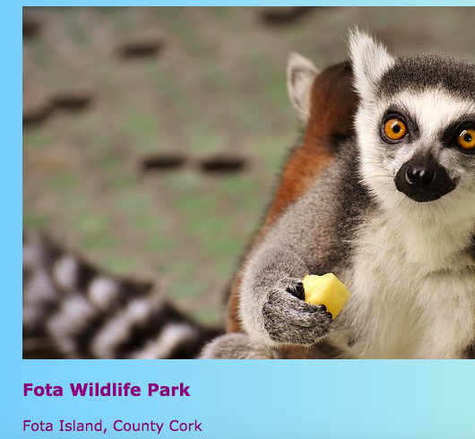
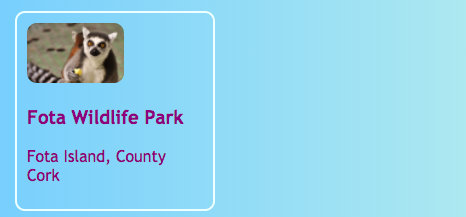

## クリック可能なカード

少し：ここでは、フォトギャラリーを作るために使用できる技術、またはプロジェクトを披露し、ポートフォリオのページの **プレビューカード**。


+ あなたの好きな場所であなたのウェブサイトに次のHTMLコードを追加します。 私は上の鉱山をやってる `index.htmlを`。 自分のプレビューカードに合わせて画像やテキストを変更することができます。 私はアイルランドで観光スポットのハイライトの束を行うつもりです。

```html
    <article class="card">
        
        <h3>フォタワイルドライフパーク</h3>
        <p>フォタ島、コーク州</p>
    </article>
```



+ 次のCSSコードを追加して、クラス `カード` と `を作成します。tinyPicture`：

```css
    .tinyPicture {height：60px; border-radius：10px; } .card {width：200px;}。高さ：200px; border：2px solid＃F0FFFF; border-radius：10px;ボックスサイズ：border-box;パディング：10px; margin-top：10px; font-family： "Trebuchet MS"、サンセリフ; } .card：ホバー{ボーダーカラー：＃1E90FF; }
```



プレビューカード全体をリンクにして、人々がクリックして詳細を表示できるようにしましょう。

+ リンク要素内に `記事` 要素全体を配置します。 閉じている `</a>` タグが閉じた `</article>` タグの後ろにあることを確認してください！ リンク **URL** を自由にリンクしたいものに変更してください。 それはあなたのウェブサイト上の別のページでも、別のウェブサイトでもかまいません。

```html
    <a href="attractions.html#scFota">  
        <article class="card ">
            
            <h3>フォタ・ワイルドライフ・パーク</h3>
            <p>フォタ島、コーク州</p>
        </article>
    </a>
```


## \---崩壊\---

## title：ページの特定の部分にリンクする

私のリンクの `href` 値が `#scFota`終わっていることに注目してください。 これは、ページの特定の部分にジャンプするために使用できるきちんとしたトリックです。

+ まず、リンクするページのURLを入力し、 `＃`ます。

+ あなたがリンクしているページのコードファイルで、ジャンプしたい部分を見つけ、その要素に `id`を与えます。例えば、 `<section id = "scFota"`。 `id` の値は、リンクの `＃` 後に入力する値です。

\--- /崩壊\---

## \---崩壊\---

## title：スタイルをリセットする

プレビューカード全体がリンクであるため、テキストフォントが変更されている可能性があります。

+ そうであれば、リンクに **CSSクラス** を追加することで修正できます： `class = "cardLink"`。 あなたのスタイルシートに入れるCSSコードは次のとおりです：

```css
    .cardLink {color：inherit;テキスト装飾：なし; }
```

任意のプロパティの値を設定 `継承` それがその値を使用します **親** 要素があります。 この場合、テキストの色はホームページ上のテキストの残りの部分と一致します。

\--- /崩壊\---

+ これらのカードの少なくとも4つまたは5つを作ってください。 私のウェブサイトの例から作業している場合は、「アトラクション」ページのセクションごとに1つずつ行うことができます。 次の寿司カードでは、すばらしいトリックでカードを手配する方法を学びます！