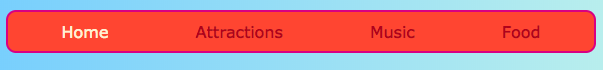

## 全行

このカードでは、あなたは物事配置するためのいくつかのトリックを学ぶことができます **水平に** ページ。 まず、物事を中心にする方法がわかります。 次に、要素を並べて並べます。

+ 次のCSSプロパティを `.card` クラスに追加します。

```css
    margin-left：auto; margin-right：auto;
```

カードがページの中央に移動するのを確認する必要があります。 左右のマージンを `auto`に設定すると、左に上書きするのではなく、中央に任意の要素を置くことができます。


+ ブラウザーウィンドウの端をドラッグして、ページの幅を広げ、幅を広げます。カードが中央に留まることに注意してください。

+ 作成したすべてのカードリンクを新しいコンテナ要素に置きます。 これは `品目` または `セクション`はなりませんが、 `div`と呼ばれます。 これは、グループ化や素敵なレイアウトの作成に使用できる汎用のコンテナです。

```html
    <div class="cardContainer">
```

+ あなたのスタイルシートに次のCSSコードを追加します：

```css
    .cardContainer {display：flex;フレックスラップ：ラップ; justify-content：スペースアラウンド;パディング：10px; }
```

Voilà！ **Flex**おかげで、あなたのカードが並んで表示されるようになりました！

+ ウィンドウの端をドラッグしてウェブサイトをより幅広く狭くし、カードがウィンドウサイズに合わせてどのように移動し、次の行に折り返すかを監視します。


+ `.card` クラスから `幅` と `高さ` プロパティを削除して、何が起こるかを見てみましょう： `フレックス` はジグソーパズルのようにカードを巧みに合わせ、同じ行にあるすべてのものにわたって均一な高さを保ちます。


あなたのページの上部にナビゲーションメニューがある場合、それは別の場所で、このトリックを使用することができます。 あなたのメニューは、この次のビットのためにリスト要素（（`li`）で構成されている必要があります。 あなたが好きなら、あなたは私のウェブサイトでそれを試すことができます。

+ メニューのCSSルールを見つけます。 私のウェブサイトでは、それはブロックです `NAV UL`、 `NAV UL李`、および `のnav ulの李`。

+ プロパティを削除する `display：inline;` をリスト項目から削除します。 次に、リスト `nav ul`、次を追加します。

```css
    ディスプレイ：フレックス; justify-content：フレックススタート。
```


あなたはほとんど同じメニューで終わるのですよね？ `フレックス` のクールなことは、プロパティ `justify-content`レイアウトを制御できることです。

+ `justify-content` の値を `flex-end` 変更し、何が起こるかを確認します。 またはそれを変更する `スペースの周りに` あなたはカードのためにやったように、等間隔のメニュー項目を作成します。




**`flex`** は非常に強力なレイアウトツールで、独自の寿司カードシリーズをいっぱいにすることができます。詳しくは、 [dojo.soy/html3-flex](http://dojo.soy/html3-flex)ご覧ください。