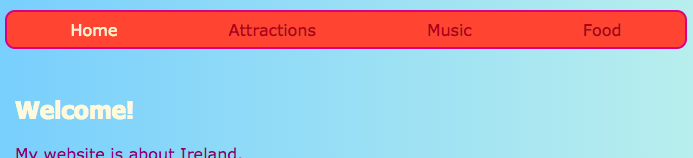

## メニューを反応させる

**応答** ウェブサイトは、それは常にあなたがコンピュータ、携帯電話、またはタブレット上でそれを見ているかどうか、偉大に見えるように、画面サイズに合わせて自動的に調整です。 あなたのメニューを反応させましょう！

あなたは通常のスタイルから始めます：これはあなたの **デフォルト** 動作になります。

## \---崩壊\---

## タイトル：「デフォルト」とはどういう意味ですか？

デフォルトのスタイルは、通常のスタイルルールのセットです。 特別な条件をチェックする前に、何に関係なく適用されます。

画面のサイズを確認し、必要に応じて調整を加えるコードを追加することができます。

\--- /崩壊\---

+ メニューに次のCSSルールを追加します。 おそらく色と罫線も定義されているはずです。私はここにスペースを節約するためにそれらを残しました！ メニューにCSSルールがすでに定義されている場合は、不足しているプロパティと値を追加または変更するだけです。

```css
    nav ul {パディング：0.5em;ディスプレイ：フレックス;フレックス方向：列; } nav ul li {text-align：center;}リストスタイルタイプ：なし; margin-right：0.5em; margin-left：0.5em; }
```

上記のCSSコードを使用すると、メニューは小さな画面に最適です。 これはと呼ばれる **モバイル-最初の** 開発。


## \---崩壊\---

## title：「モバイルファースト」は何を意味しますか？

ウェブサイトをコーディングするときは、コンピュータ画面を使用することが多く、その画面での表示方法に基づいてスタイルを定義するのが一般的です。

モバイルを最初にコーディングするときは、代わりにスマートフォンなどの小さな画面に適したデフォルトのスタイルを選択します。 その後、大きな画面の調整を行うために余分なコードを追加します。

ますます多くの人がコンピュータではなくスマートフォンやタブレットでインターネットを閲覧しているため、この点を考慮してウェブサイトを開発することをお勧めします。

\--- /崩壊\---

+ 次のコードをスタイルシートに追加します。

```css
    @media allと（最小幅：1000px）{nav ul {flex-direction：row; justify-content：スペースアラウンド; }}
```

上のコードの最初の行は、ブラウザウィンドウのサイズを調べます。 ウィンドウがある場合は **1000ピクセル** 広い以上、それはブロック内のすべてのスタイルルールを適用します。



## \---崩壊\---

## タイトル：どのように機能するのですか？

このブロックには、 `nav ul` メニューのいくつかのプロパティの新しい値が含まれています。

ウィンドウが1000ピクセルより広い場合は、 `nav ul`に対して既に定義した値の代わりに、新しい値が適用されます。

`nav ul` ために以前に定義した残りのプロパティは同じままです。

\--- /崩壊\---

+ Trinketを使用してコードを書く場合は、プロジェクトをダウンロードしてフルサイズの画面でテストできるようにすると便利です。

\---挑戦\---

## 課題：大きな画面でメニューを調整する

+ **1600ピクセル**より大きいスクリーン用にもう1つのブロックを追加できますか？ `スペース -`代わりに `フレックスエンド`？


- - ヒント - -

\---ヒント\---

次のコードは、画面が1600ピクセルより大きい場合のメニュー項目のflexプロパティを定義しています。

```css
    @media allと（最小幅：1600ピクセル）{nav ul {flex-direction：row; justify-content：フレックスエンド。 }}  
```

\--- /ヒント\---

- - /ヒント - -

\--- /チャレンジ\---

好きなCSSルールをブロックに入れて、さまざまな画面サイズの異なるスタイルを定義することができます。 後でCSSグリッドレイアウトを行うときに特に役立ちます！