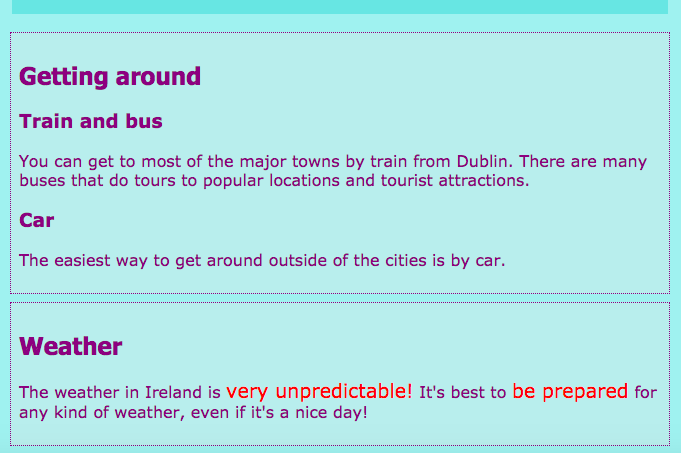

## キャプションとサイドノート

このカードでは、2つのタイプの **コンテナ** 要素について学びます：キャプション（タイトルや短い説明のようなテキスト）を画像に追加するために使用できるものと、余分なものがないときのためのもの本当にページの主な情報に属しています。

### キャプションの付いた写真

+ 画像の上または下にあるテキストを持つ `img` 要素を探します。 私は `index.html`でティトの写真と一緒に働いていますが、あなたはあなたのウェブサイトにあるものと一緒に行くことができます。 

```html
            
  <p>
    ツアーガイドティト！
  </p>
```

+ コードの上の行に、開始タグ `<figure>`追加します。 On a new line below the code, place the closing tag `</figure>`.

+ Next, remove the `p` tags, or whatever tags you have around the text (maybe it's a heading, like `h2`?), and put the text in between `<figcaption> </figcaption>` tags instead. 全体がこのように見えるはずです：

```html
  <figure>
                
      <figcaption>
      ツアーガイドティト！
      </figcaption>
  </figure>
```

`figcaption` 要素はあなたの **キャプションです**。 それは、 `img` 要素の上またはその下に行くことができます。


## \---崩壊\---

## title：これはなぜ有用ですか？

Figure</code> 要素 `は、画像とそのキャプションの <strong>コンテナ</strong> として機能します。 これにより、スタイルを定義するときに1つの単位として扱うことができます。</p>

<p>それらを論理的にグループ化することで、ウェブサイトのコードの構造を良好に保つことができます。</p>

<p>--- /崩壊---</p>

<p>あなたは、スタイルにCSSコードを使用することができます <code>図` 及び `figcaption` あなたは、クラス、IDが、または要素のセレクターを使用して、他の要素と同じように。 新しいコンテナによって追加された余分なスペースを削除するために、次のルールを追加します。

```css
  figure {margin-top：0px; margin-bottom：0px; margin-left：0px; margin-right：0px; }
```

### サイドノート

私のウェブサイトのアトラクションページは訪問する場所のリストです。 私は天気と回避方法に関するノートを追加したいと思います。 この情報は実際には属していません `記事` 、すべての観光スポットを持つ要素。 これは、 `脇に` 要素を使用する場合の例です。

+ 持っているあなたのウェブサイトのページに移動します `記事` 私が使用している-それは上の要素 `attractions.html`。

+ **Outside** of the `article` element, add one or more pairs of `<aside> </aside>` tags containing your extra stuff.

```html
  <aside class="sideNoteStyle">
      <h2>近寄り</h2>
      <h3>列車とバス</h3>
      <p>ダブリンから電車で大都市のほとんどに行くことができます。 人気のある場所や観光スポットへのツアーを行っている多くのバスがあります。</p>
      <h3>車</h3>
      <p>都市の外を回る最も簡単な方法は車で行なわれます。</p>
    </aside>
    <aside class="sideNoteStyle">
      <h2>天気</h2>
      <p>アイルランドの天気は、 <span class="specialText">非常に予測不可能！</span> それはするのがベストです <span class="specialText">調製することが</span> 、それは素敵な日だ場合でも、天候のあらゆる種類のために！</p>
  </aside>
```

## \---崩壊\---

## title：これはなぜ有用ですか？

`さておき`、 `物品`、及び他の容器は全て同様です。 唯一の本当の違いはである **の意味**あなたがのためにそれらを使用するもの、です。

可能な限り、意味のあるHTML要素を使用することが重要です。 それはあなたのウェブサイトをより良い構造にし、 **スクリーンリーダー**を使用する人々に特に役立ちます。

\--- /崩壊\---

そこに他の要素、 `スパン`を見つけましたか？ これは余分なCSSコードを追加するためだけに使用できる特別なタグです！ `スパン` タグのペアの間に何かを置くことができます。 これは、スタイリングなどで便利なのです **パート** 段落内のテキストを。

+ スタイルシートに次のCSSコードを追加して、上記のHTMLコードのスタイルを完成させます。

```css
  。sideNoteStyle {border：ドット付き1px紫;背景色：＃c1ebec;パディング：0.5em;マージン：0.5em; } .specialText {color：＃FF4500;} font-size：大きい; }
```



次のカードでは、ウェブサイトのレイアウトをより面白くする方法を学びます。

+ 準備ができて取得するには、1ページがある作る `記事` と2つの `さておき` 内の要素 `<main> </main>` タグを。 または、好きな場合は、私のウェブサイトのアトラクションページで作業できます。