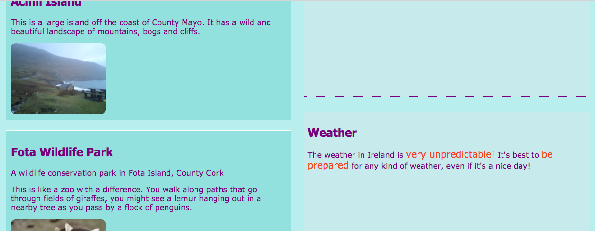

## クールなページレイアウトをデザインする

+ このカードでは、3つの要素が内部にある `メイン` 要素を含むページで作業する必要があります.1つは `つのアーティクル` つで、2つは `サイドに`つです。 必要に応じて最初に作成してください。 あなたは私のウェブサイトで作業したい場合は、追加 `さておき` 名所へ前の寿司カードからコードを。 

申請する3つの異なるページレイアウトを以下に示します：


+ 新しいCSSクラスを `メイン` とその内部の3つの要素にそれぞれ追加します。

```html
    <main class="attPageLayoutGrid">
        <article class="attGridArticle">
            <！ - その他のもの ->
        </article>
        <aside class="attGridAside1">
            <！ - その他のもの ->
        </aside>
        <aside class="attGridAside2">
            <！ - その他のもの ->
        </aside>
    </main>
```

レイアウトを変更するコンテナは `メイン`ですが、 `div` または `記事`、またはページ `本文`ように、あらゆる種類のコンテナでこれを行うことができます。 使用するテクニックは **CSSグリッド**と呼ばれ** 。</p> 

この例では、 `ヘッダー` と `フッター` はデザインから除外されますが、グリッドにもヘッダーを含めることは非常に一般的です。

+ コンテナ全体の `ディスプレイ` プロパティを `グリッド` に設定し` 。</li>
</ul>

<pre><code class="css">    .attPageLayoutGrid {display：grid;グリッド - カラム - ギャップ：0.5em;グリッド - 行 - ギャップ：1em; }
`</pre> 
    `grid-column-gap` と `grid-row-gap` プロパティは何をすると思いますか？
    
    + 次に、各要素の `グリッド領域` 名前を付けます。 
    ```css
        .attGridArticle {グリッドエリア：agArticle; } .attGridAside1 {グリッドエリア：agAside1;}。 } .attGridAside2 {グリッドエリア：agAside2; }
    ```
    
    次にあなたのレイアウトをデザインする！ 2つの入れましょう `脇に` ページの一番下に並んで要素側を。 このためには、同じ幅の2つの **列** が必要です。 **行** 高さを自動的に保つことができます。
    
    + 内部に次のコードを入れて `.attPageLayoutGrid` CSSルールを：
    ```css
        グリッドテンプレート行：自動;グリッドテンプレート列：1fr 1fr;グリッドテンプレート領域： "agArticle agArticle" "agAside1 agAside2";
    ```
    
    `fr` は **分数**表す。 `記事` が2つの列のすべてのスペースを占めるようにする方法に注目してください。
    
    ## \---崩壊\---
    
    ## タイトル：ヘルプ！ 私はエラーと警告を受け取りました！
    
    あなたがTrinketを使用している場合、上記のコードを正確に入力したとしても、いくつかのエラーと警告が表示されることがあります。 これは、TrinketがまだCSSのグリッドプロパティを認識していないためです。 ただし、コードは引き続き動作します。
    
    CSSグリッドコードで「不明なプロパティ」の警告や「予期しないトークン1fr」のようなエラーが発生した場合は、これらを無視するだけで済みます。
    
    \--- /崩壊\---
    
    
    
    右側に</code> 要素を除いて `置き、 <code>記事の幅の半分にしましょう`。
    
    + `grid-template-columns` および `grid-template-areas` の値を次のように変更します。
    ```css
        グリッドテンプレート列：2fr 1fr;グリッドテンプレート領域： "agArticle agAside1" "agArticle agAside2";
    ```
    
    
    
    + あなたがしたくない場合は `さておき` の要素は、下にすべての方法を伸ばすために、あなたは、ドットを使用して空白を追加することができます。 
    ```css
        グリッドテンプレート領域： "agArticle agAside1" "agArticle agAside2" "agArticle。 ";
    ```
    
    
    
    \---挑戦\---
    
    ## 課題：さまざまな画面サイズに異なるレイアウトを作成する
    
    + 以前に追加した画面サイズチェックを使用して、画面の幅に応じてレイアウトを変更できますか？ 注意：すでに各画面サイズでCSSブロックを作成している場合は、新しいCSSコードを新しいブロックコードを作成する代わりに、それらのブロックに追加することができます。
    
    - - ヒント - -
    
    \---ヒント\---
    
    次のコードは、画面が1000ピクセルより大きい場合のCSSクラスのレイアウトを定義しています。
    
    ```css
        @media allと（最小幅：1000px）{.attPageLayoutGrid {グリッドテンプレート列：1fr 1fr;グリッドテンプレート領域： "agArticle agArticle" "agAside1 agAside2"; }}  
    ```
    
    \--- /ヒント\---
    
    \---ヒント\---
    
    次のコードは、画面が1600ピクセルより大きい場合のCSSクラスのレイアウトを定義しています。
    
    ```css
        @media allと（最小幅：1600px）{.attPageLayoutGrid {グリッドテンプレート列：1fr 1fr;グリッドテンプレートエリア： "agArticle agAside1" "agArticle agAside2" "agArticle。"; }}  
    ```
    
    \--- /ヒント\---
    
    - - /ヒント - -
    
    \--- /チャレンジ\---
    
    **CSSグリッド**では、好きなレイアウトを作ることができます。 詳細については、 [dojo.soy/html3-css-grid](http://dojo.soy/html3-css-grid){{target = "_ blank"}}を参照してください。