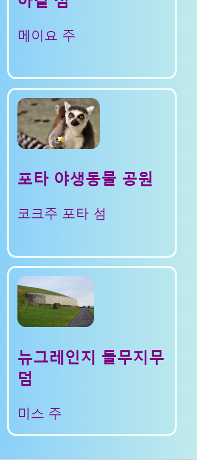
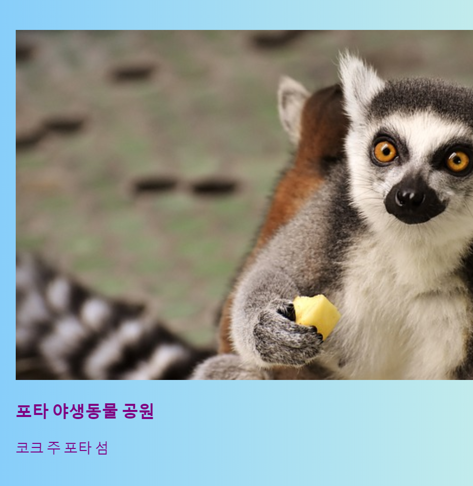
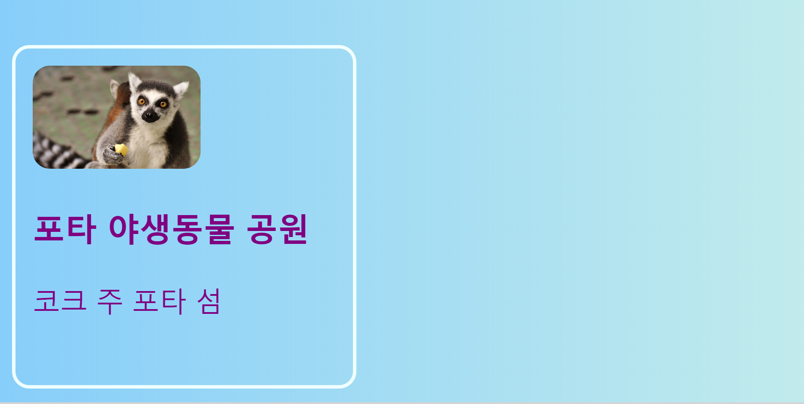
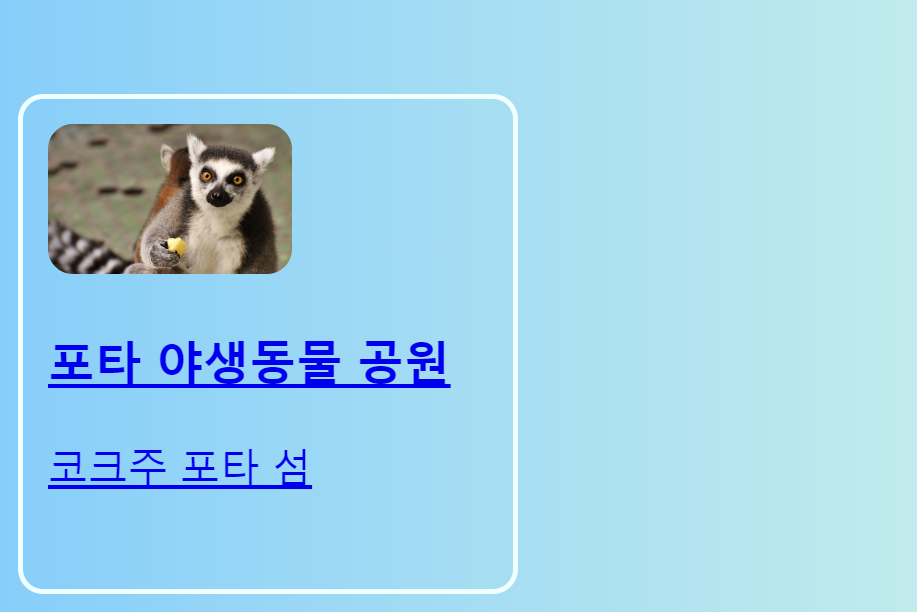

## 클릭할 수 있는 카드

다음은 사진 갤러리를 만들거나 프로젝트들을 뽐낼 수 있는 포트폴리오 페이지를 만드는데 사용할 수 있는 기술입니다: **사진 미리보기**.



+ 웹 사이트에 다음 HTML 코드를 원하는 곳에 추가하십시오. 저는 제 것을 `index.html`에서 하고 있습니다. 미리보기 사진에 맞게 그림과 텍스트를 변경할 수 있습니다. 저는 아일랜드의 관광 명소 사진들을 사용하겠습니다.

```html
    <article class="card">
        
        <h3> 포타 야생동물 공원</h3>
        <p> 코크 주 포타 섬</p>
    </article>
```



+ 다음 CSS 코드를 추가하여 `카드`와 `작은 사진` class를 만드세요:

```css
    .tinyPicture {
        height: 60px;
        border-radius: 10px;
    }
    .card {
        width: 200px;
        height: 200px;
        border: 2px solid #F0FFFF;
        border-radius: 10px;
        box-sizing: border-box;
        padding: 10px;
        margin-top: 10px;
        font-family: "Trebuchet MS", sans-serif;
    }
    .card:hover {
        border-color: #1E90FF;
    }
```



사람들이 클릭하여 자세한 정보를 볼 수 있도록 모든 미리보기 사진 링크를 걸어두겠습니다.

+ `기사`안의 요소 전체를 링크 요소 안에 위치시키세요. 닫는 태그`</a>`이 `</article>`뒤에 오게 하세요! **URL**을 원하는 링크로 자유롭게 바꾸세요. 당신의 웹사이트의 다른 페이지여도 좋고, 아니면 전혀 다른 웹사이트여도 좋습니다.

```html
    <a href="attractions.html#scFota">  
        <article class="card ">
            
            <h3>포타 야생동물공원</h3>
            <p>코크 주 포타 섬</p>
        </article>
    </a>
```



## \--- collapse \---

## title: 페이지의 특정 부분으로 링크걸기

제 링크의 `href` 값이 `#scFota`로 어떻게 끝나는지에 주목 해 주세요. 이 방법은 페이지의 특정 부분으로 이동할 때 사용할 수 있는 간단한 방법입니다.

+ 먼저 링크할 페이지의 URL을 입력한 다음 `#`를 입력합니다.

+ 예를 들어, 연결하고자 하는 페이지의 코드 파일에서 이동할 부분을 찾은 다음 해당 요소에 `id`를 부여합니다. `<section id="scFota"` 이 `id` 값이 귀하의 링크에서 `#`뒤에 입력할 내용입니다.

\--- /collapse \---

## \--- collapse \---

## title: 스타일 초기화

이제 전체 미리보기 카드가 링크이고, 글씨체도 변경할 것입니다.

+ **CSS class**를 해당 링크에 추가함으로써 글씨체를 수정할 수 있습니다: `class="cardLink"`. 다음은 스타일 시트에 넣을 CSS 코드입니다:

```css
    .cardLink {
        color: inherit;
        text-decoration: none;
    }
```

속성 값을 `상속`으로 설정하면 **부모** 요소가 가진 값을 사용할 수 있습니다. 이 경우에서는 글자 색이 홈페이지의 나머지 글자와 맞춰질 것입니다.

\--- /collapse \---

+ 적어도 4~5개의 카드를 만드세요. 만약 저의 예시 웹사이트에서 하고 있다면, 관광 명소 페이지의 각 섹션마다 하나씩 할 수 있습니다. 다음 초밥 카드에서는 멋진 방법으로 카드를 배열하는 법을 배울 것입니다!