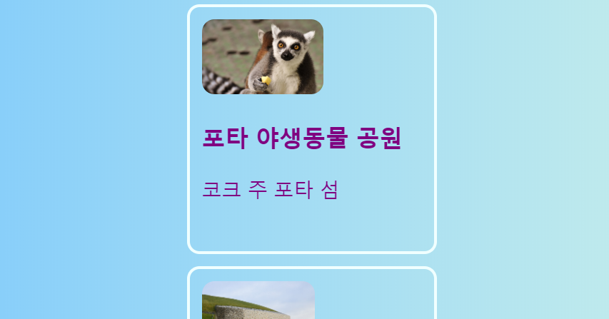
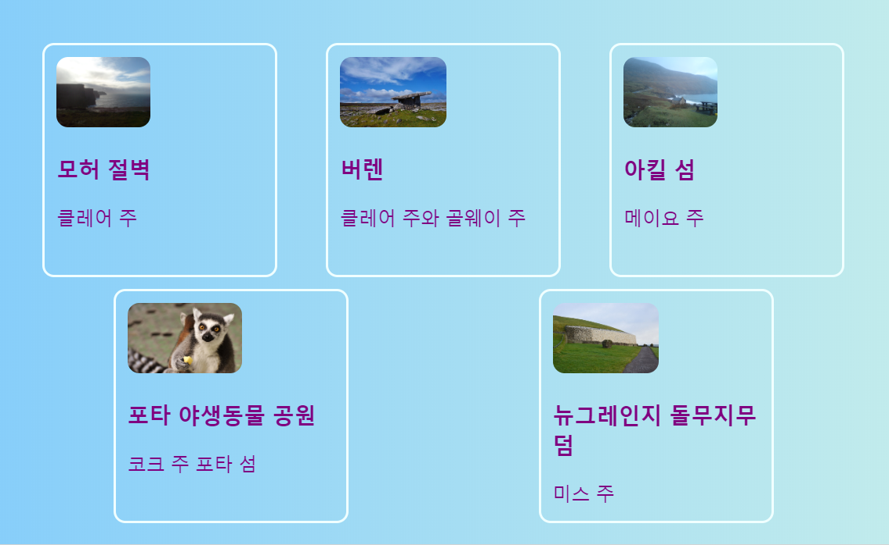
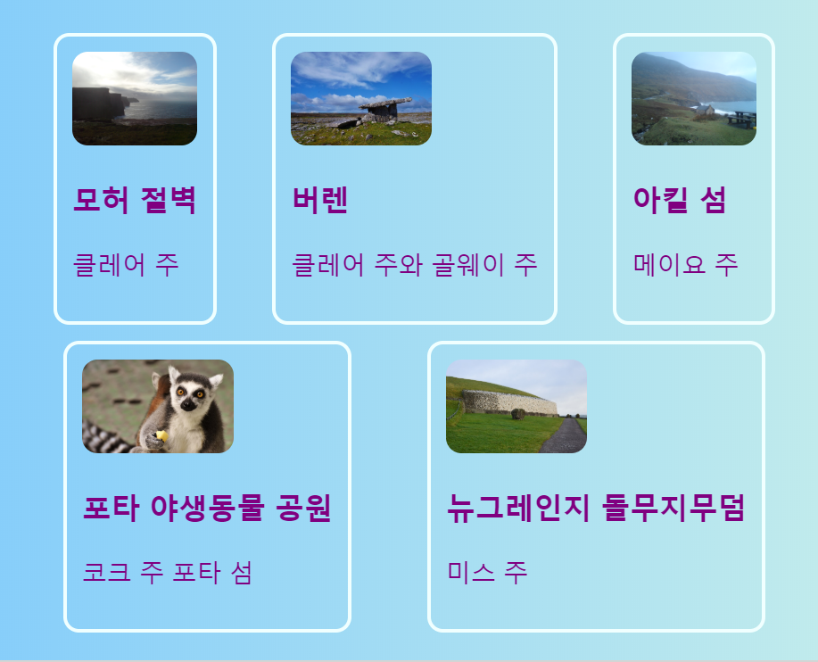
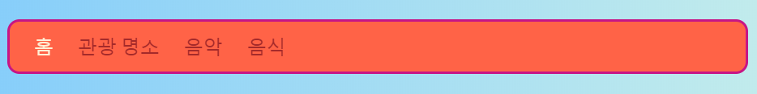
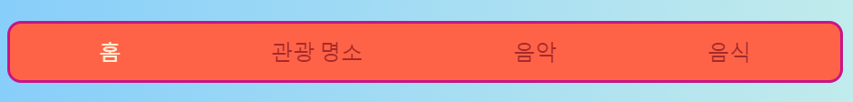
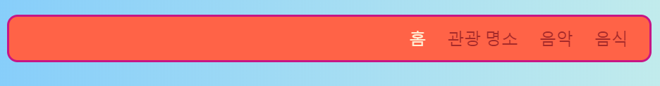

## 일렬로 세우기

이번 카드에서는, 페이지에서 대상을 **가로로** 정렬하는 기술을 배울 것입니다. 먼저, 중앙에 정렬하는 방법을 보겠습니다. 그 다음, 요소들을 한 줄로 배열하겠습니다.

+ 다음의 CSS 속성을 `.card` class에 추가하세요:

```css
    margin-left: auto;
    margin-right: auto;
```

카드들이 페이지의 중앙으로 이동하는 것을 볼 수 있습니다. 왼쪽 및 오른쪽 margin을 `auto`로 설정하면 임의의 요소를 왼쪽에 있지 않고 가운데로 위치시킬 수 있습니다.



+ 브라우저 창의 가장자리를 드래그하여 페이지를 더 좁고 넓게 만드십시오-카드는 중앙에 유지됩니다.

+ 방금 만든 모든 카드 링크를 새 컨테이너 요소에 넣습니다. `article`이나 `section`이 아니라 `div` 라고 쓰인 곳에 넣습니다. 이것은 여러분이 요소들을 그룹화하고 멋진 레이아웃을 만드는 데 사용할 수 있는 다용도의 컨테이너입니다.

```html
    <div class="cardContainer">
```

+ 다음의 CSS 코드를 당신의 스타일 시트에 추가하세요:

```css
    .cardContainer {
        display: flex;
        flex-wrap: wrap;
        justify-content: space-around;
        padding: 10px;
    }
```

바로 그거에요! **Flex** 덕분에 카드가 나란히 표시됩니다.

+ 창 가장자리를 끌어서 웹 사이트를 더 넓고 좁게 만든 다음, 창 크기에 맞춰서 카드가 종종 다음 줄로 넘어가며 크기에 맞춰 움직이는 것을 보세요.



+ `.card` 클래스에서 `width`와 `height` 특성을 삭제해 보고 어떤 일이 일어나는지 살펴보세요: `flex`은 카드를 퍼즐처럼 교묘하게 맞추어서 같은 줄에 있는 모든 것이 일정한 높이를 유지합니다.



페이지 상단에 탐색 창이 있는 경우, 그곳은 이 기술을 적용할 수 있는 또 다른 곳입니다. 이 다음 부분을 위해 다음 메뉴는 요소 리스트( (`li`) 로 구성될 필요가 있습니다. 원한다면, 제 웹사이트에서 해볼 수도 있습니다.

+ 메뉴에서 CSS 규칙을 찾으세요. 해당 CSS 규칙은 제 웹사이트에서 `nav ul`, `nav ul li`, and `nav ul li a`입니다.

+ 리스트 요소에서 `display: inline;` 속성을 삭제하세요. 그 다음 리스트 `nav ul`에서 다음을 추가하세요:

```css
    display: flex;
    justify-content: flex-start;
```



결국엔 거의 똑같은 메뉴로 끝나지 않나요? 이 `flex`의 좋은 점은 `justify-content`속성으로 레이아웃을 조절할 수 있다는 것이에요.

+ `justify-content`값을 `flex-end`로 변경하고 어떻게 되는지 확인하세요. 아니면 그것을 전에 했던 것 처럼 `space-around`로 바꿔 메뉴 항목의 간격을 균일하게 만듭니다.





**`flex`**는 초밥 카드 시리즈 전체를 채울 수 있는 꽤 강력한 레이아웃 도구입니다. 자세한 내용은 [dojo.soy/html3-flex](http://dojo.soy/html3-flex)에서 확인할 수 있습니다.