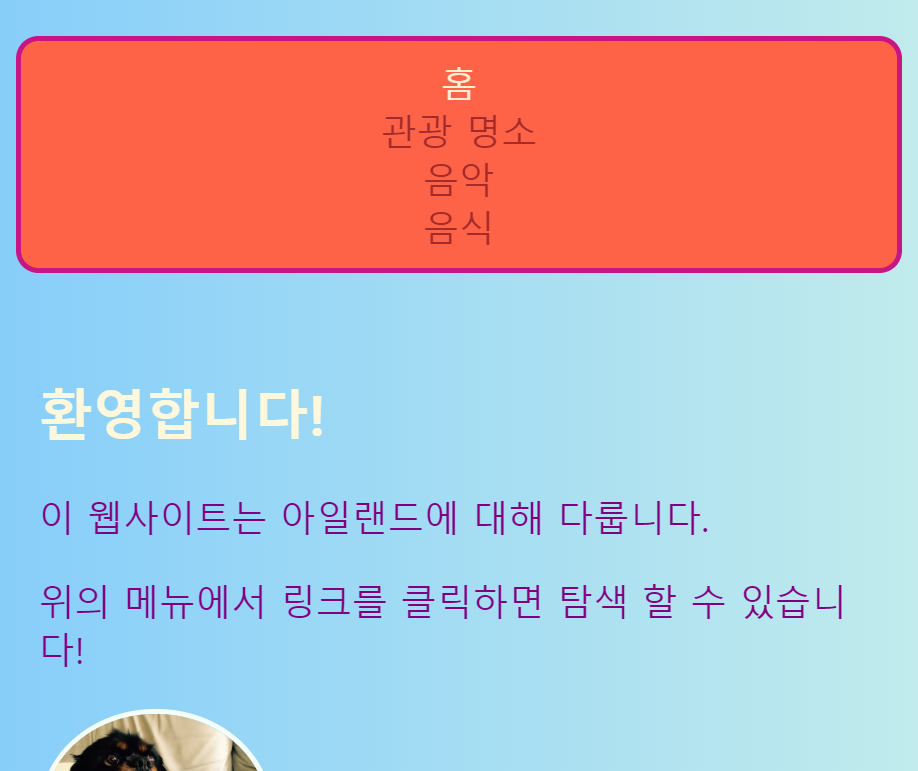
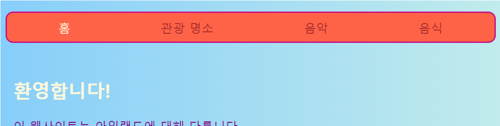
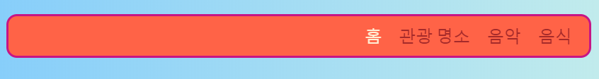

## 반응하는 메뉴 만들기

**반응하는** 웹사이트는 컴퓨터, 핸드폰, 태블릿 상관없이 스크린 크기에 맞춰 스스로 조절하여 항상 멋진 외관을 유지합니다. 나만의 반응하는 메뉴를 만들어 봅시다!

표준 스타일로 시작하겠습니다: 자신만의 **디폴트** 동작이 있을 것입니다.

## \--- collapse \---

## title: '디폴트'란?

디폴트 스타일은 기본 규칙 설정하는 것입니다. 디폴트 스타일은 특별한 조건을 제시하기 전에는 무엇이든 기본으로 설정됩니다.

코드를 추가한 다음, 화면의 크기를 확인하고 필요하다면 몇 가지 조절을 할 수 있습니다.

\--- /collapse \---

+ 메뉴에 다음의 CSS 규칙을 추가하세요. 정의된 색깔과 테두리가 있을 것입니다; 이것들을 여기 공간에 저장하기 위해 남겨두었습니다. 메뉴에 이미 CSS 규칙이 정의되어 있다면, 누락 된 속성 및 값을 추가하거나 아래에서 변경하십시오.

+ 당신은 패딩과 여백이 이전에 사용된 `px` 값이 아닌 `em` 값이 사용되었음을 알 수 있습니다. 픽셀 (px) 은 정적인 크기이지만 반응 형 웹 사이트에서는 화면 크기를 조정하기 위해 `em` 을 사용합니다.

```css
    nav ul {
        padding: 0.5em;
        display: flex;
        flex-direction: column;
    }
    nav ul li {
        text-align: center; 
        list-style-type: none;
        margin-right: 0.5em;
        margin-left: 0.5em;
    }
```

위에 있는 CSS 코드로 작은 화면에 맞는 메뉴가 될 것입니다. 이것을 **모바일 우선**개발이라고 부른다.



## \--- collapse \---

## title: '모바일 우선'이란?

여러분이 웹사이트 코딩을 할 때, 당연하게도 여러분은 컴퓨터 화면을 사용할 것 이고, 그 화면에 어떻게 보이는 지에 따라 웹사이트를 설정할 것입니다.

모바일 버전을 먼저 코딩할 때, 스마트폰 같은 작은 화면에 잘 맞는 디폴트 스타일을 선택할 것입니다. 그런 다음, 더 큰 화면에 조절하기 위해 나머지 코드를 추가합니다.

점점 더 많은 사람들이 컴퓨터보다 스마트폰이나 태블릿을 통해 인터넷을 둘러보기 때문에, 모바일 우선을 명심하고 웹사이트를 개발하는 것은 좋은 연습이 될 것입니다.

\--- /collapse \---

+ 이제 자신만의 스타일 시트에 맞춰서 다음의 코드를 추가하십시오:

```css
    @media all and (min-width: 1000px) {
        nav ul {
            flex-direction: row;
            justify-content: space-around;
        }
    }
```

위에 있는 코드의 첫 번째 줄은 브라우저 창의 크기를 확인합니다. 만약 창이 가로로 **1000 픽셀** 이상이면, 블럭 안에 있는 스타일 규칙을 적용할 것입니다.



## \--- collapse \---

## title: 어떻게 작동하나요?

그 블럭은 `nav ul` 메뉴의 단 몇 가지 속성을 위해 새로운 값을 포함합니다.

언제든 창이 1000픽셀 보다 넓다면, 이 새로운 값들은 `nav ul`에 이미 정의한 것들 대신에 적용될 것입니다.

그전에 `nav ul`에 정의한 나머지 속성들은 똑같이 남아있을 것 입니다.

\--- /collapse \---

+ 코드 작성을 위해 Trinket을 사용하고 있다면, 꽉 차는 화면에 시험해 보기 위해서 그 프로젝트를 다운로드하는 것은 도움이 될 것입니다.

\--- challenge \---

## 도전: 자신의 메뉴가 큰 화면에 스스로 조절되게 하기

+ **1600 pixels**보다 큰 화면의 `빈 공간이 남지` 않고 `끝까지 차도록` 또 다른 블럭을 추가할 수 있나요?



\--- hints \---

\--- hint \---

다음의 코드는 화면이 1600 픽셀보다 클 때, 메뉴에 있는 요소들을 위해 유연한 속성을 정의내립니다:

```css
    @media all and (min-width: 1600px) {
        nav ul {
            flex-direction: row;
            justify-content: flex-end;
        }
    }  
```

\--- /hint \---

\--- /hints \---

\--- /challenge \---

다양한 크기의 화면에 맞는 여러 스타일을 정의하기 위해 이런 방식으로 자신이 원하는 CSS 규칙을 내릴 수 있습니다. 이 기술은 특히 나중에 배우게 될 CSS 격자 레이아웃을 할 때 도움이 될 것입니다!