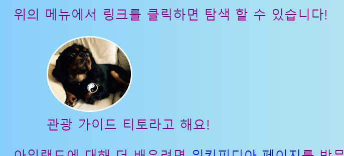
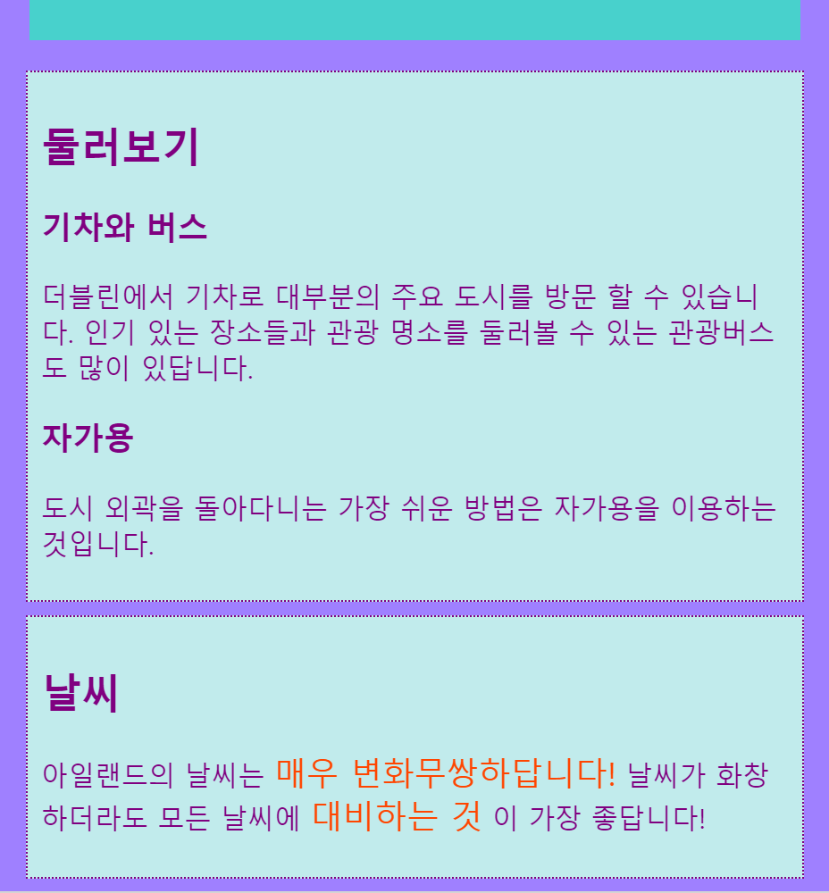

## 캡션 및 사이드 노트

이번 카드에서는 두 가지 종류의 **컨테이너**요소를 배우겠습니다: 사진에 캡션(제목이나 짧은 설명과 같은 글) 을 추가하는 데 사용할 수 있는 한 가지와 페이지의 주요 정보가 아닌 부수적인 것들을 추가하는 데 사용하는 한 가지 입니다.

### 캡션이 있는 사진

+ 텍스트가 위나 아래에 같이 있는 `이미지` 요소를 찾으세요. 저는 `index.html`에 있는 티토 사진으로 작업해 보겠습니다. 하지만 자신의 웹사이트의 어떤 이미지라도 괜찮습니다. 

```html
            
  <p>
    관광 가이드 티토라고 해요!
  </p>
```

+ 코드 위에 줄에, 여는 태그(`<figure>`)를 추가 합니다. 코드 아래에 새로운 줄에, 닫는 태그(`</figure>`) 를 추가 합니다.

+ 다음으로, `p` 태그나 자신의 텍스트 (`h2`와 같은 제목일 수 있음) 주변 아무 태그를 지우고, `<figcaption></figcaption>`태그 사이에 지운 텍스트를 넣어줍니다. 전체를 종합하면 다음과 같습니다:

```html
  <figure>
                
      <figcaption>
      관광 가이드 티토라고 해요!
      </figcaption>
  </figure>
```

`figcpation` 요소는 자신의 **캡션**입니다. `이미지` 요소 위나 아래에 위치할 수 있습니다.



## \--- collapse \---

## title: 이 기술이 왜 유용한가요?

`figure` 요소는 자신의 그림과 캡션에 **컨테이너** 요소로 작동합니다. 이 기술은 스타일을 정의 할 때 하나로 이것들을 하나로 처리할 수 있습니다.

논리적으로 이것들을 그룹화하는 것은 웹사이트 코드에서 좋은 구조를 유지하는 데 도움을 줍니다.

\--- /collapse \---

클래스, ID, 선택 요소들을 사용하면서, CSS 코드를 `figure`와 `figcaption` 스타일 지정에 사용할 수 있습니다. 새로운 컨테이너로 인해 추가된 나머지 여백을 제거하기 위해, 다음의 규칙을 추가하겠습니다:

```css
  figure { 
      margin-top: 0px;
      margin-bottom: 0px;
      margin-left: 0px;
      margin-right: 0px;
  }
```

### 사이드 노트

저의 관광 명소 페이지는 방문할 장소 목록입니다. 저는 날씨와 둘러보는 방법에 대한 노트 몇 개를 추가하려 합니다. 모든 정보들이 모든 관광명소의 `article` 요소에 실제로 해당하지 않습니다. 다음은 `aside` 요소를 사용할 때의 예시 입니다.

+ `article` 요소가 있는 자신의 웹 페이지로 갑니다 - 저는 `attractions.html`로 가겠습니다.

+ `article` 요소 **바깥에** 자신의 부수 내용을 포함하는 한 쌍 이상의 `<aside></aside>` 태그를 추가합니다.

```html
  <aside class="sideNoteStyle">
      <h2>둘러보기</h2>
      <h3>기차와 버스</h3>
      <p>더블린에서 기차로 대부분의 주요 도시를 방문 할 수 있습니다. 인기 있는 장소들과 관광 명소를 둘러볼 수 있는 관광버스도 많이 있답니다. </p>
      <h3>자가용</h3>
      <p>도시 외곽을 돌아다니는 가장 쉬운 방법은 자가용을 이용하는 것입니다.</p>
    </aside>
    <aside class="sideNoteStyle">
      <h2>날씨</h2>
      <p>아일랜드의 날씨는 <span class="specialText">매우 변화무쌍하답니다!</span> 날씨가 화창하더라도 모든 날씨에 <span class="specialText">대비하는 것</span>이 가장 좋답니다!</p>
  </aside>
```

## \--- collapse \---

## title: 이 기술이 왜 유용한가요?

`aside`, `article`와 다른 컨테이너들은 모두 비슷합니다. 유일한 차이는 사용하는 목적의 **뜻**에 있습니다.

HTML 요소를 사용할 수 있을 때 언제든지 의미있는 HTML 요소를 사용하는 것은 중요합니다. 이 기술은 더 좋은 구조를 사용하도록 해주고, 특히 **단말기기**를 사용하는 사람들에게 도움이 됩니다.

\--- /collapse \---

`span`에 있는 다른 요소를 발견했나요? 이것은 나머지 CSS 코드 추가 만을 해 사용할 수 있는 특별한 태그입니다. 쌍을 이루는 `span` 태그 사이에는 무엇이든 넣을 수 있습니다. 이 것은 문단의 텍스트 **부분**에 스타일링 하는 것에 유용합니다.

+ 위에 있는 HTML 코드 스타일링을 완성하기 위해, 다음의 CSS 코드를 스타일 시트에 추가합니다.

```css
  .sideNoteStyle {
    border: dotted 1px purple;
    background-color: #c1ebec;
    padding: 0.5em;
    margin: 0.5em;
  }
  .specialText {
      color: #FF4500;
      font-size: larger;
  }
```



다음 카드에서는, 웹사이트 레이아웃을 더 흥미롭게 만드는 방법에 대해 배워보겠습니다.

+ 준비를 위해, `<main></main>` 태그 안에 한 개의 `article`과 두 개의 `aside` 요소가 있는 페이지를 만들어 주세요. 아니면 제 웹사이트의 관광 명소 페이지로 작업할 수 있습니다.