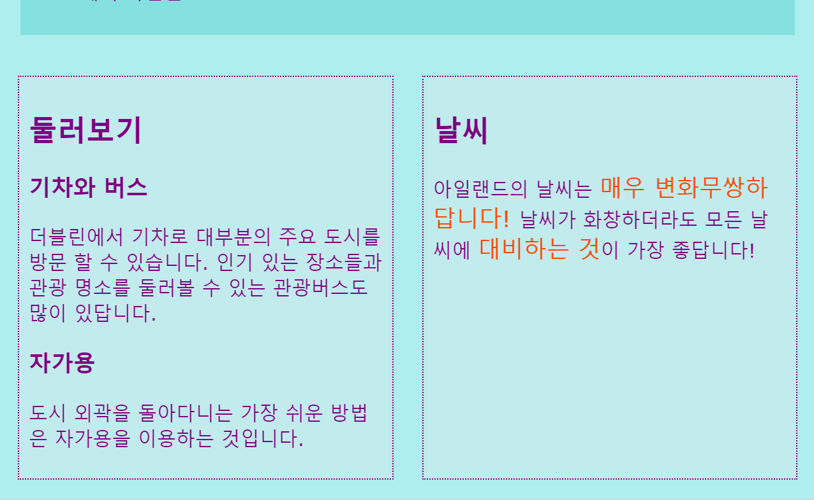
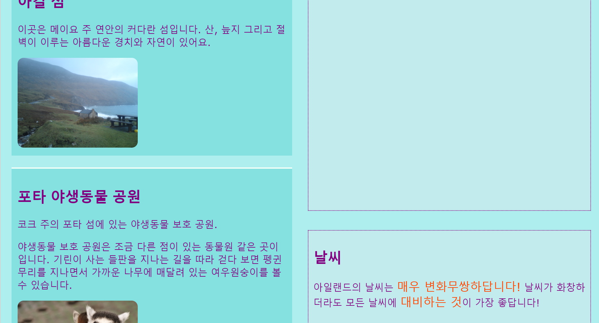
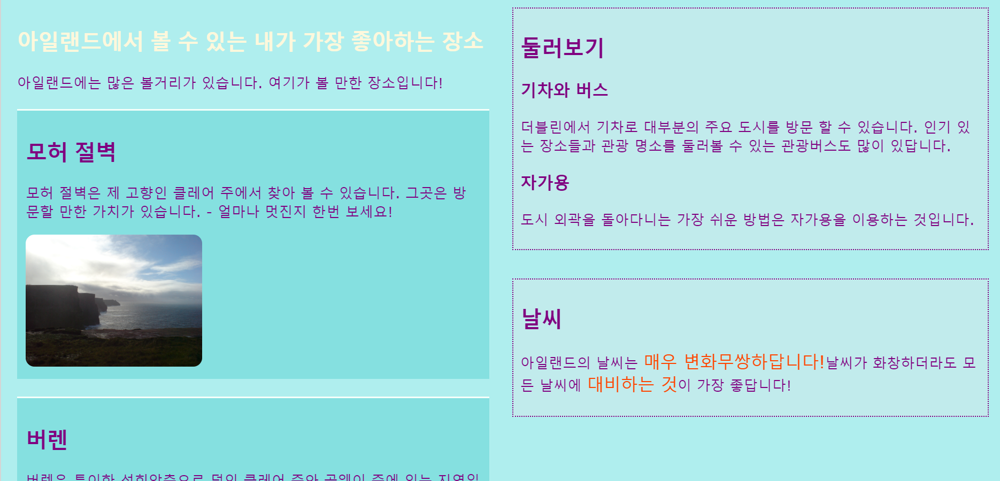

## 멋진 페이지 레이아웃 디자인하기

+ 이번 카드에서는 `main` 요소 1개와 다음의 요소 3개를 포함하는 페이지로 작업해야 합니다: `article` 1개, `aside` 2개. 필요한 경우 먼저 생성하세요. 제 웹사이트로 학습하길 희망한다면, `aside` 코드를 이전 초밥 카드에서 관광 명소 페이지에 추가합니다. 

다음은 적용할 3개의 다른 페이지 레이아웃입니다.


+ 새로운 CSS 클래스들을 `main`에 추가하고 3개의 요소를 각각 넣어줍니다.

```html
    <main class="attPageLayoutGrid">
        <article class="attGridArticle">
            <!--other stuff here-->
        </article>
        <aside class="attGridAside1">
            <!--other stuff here-->
        </aside>
        <aside class="attGridAside2">
            <!--other stuff here-->
        </aside>
    </main>
```

변경하게 될 레이아웃의 컨테이너는 `main`이지만, `div`, `article` 심지어 전체 페이지 `body`와 같은 어떤 종류의 컨테이너도 괜찮습니다. 여러분께서 배우게될 기술은 **CSS grid**라고 부릅니다.

이번 예제에서, `header`와 `footer`는 디자인 밖이지만, 이것들을 그리드에 포함하는 것은 꽤 흔합니다.

+ `display` 속성을 전반적인 컨테이너를 `grid`로 설정합니다.

```css
    .attPageLayoutGrid {
        display: grid;
        grid-column-gap: 0.5em;
        grid-row-gap: 1em;
    }
```

`grid-column-gap` 와 `grid-row-gap`의 속성이 무엇을 한다고 생각하나요?

+ 다음, 각각의 요소에 `grid-area` 이름을 지어줍니다. 

```css
    .attGridArticle {
        grid-area: agArticle;
    }
    .attGridAside1 {
        grid-area: agAside1;
    }
    .attGridAside2 {
        grid-area: agAside2;
    }
```

그런 다음 자신의 레이아웃을 디자인합니다! `aside` 요소 2개를 페이지 바닥에 나란히 놓아봅시다. 이 작업을 하기 위해, 같은 폭의 **열** 2개가 필요합니다. **행** 높이를 자동적으로 유지할 수 있습니다.

+ CSS 규칙 `.attPageLayoutGrid` 안에 다음의 코드를 넣습니다.

```css
    grid-template-rows: auto;
    grid-template-columns: 1fr 1fr;
    grid-template-areas: 
        "agArticle agArticle"
        "agAside1 agAside2";
```

`fr`은 **fraction**을 나타냅니다. 두 열의 모든 공간을 차지하는 `article`을 만드는 방법을 알아둡니다.

## \--- collapse \---

## title: 도와주세요! 에러와 경고 문구가 떠요!

Trinket을 사용하고 있다면, 위에 있는 코드를 정확하게 입력했는데도 불구하고, 에러와 경고가 뜨는 것을 알아 채셨을지도 모릅니다. 그 이우는 Trinket이 CSS 그리드 속성을 아직 인식하지 않기 때문입니다. 하지만, 코드는 여전히 작동합니다.

CSS 그리드 코드가 'unknown property' 경고 문구나 'unexpected token 1fr'과 같은 에러를 띄웠다면, 이것들을 단순히 무시할 수 있습니다.

\--- /collapse \---



`aside` 요소를 오른편에 넣어서 `article`의 너비를 반으로 만들어봅시다.

+ `grid-template-columns`와 `grid-template-areas`의 값을 다음과 같이 변경합니다:

```css
    grid-template-columns: 2fr 1fr;
    grid-template-areas: 
        "agArticle agAside1"
        "agArticle agAside2";
```



+ `aside` 요소를 바닥 전체에 펼쳐놓고 싶지 않다면, 점을 사용하여 빈칸을 추가할 수 있습니다. 

```css
    grid-template-areas: 
        "agArticle agAside1"
        "agArticle agAside2"
        "agArticle . ";
```



\--- challenge \---

## 도전: 다양한 스크린 크기에 맞는 다양한 레이아웃 만들기

+ 화면 너비에 따라 레이아웃을 변하게 하기 위해 미리 추가한 화면 크기 확인기를 사용할 수 있나요? 참고: 만약 이미 각각의 화면 크기에 맞게 CSS 블럭을 생성했다면, 새로운 블록들을 만드는 대신에 새로운 CSS 코드를 이 블럭에 추가할 수 있습니다.

\--- hints \---

\--- hint \---

다음의 코드는 화면 크기가 1000 픽셀보다 클 때 위에 있는 CSS 클래스의 레이아웃을 정의합니다:

```css
    @media all and (min-width: 1000px) {
        .attPageLayoutGrid {
            grid-template-columns: 1fr 1fr;
            grid-template-areas: 
                "agArticle agArticle"
                "agAside1 agAside2";
        }
    }  
```

\--- /hint \---

\--- hint \---

다음의 코드는 화면 크기가 1600 픽셀보다 클 때 위에 있는 CSS 클래스의 레이아웃을 정의합니다:

```css
    @media all and (min-width: 1600px) {
        .attPageLayoutGrid {
            grid-template-columns: 1fr 1fr;
            grid-template-areas: 
                "agArticle agAside1"
                "agArticle agAside2"
                "agArticle .";
        }
    }  
```

\--- /hint \---

\--- /hints \---

\--- /challenge \---

**CSS 그리드**를 이용하여 원하는 레이아웃의 대부분을 만들 수 있습니다. 더 배우고 싶다면, [dojo.soy/html3-css-grid](http://dojo.soy/html3-css-grid){:target="_blank"}에 배울 수 있습니다.